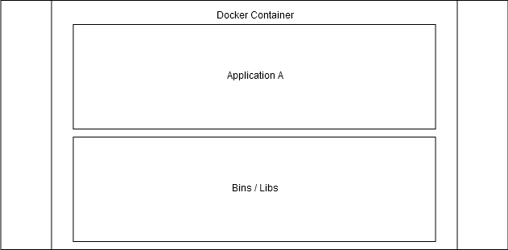
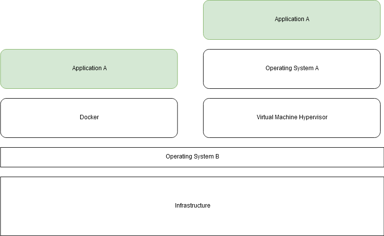

## Czym jest DevOps?

Zanim zaczniemy pracę z Dockerem, ułóżmy podstawy właściwego sposobu myślenia. Zdefiniowanie DevOps nie jest banalnym zadaniem, ale sam termin składa się z dwóch części: *Dev* i *Ops*. *Dev* odnosi się do tworzenia oprogramowania, a *Ops* do operacji/utrzymania. Prosta definicja DevOps mogłaby brzmieć: wydawanie, konfigurowanie i monitorowanie oprogramowania spoczywa w rękach tych samych osób, które je tworzą.

Bardziej formalną definicję proponują [Jabbari i in.](https://dl.acm.org/citation.cfm?id=2962707): „DevOps to metodyka rozwoju ukierunkowana na zniwelowanie luki między Development a Operations, kładąca nacisk na komunikację i współpracę, ciągłą integrację, zapewnienie jakości oraz dostarczanie z automatycznym wdrażaniem, z wykorzystaniem zestawu praktyk deweloperskich”.


Grafika łańcucha narzędzi DevOps autorstwa Kharnagy z [Wikipedii](https://commons.wikimedia.org/wiki/File:Devops-toolchain.svg)

*Czasem* DevOps bywa postrzegany jako rola, którą może pełnić jedna osoba lub zespół. Oto nieco zewnętrznej motywacji do nauki umiejętności DevOps: [wynagrodzenia według typu programisty w ankiecie StackOverflow](https://insights.stackoverflow.com/survey/2020#work-salary-and-experience-by-developer-type). Sam ten kurs nie uczyni z Ciebie specjalisty DevOps, ale da Ci umiejętności pomagające poruszać się w coraz bardziej skonteneryzowanym świecie.

W trakcie tego kursu skupimy się głównie na pakowaniu, wydawaniu i konfigurowaniu aplikacji. Nie będziesz proszony o planowanie czy tworzenie nowego oprogramowania. Omówimy Dockera i kilka technologii, z którymi możesz mieć do czynienia na co dzień, m.in. Redis i Postgres. Zobacz [ankietę StackOverflow](https://insights.stackoverflow.com/survey/2020#technology-how-technologies-are-connected), aby sprawdzić, jak silnie technologie te współwystępują.

## Czym jest Docker?

„Docker to zestaw produktów typu platform as a service (PaaS), które wykorzystują wirtualizację na poziomie systemu operacyjnego do dostarczania oprogramowania w pakietach zwanych kontenerami.” – [z Wikipedii](https://en.wikipedia.org/wiki/Docker_(software)).

Zatem upraszczając żargon, otrzymujemy dwie definicje:
  1. Docker to zestaw narzędzi do dostarczania oprogramowania w kontenerach.
  2. Kontenery to pakiety oprogramowania.



Powyższy obrazek pokazuje, że kontenery zawierają aplikację i jej zależności. Kontenery są odizolowane, aby nie zakłócały działania siebie nawzajem ani oprogramowania uruchomionego poza nimi. Jeśli musisz z nimi wchodzić w interakcję lub umożliwić interakcje między nimi, Docker udostępnia do tego narzędzia.

## Korzyści z kontenerów ##

Kontenery pakują aplikacje. Brzmi prosto, prawda? Aby zobrazować potencjalne korzyści, omówmy kilka scenariuszy.

### Scenariusz 1: U mnie działa ###

Przyjrzyjmy się najpierw, co dzieje się w tworzeniu aplikacji webowych bez kontenerów, podążając łańcuchem powyżej, zaczynając od „Plan”.

Najpierw planujesz aplikację. Następnie Twój zespół 1–n deweloperów tworzy oprogramowanie. Działa na Twoim komputerze. Może nawet przejść przez pipeline testowy i działać perfekcyjnie. Wysyłasz je na serwer i...

...nie działa.

To znany problem „**u mnie działa**”. Jedynym sposobem rozwiązania jest ustalenie, co też takiego miał zainstalowane deweloper na swoim komputerze, że aplikacja mu działała.

Kontenery rozwiązują ten problem, pozwalając deweloperowi uruchomić aplikację wewnątrz kontenera, który zawiera wszystkie zależności potrzebne do jej działania.

* Czasem wciąż usłyszysz o problemach „u mnie w **kontenerze** działa” – często są to po prostu błędy w użyciu.

### Scenariusz 2: Izolowane środowiska ###

Masz 5 różnych aplikacji w Pythonie. Musisz wdrożyć je na serwer, na którym już działa aplikacja wymagająca Pythona 2.7, a oczywiście żadna z Twoich aplikacji nie jest w wersji 2.7. Co robisz?

Ponieważ kontenery pakują oprogramowanie wraz z jego zależnościami, pakujesz istniejącą aplikację i wszystkie 5 nowych wraz z odpowiednimi wersjami Pythona i gotowe.

Można sobie tylko wyobrazić, jaki chaos powstałby, gdyby próbować uruchamiać je obok siebie na tej samej maszynie bez izolacji środowisk. Brzmi jak tykająca bomba. Czasem różne elementy systemu mogą się z czasem zmieniać, co może prowadzić do niedziałania aplikacji. Zmiany te mogą dotyczyć wszystkiego — od aktualizacji systemu operacyjnego po zmiany w zależnościach.

### Scenariusz 3: Development ###

Dołączasz do zespołu developerskiego. Uruchamiają aplikację webową, która w trakcie działania korzysta z innych usług: bazy danych Postgres, MongoDB, Redis i kilku innych. Proste — instalujesz wszystko, co potrzebne do uruchomienia aplikacji i wszystkich zależnych usług...

Co za ból głowy instalować, a potem samodzielnie zarządzać bazami deweloperskimi na swoim komputerze.

Na szczęście, zanim Cię o to poproszą, jesteś już ekspertem Dockera. Jednym poleceniem uruchamiasz na swojej maszynie odizolowaną aplikację, jak Postgres lub Mongo.

### Scenariusz 4: Skalowanie ###

Uruchamianie i zatrzymywanie kontenera Dockera ma niewielki narzut. Ale kiedy uruchamiasz własnego „Netflixa” czy „Facebooka”, chcesz sprostać zmiennemu popytowi. Dzięki zaawansowanym narzędziom, których nauczymy się w częściach 2 i 3, możemy natychmiast uruchamiać wiele kontenerów i równoważyć między nimi ruch.

Orkiestrację kontenerów omówimy w częściach 2 i 3. Najprostszy przykład: co się dzieje, gdy jedna instancja aplikacji padnie? System orkiestracji to zauważa, dzieli ruch między działające repliki i uruchamia nowy kontener, aby zastąpić ten martwy.

## Maszyny wirtualne ##

Czy nie istnieje już rozwiązanie tego problemu? Maszyny wirtualne to nie to samo, co kontenery — rozwiązują inne problemy. Nie będziemy zagłębiać się w maszyny wirtualne w tym kursie. Oto jednak diagram, który z grubsza pokazuje różnicę.



Różnica między maszyną wirtualną a rozwiązaniami Dockera uwidacznia się po przeniesieniu Aplikacji A na niekompatybilny system „Operating System B”. Uruchamianie oprogramowania na kontenerach jest niemal tak wydajne, jak uruchamianie go „natywnie” poza kontenerami, zwłaszcza w porównaniu z maszynami wirtualnymi.

Kontenery mają bezpośredni dostęp do jądra i zasobów Twojego systemu operacyjnego. Narzut zasobów wynikający z używania kontenerów jest zminimalizowany, ponieważ aplikacje zachowują się tak, jakby nie było dodatkowych warstw. Ponieważ Docker używa jąder Linuksa, macOS i Windows nie mogą go uruchamiać bez pewnych obejść i każdy z tych systemów ma własne rozwiązania, jak uruchamiać Dockera.

## Uruchamianie kontenerów ##

Masz już zainstalowanego Dockera, więc uruchommy nasz pierwszy kontener!

hello-world to prosta aplikacja, która wypisuje „Hello from Docker!” i kilka dodatkowych informacji.

Po prostu uruchom `docker container run hello-world`, a wynik będzie następujący:

```console
$ docker container run hello-world
  Unable to find image 'hello-world:latest' locally
  latest: Pulling from library/hello-world
  b8dfde127a29: Pull complete
  Digest: sha256:308866a43596e83578c7dfa15e27a73011bdd402185a84c5cd7f32a88b501a24
  Status: Downloaded newer image for hello-world:latest

  Hello from Docker!
  This message shows that your installation appears to be working correctly.

  To generate this message, Docker took the following steps:
   1. The Docker client contacted the Docker daemon.
   2. The Docker daemon pulled the "hello-world" image from the Docker Hub.
      (amd64)
   3. The Docker daemon created a new container from that image which runs the
      executable that produces the output you are currently reading.
   4. The Docker daemon streamed that output to the Docker client, which sent it
      to your terminal.

  To try something more ambitious, you can run an Ubuntu container with:
   $ docker run -it ubuntu bash
```

W zależności od Twojego środowiska hosta, Docker pobierze obraz i uruchomi go w kontenerze. Zauważ, że użyliśmy polecenia `container run`, aby nakazać Dockerowi uruchomienie kontenera.

Alternatywnie można użyć `docker run hello-world`, co oznacza to samo.

## Obrazy (images) ##

Słowo *image* może nasuwać skojarzenie z grafiką, ale tutaj oznacza ono „*obraz systemu*”. Możesz traktować obraz jako szablon wykorzystywany przez Dockera do tworzenia kontenerów.

Wypróbujmy **Ubuntu** i zadzwońmy do Google'a:

```console
$ docker container run -it ubuntu sh -c 'apt update && apt install -y curl && curl https://www.google.com'
```

Polecenie zaczyna się od `docker`, czyli klienta Dockera, następnie nakazujemy klientowi Dockera `container run` — uruchomienie kontenera.

Argument `-it` znaczy tryb „interactive terminal”, dzięki czemu możesz wchodzić w interakcję z uruchomionym kontenerem.

Kolejny argument to `ubuntu`, co oznacza, że kontener powstanie na bazie obrazu o nazwie „ubuntu”.

Reszta polecenia `sh -c 'apt update && apt install -y curl && curl https://www.google.com'` mówi, co ma zostać wykonane wewnątrz kontenera.

Po uruchomieniu, jeśli połączenie sieciowe działało, powinieneś zobaczyć zrzut źródła strony głównej Google.

## Zarządzanie kontenerami ##

Możesz sprawdzić działające kontenery i te, które zakończyły działanie, za pomocą poniższych poleceń:

```console
$ docker container ls
$ docker container ls -a
```

Aby zatrzymać kontener:

```console
$ docker container stop <container-id>
```

Aby usunąć kontener:

```console
$ docker container rm <container-id>
```

Aby pobrać obraz bez uruchamiania kontenera:

```console
$ docker image pull ubuntu
```

Aby wyświetlić obrazy:

```console
$ docker image ls
```

Aby usunąć obraz:

```console
$ docker image rm <image-id>
```

W kolejnych sekcjach pogłębimy te zagadnienia i poznamy wolumeny, sieci oraz orkiestrację.
