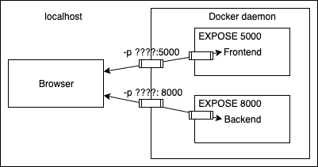

Jak już widzieliśmy, da się skonteneryzować niemal każdy projekt. Skoro jesteśmy pomiędzy Dev a Ops, załóżmy, że nasi koledzy deweloperzy stworzyli aplikację z README, które instruuje, co zainstalować i jak uruchomić aplikację. My, jako eksperci od kontenerów, możemy ją skonteneryzować w kilka chwil.

Otwórz projekt <https://github.com/docker-hy/material-applications/tree/main/rails-example-project>, przeczytaj README i zastanów się, jak przetłumaczyć je na Dockerfile. Dzięki README powinniśmy zrozumieć, co trzeba zrobić, nawet jeśli nie mamy pojęcia o danym języku czy technologii!

Musimy sklonować [repozytorium](https://github.com/docker-hy/material-applications) — być może już to zrobiłeś. Po tym zacznijmy od Dockerfile. Wiemy, że musimy zainstalować Ruby i zależności. Umieśćmy Dockerfile w katalogu głównym projektu.

**Dockerfile**

```Dockerfile
# We need ruby 3.1.0. I found this from Docker Hub
FROM ruby:3.1.0

EXPOSE 3000

WORKDIR /usr/src/app
```

OK, to podstawy: FROM wskazuje wersję Ruby, EXPOSE 3000 jest wspomniane na dole README, a WORKDIR /usr/src/app to konwencja.

Kolejne kroki dyktuje README. Nie musimy kopiować niczego spoza kontenera, aby to wykonać:

```Dockerfile
# Install the correct bundler version
RUN gem install bundler:2.3.3

# Copy the files required for dependencies to be installed
COPY Gemfile* ./

# Install all dependencies
RUN bundle install
```

Tutaj wykonaliśmy szybki trik, rozdzielając instalowanie zależności od części, w której kopiujemy kod źródłowy. COPY skopiuje oba pliki Gemfile i Gemfile.lock do bieżącego katalogu. Pomoże nam to cache’ować warstwy zależności, jeśli kiedykolwiek będziemy zmieniać kod źródłowy. Podobny trik z cache’owaniem działa w wielu innych językach i frameworkach, np. w Node.js.

Na koniec kopiujemy projekt i podążamy za README:

```Dockerfile
# Copy all of the source code
COPY . .

# We pick the production mode since we have no intention of developing the software inside the container.
# Run database migrations by following instructions from README
RUN rails db:migrate RAILS_ENV=production

# Precompile assets by following instructions from README
RUN rake assets:precompile

# And finally the command to run the application
CMD ["rails", "s", "-e", "production"]
```

OK. Zobaczmy, jak dobrze zadziałało małpowanie README, i uruchommy poniższy oneliner, który buduje obraz, a następnie uruchamia go z opublikowanym portem 3000:

```console
docker build . -t rails-project && docker run -p 3000:3000 rails-project
```

Po chwili aplikacja startuje na porcie 3000 w trybie produkcyjnym... chyba że masz Maca z procesorem M1 lub M2.

::::tip Building the image with a more recent Mac

Jeśli masz nowszego Maca z procesorem [M1 lub M2](https://support.apple.com/en-us/HT211814), budowanie obrazu się nie powiedzie:

```bash
 => ERROR [7/8] RUN rails db:migrate RAILS_ENV=production
------
 > [7/8] RUN rails db:migrate RAILS_ENV=production:
#11 1.142 rails aborted!
#11 1.142 LoadError: cannot load such file -- nokogiri
```

Można to naprawić, zmieniając następującą linię w pliku <i>Gemfile.lock</i>

```bash
nokogiri (1.13.1-x86_64-darwin)
```

na:

```bash
nokogiri (1.14.2-arm64-darwin)
```

Powodem problemu jest to, że plik Gemfile.lock, który definiuje <i>dokładne</i> wersje instalowanych bibliotek (w żargonie Ruby — Gemów), został wygenerowany na Linuksie z procesorem Intela. Gem [Nokogiri](https://nokogiri.org/) ma różne wersje dla procesorów Intel i Apple M1/M2 i aby uzyskać właściwą wersję na nowszym Macu, najłatwiej teraz zmienić wpis w Gemfile.lock.

::::

## Ćwiczenia 1.11-1.14

::::info Exercise 1.11: Spring

Utwórz Dockerfile dla starego projektu Java Spring, który znajdziesz w [repozytorium kursu](https://github.com/docker-hy/material-applications/tree/main/spring-example-project).

Konfiguracja powinna być prosta, zgodnie z README. Wskazówki na start:

Istnieje wiele opcji uruchamiania Javy; możesz użyć np. [amazoncorretto](https://hub.docker.com/_/amazoncorretto) `FROM amazoncorretto:_tag_`, aby mieć Javę bez ręcznej instalacji. Wybierz tag na podstawie README i strony Docker Hub.

Zadanie ukończysz, gdy zobaczysz komunikat 'Success' w przeglądarce.

Prześlij Dockerfile, którego użyłeś do uruchomienia kontenera.

::::

Kolejne trzy ćwiczenia rozpoczną większy projekt, który skonfigurujemy w częściach 2 i 3. Wymagają użycia wszystkiego, czego nauczyłeś się do tej pory. Jeśli w późniejszych ćwiczeniach trzeba będzie zmodyfikować Dockerfile, śmiało rób to na bazie plików stworzonych tutaj.

::::warning Mandatory exercises
  The next exercises are the first mandatory ones. Mandatory exercises can not be skipped.
::::

::::caution Mandatory Exercise 1.12: Hello, frontend!

Dobry deweloper tworzy porządne README — takie, na podstawie których łatwo stworzyć Dockerfile.

Sklonuj, sforkuj lub pobierz projekt z
[https://github.com/docker-hy/material-applications/tree/main/example-frontend](https://github.com/docker-hy/material-applications/tree/main/example-frontend).

Utwórz Dockerfile dla projektu (example-frontend) i podaj komendę tak, aby projekt uruchamiał się w kontenerze Dockera z portem 5000 wystawionym i opublikowanym — po uruchomieniu kontenera i przejściu do [http://localhost:5000](http://localhost:5000) zobaczysz komunikat o powodzeniu.
* uwaga: port 5000 jest zarezerwowany w nowszych wersjach macOS (Monterey, Big Sur), więc użyj innego portu po stronie hosta

Prześlij Dockerfile.

_Jak w innych ćwiczeniach, nie modyfikuj kodu projektu_

Wskazówki:
- Projekt ma instrukcje instalacji w README.
- Zauważ, że aplikacja zaczyna akceptować połączenia, gdy na ekranie pojawi się „Accepting connections at http://localhost:5000” — to zajmuje kilka sekund
- Nie musisz nic nowego instalować poza kontenerami.
- Projekt może nie działać zbyt nowymi wersjami Node.js

::::

::::caution Mandatory Exercise 1.13: Hello, backend!

Sklonuj, sforkuj lub pobierz projekt z
[https://github.com/docker-hy/material-applications/tree/main/example-backend](https://github.com/docker-hy/material-applications/tree/main/example-backend).

Utwórz Dockerfile dla projektu (example-backend). Uruchom kontener z opublikowanym portem 8080.

Po uruchomieniu kontenera i przejściu do [http://localhost:8080/ping](http://localhost:8080/ping) powinieneś otrzymać odpowiedź „pong”.

Prześlij Dockerfile i użyte polecenie.

_Nie modyfikuj kodu projektu_

Wskazówki:
- może przydać się [to](https://docs.docker.com/reference/dockerfile/#env)
- Jeśli masz Maca M1/M2, być może trzeba będzie zbudować obraz z dodatkową opcją `docker build --platform linux/amd64 -t imagename .`

::::

::::caution Mandatory Exercise 1.14: Environment

Uruchom frontend i backend z prawidłowo wystawionymi portami i dodaj [ENV](https://docs.docker.com/reference/dockerfile/#env) do Dockerfile z niezbędnymi informacjami z obu README
([front](https://github.com/docker-hy/material-applications/tree/main/example-frontend), [back](https://github.com/docker-hy/material-applications/tree/main/example-backend)).

Zignoruj konfiguracje backendu, dopóki frontend nie zacznie wysyłać żądań do `_backend_url_/ping` po kliknięciu przycisku.

Wiesz, że konfiguracja jest gotowa, gdy przycisk dla 1.14 we froncie odpowiada i zmienia kolor na zielony.

_Nie modyfikuj kodu żadnego z projektów_

Prześlij zmodyfikowane Dockerfile i komendy użyte do uruchomienia.


Frontend najpierw rozmawia z Twoją przeglądarką. Następnie kod wykonywany jest w przeglądarce i ta wysyła żądanie do backendu.



Wskazówki:
* Konfigurując aplikacje webowe, ZAWSZE miej otwarte narzędzia deweloperskie przeglądarki (F12 lub cmd+shift+I). Informacje o konfiguracji żądań cross-origin są w README projektu backend.
* Konsola deweloperska ma wiele widoków; najważniejsze to Console i Network. Analiza zakładki Network daje mnóstwo informacji o tym, dokąd wysyłane są komunikaty i co przychodzi w odpowiedzi!

::::

## Publikowanie projektów

Wejdź na <https://hub.docker.com/>, aby utworzyć konto. Możesz skonfigurować Docker Hub, aby budował obrazy za Ciebie, ale użycie `push` też działa.

Opublikujmy obraz youtube-dl. Zaloguj się, przejdź do [dashboardu](https://hub.docker.com/repositories) i naciśnij Create Repository. Namespace może być Twoim kontem osobistym lub kontem organizacji. Na razie trzymajmy się kont osobistych i wpiszmy coś opisowego, jak youtube-dl, jako nazwę repozytorium. Będzie nam potrzebne w części 2.

Ustaw widoczność na _public_.

Ostatnią rzeczą jest uwierzytelnienie push przez zalogowanie:

```console
$ docker login
```

Następnie musisz przemianować obraz, aby zawierał Twoją nazwę użytkownika, i możesz go wypchnąć:

```console
$ docker tag youtube-dl <username>/<repository>
  ...

$ docker push <username>/<repository>
  ...
```

## Ćwiczenia 1.15-1.16

::::info Exercise 1.15: Homework

Utwórz Dockerfile dla aplikacji lub innego projektu dockerowego w jednym z Twoich repozytoriów i opublikuj go w Docker Hub. Może to być dowolny projekt, poza klonami lub forkami backend-example albo frontend-example.

Aby zaliczyć to ćwiczenie, podaj link do projektu w Docker Hub, upewnij się, że masz choć podstawowy opis i instrukcje uruchomienia w [README](https://help.github.com/en/articles/about-readmes), dostępne przez Twoje zgłoszenie.

::::

::::info Exercise 1.16: Cloud deployment

Czas podsumować tę część i uruchomić aplikację skonteneryzowaną w chmurze.

Możesz wziąć dowolną aplikację webową, np. przykład lub ćwiczenie z tej części, własną aplikację albo nawet materiały kursowe (zob. [devopsdockeruh/coursepage](https://hub.docker.com/r/devopsdockeruh/coursepage)) i wdrożyć ją u któregoś dostawcy chmury.

Istnieje wiele alternatyw i większość ma darmowy poziom. Oto kilka dość prostych w użyciu:

- [fly.io](https://fly.io) (łatwy w użyciu, ale wymaga karty kredytowej nawet w darmowym planie)
- [render.com](https://render.com) (słaba dokumentacja, prawdopodobnie będziesz potrzebować Google)
- [heroku.com](https://heroku.com) (ma darmowy plan studencki przez [GitHub Student Developer Pack](https://www.heroku.com/github-students))

Jeśli znasz dobrą usługę chmurową do celów tego ćwiczenia, daj nam znać (tak, wiemy już o Amazon AWS, Google Cloud i Azure...).

Prześlij Dockerfile, krótki opis tego, co zrobiłeś, oraz link do działającej aplikacji.

::::
