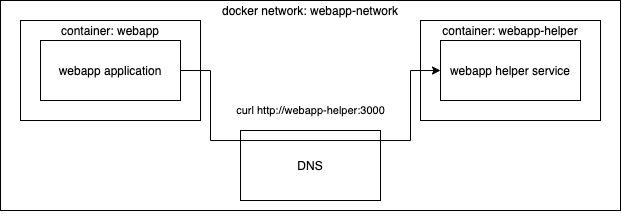

Połączenie dwóch usług, takich jak serwer i jego baza danych, w Dockerze można osiągnąć za pomocą [Docker network](https://docs.docker.com/network/). Oprócz uruchamiania usług wymienionych w docker-compose.yml Docker Compose automatycznie tworzy sieć i dołącza do niej oba kontenery, z usługą [DNS](https://docs.docker.com/network/#dns-services). Każda usługa jest nazwana według nazwy nadanej w pliku docker-compose.yml. Dzięki temu kontenery mogą się do siebie odwoływać po prostu nazwami usług, co różni się od nazwy kontenera.



Tutaj mamy dwie usługi w jednej sieci: webapp i webapp-helper. Webapp-helper ma serwer nasłuchujący na porcie 3000, do którego webapp chce się dostać. Ponieważ zostały zdefiniowane w tym samym pliku docker-compose.yml, dostęp jest trywialny. Docker Compose zadbał już o utworzenie sieci i webapp może po prostu wysłać żądanie do webapp-helper:3000 — wewnętrzny DNS przetłumaczy to na właściwy dostęp, a portów nie trzeba publikować poza siecią.

::::tip Security reminder: Plan your infrastructure and keep to your plan

W następnym ćwiczeniu i kilku kolejnych znajduje się ilustracja infrastruktury. Spójrz na nią i użyj jej do napisania konfiguracji.

Na przykład w ćwiczeniu 2.4 nie chcemy otwierać portów Redis na świat. Nie dodawaj konfiguracji `ports` pod Redis! Backend będzie mógł uzyskać dostęp do aplikacji w sieci Dockera.

::::

## Ćwiczenie 2.4

::::info Exercise 2.4

W tym ćwiczeniu należy rozbudować konfigurację z [Ćwiczenia 2.3](/part-2/section-1#exercises-22---23) i skonfigurować przykładowy backend do użycia bazy klucz-wartość [Redis](https://redis.com/).

Redis jest często używany jako [cache](https://en.wikipedia.org/wiki/Cache_(computing)) do przechowywania danych, aby przyszłe żądania mogły być obsługiwane szybciej.

Backend używa wolnego API do pobierania pewnych informacji. Możesz przetestować wolne API, wysyłając żądanie `/ping?redis=true` za pomocą curl. Aplikacja frontend ma przycisk do testu.

Zatem powinieneś poprawić wydajność aplikacji i skonfigurować kontener Redis do buforowania informacji dla backendu. [Dokumentacja](https://hub.docker.com/_/redis/) obrazu Redis może zawierać przydatne informacje.

[README backendu](https://github.com/docker-hy/material-applications/tree/main/example-backend) powinno zawierać wszystkie potrzebne informacje do skonfigurowania backendu.

Gdy poprawnie skonfigurujesz, przycisk zmieni kolor na zielony.

Prześlij docker-compose.yml

  

Konfiguracja [restart: unless-stopped](https://docs.docker.com/compose/compose-file/compose-file-v3/#restart) może pomóc, jeśli Redis potrzebuje chwili, by się przygotować.

::::

## Ręczne definiowanie sieci

Możliwe jest też ręczne zdefiniowanie sieci w pliku Docker Compose. Główną korzyścią ręcznej definicji jest łatwe skonfigurowanie takiego układu, w którym kontenery zdefiniowane w dwóch różnych plikach Docker Compose współdzielą sieć i mogą się ze sobą komunikować.

Spójrzmy, jak definiuje się sieć w docker-compose.yml:

```yaml
version: "3.8"

services:
  db:
    image: postgres:13.2-alpine
    networks:
      - database-network # Name in this Docker Compose file

networks:
  database-network: # Name in this Docker Compose file
    name: database-network # Name that will be the actual name of the network
```

Definiuje to sieć o nazwie `database-network`, która jest tworzona przy `docker compose up` i usuwana przy `docker compose down`.

Jak widać, usługi konfiguruje się do użycia sieci poprzez dodanie `networks` w definicji usługi.

Nawiązanie połączenia z siecią zewnętrzną (tj. siecią zdefiniowaną w innym docker-compose.yml lub w inny sposób) wygląda tak:

```yaml
version: "3.8"

services:
  db:
    image: backend-image
    networks:
      - database-network

networks:
  database-network:
    external:
      name: database-network # Must match the actual name of the network
```

Domyślnie wszystkie usługi są dodawane do sieci o nazwie `default`. Sieć domyślną można skonfigurować, co umożliwia także domyślne podłączenie do sieci zewnętrznej:

```yaml
version: "3.8"

services:
  db:
    image: backend-image

networks:
  default:
    external:
      name: database-network # Must match the actual name of the network
```

## Skalowanie

Compose potrafi też skalować usługę, uruchamiając wiele instancji:

```console
$ docker compose up --scale whoami=3

  WARNING: The "whoami" service specifies a port on the host. If multiple containers for this service are created on a single host, the port will clash.

  Starting whoami_whoami_1 ... done
  Creating whoami_whoami_2 ... error
  Creating whoami_whoami_3 ... error
```

Polecenie nie powiodło się z powodu konfliktu portów — każda instancja próbuje zbindować ten sam port hosta (8000).

Możemy to obejść, podając tylko port kontenera. Jak wspomniano w [części 1](/part-1/section-5#allowing-external-connections-into-containers), gdy nie podamy portu hosta, Docker automatycznie wybierze wolny port.

Zaktualizuj definicję ports w `docker-compose.yml`:

```yaml
ports:
  - 8000
```

Następnie uruchom polecenie ponownie:

```console
$ docker compose up --scale whoami=3
  Starting whoami_whoami_1 ... done
  Creating whoami_whoami_2 ... done
  Creating whoami_whoami_3 ... done
```

Wszystkie trzy instancje działają i nasłuchują na losowych portach hosta. Możemy użyć `docker compose port`, aby sprawdzić, do których portów są zbindowane instancje.

```console
$ docker compose port --index 1 whoami 8000
  0.0.0.0:32770

$ docker compose port --index 2 whoami 8000
  0.0.0.0:32769

$ docker compose port --index 3 whoami 8000
  0.0.0.0:32768
```

Możemy teraz curlować te porty:

```console
$ curl 0.0.0.0:32769
  I'm 536e11304357

$ curl 0.0.0.0:32768
  I'm 1ae20cd990f7
```

W środowisku serwerowym często stosuje się [load balancer](https://en.wikipedia.org/wiki/Load_balancing_(computing)) przed usługą. Dla skonteneryzowanego środowiska lokalnego (lub pojedynczego serwera) dobrym rozwiązaniem jest <https://github.com/jwilder/nginx-proxy>.

Dodajmy nginx-proxy do naszego pliku compose i usuńmy wiązania portów z usługi whoami. Zamontujemy nasz [docker.sock](https://stackoverflow.com/questions/35110146/can-anyone-explain-docker-sock) (gniazdo używane do komunikacji z [Docker Daemon](https://docs.docker.com/engine/reference/commandline/dockerd/)) wewnątrz kontenera w trybie tylko do odczytu `:ro`:

```yaml
version: "3.8"

services:
  whoami:
    image: jwilder/whoami
  proxy:
    image: jwilder/nginx-proxy
    volumes:
      - /var/run/docker.sock:/tmp/docker.sock:ro
    ports:
      - 80:80
```

Przetestujmy konfigurację:

```console
$ docker compose up -d --scale whoami=3
$ curl localhost:80
  <html>
  <head><title>503 Service Temporarily Unavailable</title></head>
  <body bgcolor="white">
  <center><h1>503 Service Temporarily Unavailable</h1></center>
  <hr><center>nginx/1.13.8</center>
  </body>
  </html>
```

„Działa”, ale Nginx nie wie, której usługi chcemy. `nginx-proxy` współpracuje z dwiema zmiennymi środowiskowymi: `VIRTUAL_HOST` i `VIRTUAL_PORT`. `VIRTUAL_PORT` nie jest potrzebne, jeśli obraz usługi ma `EXPOSE`. Widzimy, że `jwilder/whoami` to ustawia: <https://github.com/jwilder/whoami/blob/master/Dockerfile#L9>

- Uwaga: Użytkownicy Mac z procesorem M1 mogą zobaczyć komunikat o błędzie: `runtime: failed to create new OS thread`. W takim przypadku można użyć obrazu Dockera `ninanung/nginx-proxy`, który oferuje tymczasową poprawkę do czasu aktualizacji `jwilder/nginx-proxy` z obsługą M1.

Domena `colasloth.com` jest skonfigurowana tak, że wszystkie subdomeny wskazują na `127.0.0.1`. Więcej informacji o tym, jak to działa, znajduje się na [colasloth.github.io](https://colasloth.github.io), w skrócie to prosty „hack” DNS. Istnieje kilka innych domen służących temu samemu celowi, m.in. `localtest.me`, `lvh.me` i `vcap.me`. W każdym razie tutaj użyjemy `colasloth.com`:

```yaml
version: "3.8"

services:
  whoami:
    image: jwilder/whoami
    environment:
      - VIRTUAL_HOST=whoami.colasloth.com
  proxy:
    image: jwilder/nginx-proxy
    volumes:
      - /var/run/docker.sock:/tmp/docker.sock:ro
    ports:
      - 80:80
```

Teraz proxy działa:

```console
$ docker compose up -d --scale whoami=3
$ curl whoami.colasloth.com
  I'm f6f85f4848a8
$ curl whoami.colasloth.com
  I'm 740dc0de1954
```

Dodajmy jeszcze kilka kontenerów za tym samym proxy. Możemy użyć oficjalnego obrazu `nginx`, aby serwować prostą statyczną stronę. Nie musimy nawet budować obrazów — możemy po prostu podmontować zawartość do obrazu. Przygotujmy zawartość dla dwóch usług o nazwach „hello” i „world”.

```console
$ echo "hello" > hello.html
$ echo "world" > world.html
```

Następnie dodaj te usługi do pliku `docker-compose.yml`, gdzie montujesz tylko zawartość jako `index.html` w domyślnej ścieżce nginxa:

```yaml
hello:
  image: nginx:1.19-alpine
  volumes:
    - ./hello.html:/usr/share/nginx/html/index.html:ro
  environment:
    - VIRTUAL_HOST=hello.colasloth.com
world:
  image: nginx:1.19-alpine
  volumes:
    - ./world.html:/usr/share/nginx/html/index.html:ro
  environment:
    - VIRTUAL_HOST=world.colasloth.com
```

Teraz przetestuj:

```console
$ docker compose up -d --scale whoami=3
$ curl hello.colasloth.com
  hello

$ curl world.colasloth.com
  world

$ curl whoami.colasloth.com
  I'm f6f85f4848a8

$ curl whoami.colasloth.com
  I'm 740dc0de1954
```

Mamy teraz podstawową konfigurację hostingu na jednej maszynie, działającą.

Sprawdź aktualizację `hello.html` bez restartu kontenera — czy działa?

## Ćwiczenie 2.5

::::info Exercise 2.5

Projekt [https://github.com/docker-hy/material-applications/tree/main/scaling-exercise](https://github.com/docker-hy/material-applications/tree/main/scaling-exercise) to ledwo działająca aplikacja. Sklonuj go. Projekt zawiera już docker-compose.yml, więc możesz go uruchomić przez `docker compose up`.

Aplikacja powinna być dostępna pod [http://localhost:3000](http://localhost:3000). Jednak nie działa wystarczająco dobrze i dodaliśmy load balancer do skalowania. Twoim zadaniem jest wyskalować kontenery `compute` tak, aby przycisk w aplikacji zmienił kolor na zielony.

To ćwiczenie powstało z [Sasu Mäkinen](https://github.com/sasumaki)

Proszę zwrócić użyte komendy dla tego ćwiczenia.

::::
