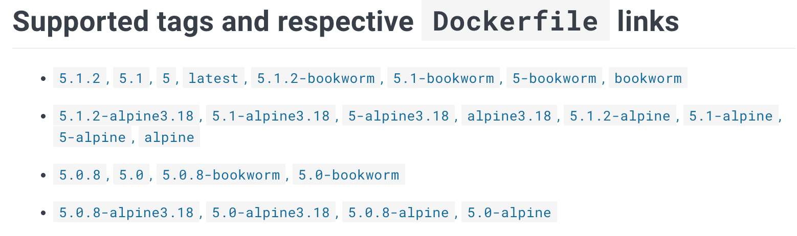
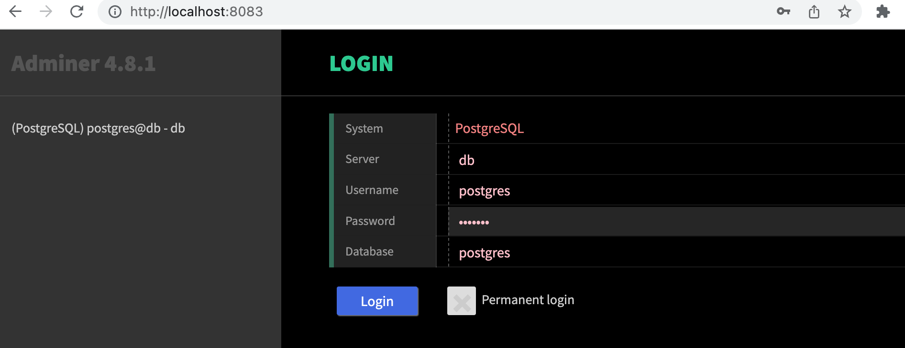

Następnie skonfigurujemy aplikację do zarządzania projektami [Redmine](https://www.redmine.org/), bazę danych PostgreSQL oraz [Adminer](https://www.adminer.org/), graficzny interfejs do administracji bazą.

Wszystkie powyższe mają dostępne oficjalne obrazy Dockera, co widać odpowiednio na stronach: [Redmine](https://hub.docker.com/_/redmine), [Postgres](https://hub.docker.com/_/postgres) i [Adminer](https://hub.docker.com/_/adminer). „Oficjalność” kontenerów nie jest kluczowa, ważne, by można było liczyć na pewne wsparcie. W podobny sposób moglibyśmy uruchomić w kontenerach np. Wordpressa czy MediaWiki, jeśli interesuje Cię uruchamianie istniejących aplikacji w Dockerze. Mógłbyś nawet postawić narzędzie do monitoringu aplikacji, takie jak [Sentry](https://hub.docker.com/_/sentry/).

Na stronie <https://hub.docker.com/_/redmine> znajduje się lista różnych oznaczonych tagów wersji:



Najprawdopodobniej możemy użyć dowolnego z dostępnych obrazów.

W sekcji _Environment Variables_ widać, że wszystkie wersje mogą używać zmiennej środowiskowej `REDMINE_DB_POSTGRES` do skonfigurowania bazy Postgresa. Zanim pójdziemy dalej, przygotujmy więc Postgresa.

Na stronie <https://hub.docker.com/_/postgres> w sekcji „via docker-compose or docker stack deploy” znajduje się przykładowy plik compose. Odetnijmy zbędne elementy w następujący sposób

```yaml
version: "3.8"

services:
  db:
    image: postgres:13.2-alpine
    restart: unless-stopped
    environment:
      POSTGRES_PASSWORD: example
    container_name: db_redmine
```

Uwaga:

- `restart: always` został zmieniony na `unless-stopped`, co utrzyma kontener działający, dopóki nie zatrzymamy go explicite. Przy `always` zatrzymany kontener zostanie uruchomiony po restarcie systemu itp., zob. [więcej tutaj](https://docs.docker.com/config/containers/start-containers-automatically/).

W sekcji [Where to store data](https://github.com/docker-library/docs/blob/master/postgres/README.md#where-to-store-data) widzimy, że `/var/lib/postgresql/data` należy zamontować osobno, aby zachować dane.

Są dwie opcje montowania. Możemy użyć bind mount jak wcześniej i podmontować łatwy do zlokalizowania katalog do przechowywania danych. Tym razem użyjemy drugiej opcji — [wolumenu zarządzanego przez Dockera](https://docs.docker.com/storage/volumes/).

Uruchommy plik Docker Compose bez dodawania nic nowego:

```console
$ docker compose up

  ✔ Network redmine_default  Created                                                                                              0.0s
  ✔ Container db_redmine     Created                                                                                              0.2s
  Attaching to db_redmine
  db_redmine  | The files belonging to this database system will be owned by user "postgres".
  db_redmine  | This user must also own the server process.
  ...
  db_redmine  | 2024-03-11 14:05:52.340 UTC [1] LOG:  starting PostgreSQL 13.2 on aarch64-unknown-linux-musl, compiled by gcc (Alpine 10.2.1_pre1) 10.2.1 20201203, 64-bit
  db_redmine  | 2024-03-11 14:05:52.340 UTC [1] LOG:  listening on IPv4 address "0.0.0.0", port 5432
  db_redmine  | 2024-03-11 14:05:52.340 UTC [1] LOG:  listening on IPv6 address "::", port 5432
  db_redmine  | 2024-03-11 14:05:52.342 UTC [1] LOG:  listening on Unix socket "/var/run/postgresql/.s.PGSQL.5432"
  db_redmine  | 2024-03-11 14:05:52.345 UTC [46] LOG:  database system was shut down at 2024-03-11 14:05:52 UTC
  db_redmine  | 2024-03-11 14:05:52.347 UTC [1] LOG:  database system is ready to accept connections
```

Obraz przy pierwszym uruchomieniu inicjalizuje pliki danych. Zatrzymajmy kontener kombinacją ^C. Compose używa bieżącego katalogu jako prefiksu nazw kontenerów i wolumenów, aby projekty się nie gryzły (prefiks można nadpisać zmienną `COMPOSE_PROJECT_NAME`, jeśli trzeba).

Sprawdźmy **inspect** czy został utworzony wolumen poleceniem `docker container inspect db_redmine | grep -A 5 Mounts`

```json
"Mounts": [
    {
        "Type": "volume",
        "Name": "2d86a2480b60743147ce88e8e70b612d10b4c4151779b462baf4e81b84061ef5",
        "Source": "/var/lib/docker/volumes/2d86a2480b60743147ce88e8e70b612d10b4c4151779b462baf4e81b84061ef5/_data",
        "Destination": "/var/lib/postgresql/data",
```

Istotnie, jest! A więc mimo że **nie** skonfigurowaliśmy go jawnie, automatycznie utworzono dla nas anonimowy wolumen.

Jeśli teraz sprawdzimy `docker volume ls`, zobaczymy wolumen o nazwie „2d86a2480b60743147ce88e8e70b612d10b4c4151779b462baf4e81b84061ef5”.

```console
$ docker volume ls
  DRIVER              VOLUME NAME
  local     2d86a2480b60743147ce88e8e70b612d10b4c4151779b462baf4e81b84061ef5
```

Na Twojej maszynie może być więcej wolumenów. Jeśli chcesz się ich pozbyć, użyj `docker volume prune`. Teraz sprowadźmy całą „aplikację” w dół poleceniem `docker compose down`.

Zamiast losowo nazwanych wolumenów lepiej jawnie zdefiniować jeden.
Zmieńmy definicję w ten sposób:

```yaml
version: "3.8"

services:
  db:
    image: postgres:13.2-alpine
    restart: unless-stopped
    environment:
      POSTGRES_PASSWORD: example
    container_name: db_redmine
    volumes:
      - database:/var/lib/postgresql/data

volumes:
  database:
```

Teraz, po ponownym `docker compose up`, sprawdźmy, jak to wygląda:

```console
$ docker volume ls
  DRIVER              VOLUME NAME
  local               redmine_database

$ docker container inspect db_redmine | grep -A 5 Mounts
"Mounts": [
    {
        "Type": "volume",
        "Name": "redmine_database",
        "Source": "/var/lib/docker/volumes/ongoing_redminedata/_data",
        "Destination": "/var/lib/postgresql/data",
```

OK, wygląda nieco bardziej „ludzko”! Skoro Postgres działa, czas dodać [Redmine](https://hub.docker.com/_/redmine).

Kontener wydaje się wymagać tylko dwóch zmiennych środowiskowych.

```yaml
redmine:
  image: redmine:5.1-alpine
  environment:
    - REDMINE_DB_POSTGRES=db
    - REDMINE_DB_PASSWORD=example
  ports:
    - 9999:3000
  depends_on:
    - db
```

Zwróć uwagę na deklarację [depends_on](https://docs.docker.com/compose/compose-file/compose-file-v3/#depends_on). Dzięki temu najpierw uruchamiana jest usługa `db`. `depends_on` nie gwarantuje, że baza już działa — jedynie, że wystartowała wcześniej. Serwer Postgresa jest dostępny pod nazwą DNS „db” z usługi Redmine, jak omówiono w sekcji [Docker networking](/part-2/section-2).

Gdy teraz uruchomisz `docker compose up`, zobaczysz najpierw serię migracji bazy danych.

```console
  redmine_1  | I, [2024-03-03T10:59:20.956936 #25]  INFO -- : Migrating to Setup (1)
  redmine_1  | == 1 Setup: migrating =========================================================
  ...
  redmine_1  | [2024-03-03 11:01:10] INFO  ruby 3.2.3 (2024-01-30) [x86_64-linux]
  redmine_1  | [2024-03-03 11:01:10] INFO  WEBrick::HTTPServer#start: pid=1 port=3000
```

Jak wspomina [dokumentacja](https://hub.docker.com/_/redmine), obraz tworzy pliki w `/usr/src/redmine/files` i te pliki lepiej utrwalić. Dockerfile ma [taką linię](https://github.com/docker-library/redmine/blob/cea16044e97567c28802fc8cc06f6cd036c49a5c/4.0/Dockerfile#L155), gdzie deklaruje utworzenie wolumenu. Docker ponownie utworzy wolumen, ale będzie to wolumen anonimowy, niezarządzany przez Docker Compose, więc lepiej zdefiniować go jawnie.

Mając to na względzie, nasza konfiguracja zmienia się na:

```yaml
version: "3.8"

services:
  db:
    image: postgres:13.2-alpine
    restart: unless-stopped
    environment:
      POSTGRES_PASSWORD: example
    container_name: db_redmine
    volumes:
      - database:/var/lib/postgresql/data
  redmine:
    image: redmine:4.1-alpine
    environment:
      - REDMINE_DB_POSTGRES=db
      - REDMINE_DB_PASSWORD=example
    ports:
      - 9999:3000
    volumes:
      - files:/usr/src/redmine/files
    depends_on:
      - db

volumes:
  database:
  files:
```

Teraz możemy korzystać z aplikacji w przeglądarce pod adresem <http://localhost:9999>. Po wprowadzeniu zmian wewnątrz aplikacji możemy sprawdzić, jakie zmiany zaszły w obrazie i upewnić się, że do kontenera nie zapisano dodatkowych istotnych plików:

```console
$ docker container diff $(docker compose ps -q redmine)
  C /usr/src/redmine/config/environment.rb
  ...
  C /usr/src/redmine/tmp/pdf
```

Prawdopodobnie nie.

Możemy użyć polecenia `psql` wewnątrz kontenera Postgresa, aby wejść do bazy, uruchamiając

```console
docker container exec -it db_redmine psql -U postgres
```

Tą samą metodą można tworzyć kopie zapasowe poleceniem pg_dump

```console
docker container exec db_redmine pg_dump -U postgres > redmine.dump
```

Zamiast archaicznego CLI do dostępu do Postgresa, skonfigurujmy teraz do aplikacji bazę [Adminer](https://www.adminer.org/).

Po spojrzeniu w [dokumentację](https://hub.docker.com/_/adminer) konfiguracja jest prosta:

```yaml
adminer:
  image: adminer:4
  restart: always
  environment:
    - ADMINER_DESIGN=galkaev
  ports:
    - 8083:8080
```

Po uruchomieniu aplikacji możemy wejść do adminera pod <http://localhost:8083>:



Skonfigurowanie adminera jest proste, ponieważ w sieci Dockera będzie on w stanie dotrzeć do bazy. Możesz się zastanawiać, skąd adminer wie, gdzie jest kontener Postgresa. Te informacje przekazujemy Redmine’owi za pomocą zmiennej środowiskowej:

```yaml
  redmine:
    environment:
      - REDMINE_DB_POSTGRES=db
```

Adminer w rzeczywistości zakłada, że baza ma nazwę DNS _db_, więc przy takim wyborze nazwy nie musieliśmy nic wskazywać. Jeśli baza nazywa się inaczej, musimy przekazać tę nazwę adminerowi przez zmienną środowiskową:

```yaml
  adminer:
    environment:
      - ADMINER_DEFAULT_SERVER=database_server
```

## Ćwiczenia 2.6 - 2.10

::::info Exercise 2.6

Kontynuujmy pracę z przykładową aplikacją z [Ćwiczenia 2.4](/part-2/section-2#exercise-24).

Teraz powinieneś dodać bazę danych do przykładowego backendu.

Użyj bazy Postgres do zapisywania wiadomości. Na razie nie musisz konfigurować wolumenu, ponieważ oficjalny obraz Postgresa ustawia domyślny wolumen za nas. Skorzystaj z dokumentacji obrazu podczas konfiguracji: [https://hub.docker.com/_/postgres/](https://hub.docker.com/_/postgres/). Szczególnie cenna jest część _Environment Variables_.

[README backendu](https://github.com/docker-hy/material-applications/tree/main/example-backend) powinno zawierać wszystkie informacje potrzebne do połączenia.

We froncie jest ponownie przycisk (i formularz!), którego możesz użyć, aby upewnić się, że konfiguracja działa poprawnie.

Prześlij docker-compose.yml

Wskazówki:
* Konfigurując bazę, może być konieczne usunięcie automatycznie utworzonych wolumenów. Użyj `docker volume prune`, `docker volume ls` i `docker volume rm`, aby usuwać nieużywane wolumeny podczas testów. Upewnij się wcześniej, że usunąłeś zależne kontenery.
* `restart: unless-stopped` może pomóc, jeśli Postgres potrzebuje chwili, by się podnieść


::::

::::info Exercise 2.7

Obraz Postgresa domyślnie używa wolumenu. Zdefiniuj ręcznie wolumen dla bazy w dogodnej lokalizacji, np. w `./database`, czyli użyj teraz [bind mount](https://docs.docker.com/storage/bind-mounts/). W zadaniu może pomóc [dokumentacja](https://github.com/docker-library/docs/blob/master/postgres/README.md#where-to-store-data).

Po skonfigurowaniu wolumenu bind mount:

- Zapisz kilka wiadomości przez frontend
- Uruchom `docker compose down`
- Uruchom `docker compose up` i sprawdź, że wiadomości są dostępne po odświeżeniu przeglądarki
- Uruchom `docker compose down` i ręcznie usuń folder wolumenu
- Uruchom `docker compose up` i dane powinny zniknąć

> WSKAZÓWKA: Aby oszczędzić sobie testowania wszystkich kroków, zajrzyj do folderu przed próbą. Jeśli
> po `docker compose up` jest pusty, coś jest nie tak.

Prześlij docker-compose.yml

Korzyścią z bind mount jest to, że skoro dokładnie wiesz, gdzie w systemie plików znajdują się dane, łatwo jest tworzyć kopie zapasowe. Jeśli używane są wolumeny zarządzane przez Dockera, lokalizacja danych w systemie plików nie jest pod naszą kontrolą i kopie zapasowe są trochę mniej trywialne…

::::

::::tip Tips for making sure the backend connection works

W następnym ćwiczeniu spróbuj w przeglądarce wejść na http://localhost/api/ping i sprawdź, czy odpowiada „pong”.

To może być problem z konfiguracją Nginxa. Upewnij się, że masz kończący ukośnik / w URL-u backendu, zgodnie z kontekstem location /api/ w nginx.conf.

::::

::::info Exercise 2.8

W tym ćwiczeniu dodasz [Nginx](https://hub.docker.com/_/nginx) jako [reverse proxy](https://en.wikipedia.org/wiki/Reverse_proxy) przed frontendem i backendem przykładowej aplikacji.

Zgodnie z Wikipedią _reverse proxy to rodzaj serwera proxy, który pobiera zasoby w imieniu klienta z jednego lub więcej serwerów. Następnie zwraca te zasoby klientowi, tak jakby pochodziły bezpośrednio z serwera reverse proxy._


W naszym przypadku reverse proxy będzie pojedynczym punktem wejścia do aplikacji, a końcowym celem będzie umieszczenie zarówno frontendu React, jak i backendu Express za reverse proxy.

Idea jest taka, że przeglądarka wykonuje _wszystkie_ żądania do _http://localhost_. Jeśli żądanie ma prefiks URL _http://localhost/api_, Nginx powinien przekierować żądanie do kontenera backend. Wszystkie pozostałe żądania kierowane są do kontenera frontend.

Docelowo frontend powinien być dostępny po prostu pod <http://localhost>. Wszystkie przyciski, poza oznaczonym _Exercise 2.8_, mogą przestać działać — nie przejmuj się, naprawimy to później.

Poniższy plik powinien znaleźć się pod _/etc/nginx/nginx.conf_ wewnątrz kontenera Nginxa. Możesz użyć bind mountu pliku, którego zawartość jest następująca:

```bash
events { worker_connections 1024; }

http {
  server {
    listen 80;

    location / {
      proxy_pass _frontend-connection-url_;
    }

    # configure here where requests to http://localhost/api/...
    # are forwarded
    location /api/ {
      proxy_set_header Host $host;
      proxy_pass _backend-connection-url_;
    }
  }
}
```

Nginx, backend i frontend powinny być w tej samej sieci. Zobacz obrazek powyżej, aby zobaczyć, jak połączone są usługi. Dokumentacja [Nginx](https://www.nginx.com/resources/wiki/start/topics/examples/full/) może być pomocna, ale pamiętaj — potrzebna konfiguracja jest dość prosta; jeśli robisz zbyt skomplikowane rzeczy, najpewniej idziesz w złą stronę.

Gdy aplikacja „nie działa”, zajrzyj do logów — bardzo pomagają namierzać błędy:

```bash
2_7-proxy-1  | /docker-entrypoint.sh: Launching /docker-entrypoint.d/30-tune-worker-processes.sh
2_7-proxy-1  | /docker-entrypoint.sh: Configuration complete; ready for start up
2_7-proxy-1  | 2023/03/05 09:24:51 [emerg] 1#1: invalid URL prefix in /etc/nginx/nginx.conf:8
2_7-proxy-1 exited with code 1
```

Prześlij docker-compose.yml

::::

::::info Exercise 2.9

Większość przycisków mogła przestać działać w przykładowej aplikacji. Upewnij się, że każdy przycisk do ćwiczeń działa.

Pamiętaj, aby znów zajrzeć do konsol deweloperskich przeglądarki, jak w [części 1](/part-1/section-6); pamiętaj też o [tym](https://github.com/docker-hy/material-applications/tree/main/example-frontend#exercise-114---to-connect-to-backend) i [tym](https://github.com/docker-hy/material-applications/tree/main/example-backend).

Przyciski ćwiczenia z Nginx i pierwszy przycisk zachowują się inaczej, ale chcesz, by były spójne.

Jeśli musiałeś coś zmienić, wyjaśnij co i gdzie.

Prześlij docker-compose.yml i oba Dockerfile.

::::

::::tip Publishing ports to host network

W następnym ćwiczeniu kryje się ważna lekcja o sieciach Dockera i portach.

Gdy robimy [mapowanie portów](https://docs.docker.com/desktop/networking/#port-mapping), w `docker run -p 8001:80 ...` albo w pliku Docker Compose, [publikujemy](https://docs.docker.com/config/containers/container-networking/#published-ports) port kontenera do sieci hosta, aby był dostępny na localhost.

Port kontenera istnieje w sieci Dockera i jest dostępny dla innych kontenerów w tej samej sieci, nawet jeśli nic nie publikujemy. Publikowanie portów służy wyłącznie do wystawiania ich poza sieć Dockera. Jeśli dostęp z zewnątrz nie jest potrzebny, po prostu nic nie publikujemy.
::::

::::info Exercise 2.10

Proxy odwrotne już działa! Cała komunikacja z naszą aplikacją powinna odbywać się przez reverse proxy, a bezpośredni dostęp (np. GET do backendu pod http://localhost:8080/ping) powinien być zablokowany.

Użyj skanera portów, np. <https://hub.docker.com/r/networkstatic/nmap>, aby upewnić się, że w hoście nie ma otwartych dodatkowych portów.

Wystarczy uruchomić

```
$ docker run -it --rm --network host networkstatic/nmap localhost
```

Jeśli masz Maca M1/M2, być może będziesz musiał zbudować obraz samodzielnie.

Wynik wygląda mniej więcej tak (użyto obrazu zbudowanego samodzielnie):

```bash
$ docker run -it --rm --network host nmap localhost
Starting Nmap 7.93 ( https://nmap.org ) at 2023-03-05 12:28 UTC
Nmap scan report for localhost (127.0.0.1)
Host is up (0.0000040s latency).
Other addresses for localhost (not scanned): ::1
Not shown: 996 closed tcp ports (reset)
PORT     STATE    SERVICE
80/tcp   filtered http
111/tcp  open     rpcbind
5000/tcp filtered commplex-link
8080/tcp filtered http-proxy

Nmap done: 1 IP address (1 host up) scanned in 1.28 seconds
```

Jak widać, są dwa podejrzane otwarte porty: 5000 i 8080. Najwyraźniej frontend i backend są nadal bezpośrednio dostępne w sieci hosta. Trzeba to naprawić!

Jesteś gotów, gdy raport skanowania portów wygląda mniej więcej tak:

```bash
Starting Nmap 7.93 ( https://nmap.org ) at 2023-03-05 12:39 UTC
Nmap scan report for localhost (127.0.0.1)
Host is up (0.0000040s latency).
Other addresses for localhost (not scanned): ::1
Not shown: 998 closed tcp ports (reset)
PORT    STATE    SERVICE
80/tcp  filtered http
111/tcp open     rpcbind

Nmap done: 1 IP address (1 host up) scanned in 1.28 seconds
```

::::
