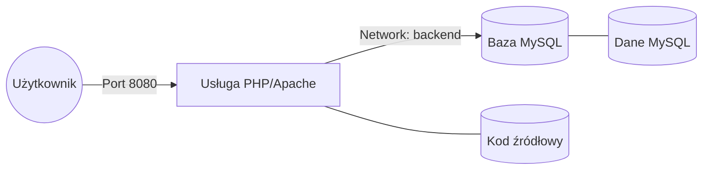

# Przykład 02: PHP + MySQL (Docker Compose)

Przykład wielokontenerowej aplikacji wykorzystującej Docker Compose do połączenia serwera Apache (z PHP) oraz bazy danych MySQL.

## Architektura aplikacji



## Instrukcje

1. **Uruchomienie usług:**
   ```bash
   docker compose up -d
   ```

2. **Dostęp do aplikacji:**
   Przejdź pod adres [http://localhost:8080](http://localhost:8080).

3. **Zatrzymywanie aplikacji:**
   ```bash
   docker compose down
   ```

4. **Usuwanie wraz z danymi (wolumenami):**
   ```bash
   docker compose down -v
   ```

## Dane dostępowe do bazy (wewnątrz sieci Dockera)
- **Host:** `db`
- **Baza danych:** `appdb`
- **Użytkownik:** `appuser`
- **Hasło:** `apppass`

## Kluczowe aspekty
- **Docker Compose:** Definiuje całą infrastrukturę w jednym pliku `.yaml`.
- **Wolumeny:** Zapewniają trwałość danych bazy danych nawet po usunięciu kontenerów.
- **Sieci (Networks):** Kontenery komunikują się ze sobą po nazwach usług (np. `db`).
