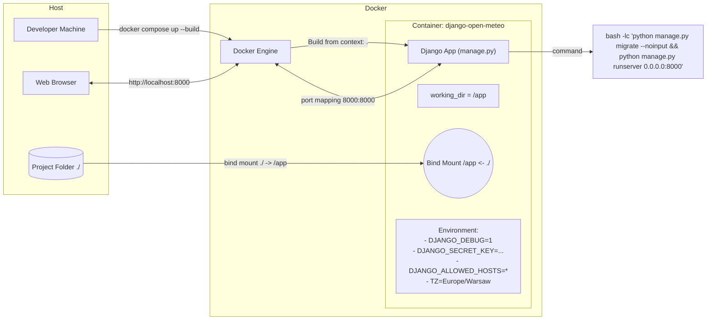

# Django (Open Meteo) - Docker Compose Overview

This example runs a Django application in Docker using a single `web` service defined in `docker-compose.yaml`.

- Builds the image from the current directory.
- Runs database migrations, then starts the Django development server.
- Maps host port 8000 to container port 8000.
- Mounts the project directory into the container for live code reload.
- Configures environment variables suited for development.

How to run:

1. From this directory run: `docker compose up --build`
2. Open: `http://localhost:8000`

---

## docker-compose.yaml (annotated)

Key directives explained:

- `build.context: .` - build image from the current directory.
- `container_name: django-open-meteo` - stable, friendly name for the container.
- `command:` - executes two steps at startup:
  1. `python manage.py migrate --noinput` - applies database migrations.
  2. `python manage.py runserver 0.0.0.0:8000` - starts the Django dev server bound to all interfaces.
- `ports: ["8000:8000"]` - publish container port 8000 as host port 8000.
- `environment:` - development settings:
  - `DJANGO_DEBUG=1` - enable Django debug mode.
  - `DJANGO_SECRET_KEY=change-me-in-prod` - placeholder secret; replace in production.
  - `DJANGO_ALLOWED_HOSTS=*` - allow all hosts (fine for dev only).
  - `TZ=Europe/Warsaw` - container timezone.
- `volumes: [./:/app]` - bind mount the working directory into the container (live code sync).
- `working_dir: /app` - set the working directory inside the container.

---

## Architecture (Mermaid flowchart)



---

## Startup sequence (Mermaid sequence diagram)

```mermaid
sequenceDiagram
  participant Dev as Developer
  participant Docker as Docker Engine
  participant C as Container (django-open-meteo)
  participant Django as Django app

  Dev->>Docker: docker compose up --build
  Docker->>Docker: Build image from context '.'
  Docker->>C: Create & start container
  Note over C: working_dir=/app\nVolumes: ./ -> /app\nEnv vars set
  C->>Django: python manage.py migrate --noinput
  Django-->>C: Applies migrations (SQLite or configured DB)
  C->>Django: python manage.py runserver 0.0.0.0:8000
  Note over C,Docker: Expose 8000; Map Host 8000 -> Container 8000
  Dev->>Django: Open http://localhost:8000
```

---

## Network and storage at a glance

```text
Host (localhost)
  |- Browser -> http://localhost:8000 --------------------|
  |- Project folder ./  (bind mounted)                    |
                                                          |  ports: 8000:8000
Docker Engine                                             v
  \- Container: django-open-meteo (service: web)
       * working_dir: /app
       * volume: ./  -> /app   (live code sync)
       * env: DJANGO_DEBUG=1, DJANGO_SECRET_KEY=..., DJANGO_ALLOWED_HOSTS=*, TZ=Europe/Warsaw
       * command: migrate DB -> run Django dev server at 0.0.0.0:8000
```

---

## Notes and recommendations

- This setup targets development. For production you would typically:
  - Use `gunicorn`/`uwsgi` behind a reverse proxy (e.g., Nginx) instead of `runserver`.
  - Provide a strong, secret value for `DJANGO_SECRET_KEY`.
  - Limit `DJANGO_ALLOWED_HOSTS` to explicit hostnames.
  - Consider replacing bind mounts with immutable images plus CI/CD.
  - Externalize the database (PostgreSQL/MySQL) instead of SQLite, and configure credentials via secrets.