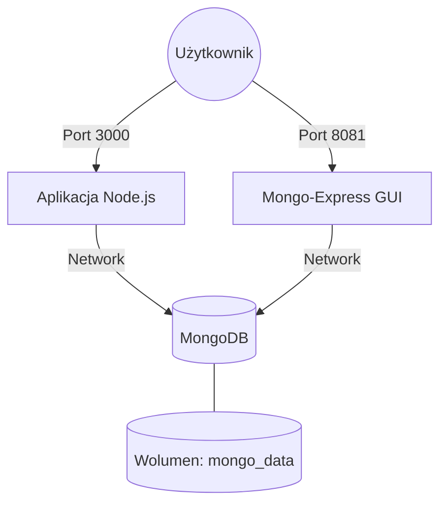

# Przykład 05: Node.js + MongoDB

Kompletny przykład aplikacji "To-Do" wykorzystujący Node.js (Express), bazę NoSQL MongoDB oraz panel administracyjny Mongo-Express.

## Architektura systemu



## Instrukcje

1. **Uruchomienie całego stosu:**
   ```bash
   docker compose up -d --build
   ```

2. **Dostęp do usług:**
   - **Aplikacja To-Do:** [http://localhost:3000](http://localhost:3000)
   - **Panel Mongo-Express:** [http://localhost:8081](http://localhost:8081)

3. **Zatrzymywanie:**
   ```bash
   docker compose down
   ```

4. **Czyszczenie (łącznie z danymi bazy):**
   ```bash
   docker compose down -v
   ```

## Kluczowe cechy
- **Mongo-Express:** Webowy interfejs do zarządzania bazą danych (ułatwia naukę i debugowanie).
- **Trwałość danych:** Zastosowanie nazwanego wolumenu `mongo_data` gwarantuje, że Twoje zadania nie znikną po restarcie kontenera.
- **Komunikacja wewn. Dockera:** Aplikacja łączy się z bazą używając URIs: `mongodb://mongo:27017/todos`.

## Struktura plików
- `Dockerfile`: Definiuje środowisko uruchomieniowe dla aplikacji Node.js.
- `docker-compose.yaml`: Orkiestruje trzy kontenery (web, baza, gui) oraz wolumeny.
- `src/`: Kod źródłowy aplikacji.
