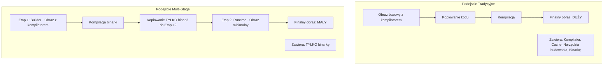

# Przykład 06: Multi-Stage Builds (Go)

Ten przykład demonstruje potęgę techniki **Multi-Stage Builds** na przykładzie prostej aplikacji w języku Go. Porównujemy tradycyjne podejście (jeden etap) z podejściem optymalnym (dwa etapy).

## Dlaczego Multi-Stage?



## Porównanie

| Cecha | Single-Stage (`Dockerfile.single`) | Multi-Stage (`Dockerfile.multi`) |
|-------|------------------------------------|---------------------------------|
| **Rozmiar obrazu** | ok. 300MB - 800MB | ok. 5MB - 15MB |
| **Bezpieczeństwo** | Niższe (zawiera shell, kompilator) | Wyższe (tylko binarka, brak shella) |
| **Szybkość wdrożenia** | Wolniejszy (duży obraz do pobrania) | Bardzo szybki (minimalny obraz) |

## Instrukcje

1. **Budowanie obu wersji:**
   ```bash
   # Wersja ciężka
   docker build -f Dockerfile.single -t msb-single .
   
   # Wersja lekka (Multi-stage)
   docker build -f Dockerfile.multi -t msb-multi .
   ```

2. **Porównanie rozmiarów:**
   ```bash
   docker images | grep msb-
   ```

3. **Uruchomienie:**
   ```bash
   docker run --rm -p 8080:8080 msb-multi
   ```

## Kluczowe komendy w Dockerfile
- `FROM ... AS builder`: Nadanie nazwy pierwszemu etapowi.
- `COPY --from=builder /ścieżka /cel`: Skopiowanie artefaktu z poprzedniego etapu do obecnego.
- `FROM scratch`: Użycie pustego obrazu jako bazy dla finalnego kontenera (maksymalna optymalizacja).
