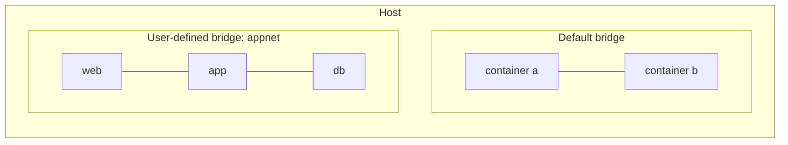
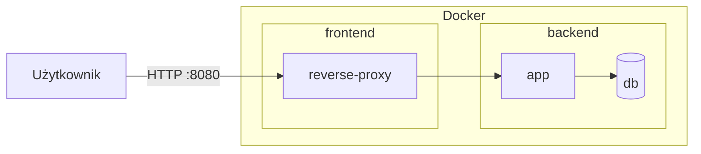

# Sieci w Dockerze — najlepsze praktyki i przykłady

Poniżej znajdziesz krótką instrukcję oraz gotowe pliki `docker-compose` pokazujące dobre praktyki budowania sieci w Dockerze. Wszystkie przykłady są minimalne, tak aby łatwo je uruchomić i przetestować.

## Dlaczego warto tworzyć własne sieci (user-defined networks)?

- Izolacja: kontenery na różnych sieciach nie widzą się nawzajem, o ile nie podłączysz ich do wspólnej sieci.
- Wbudowane DNS: usługi odnajdują się po nazwach serwisów (`service_name`) bez konieczności publikowania portów na hosta.
- Lepsza kontrola: możesz decydować, co jest dostępne tylko wewnątrz klastra kontenerów, a co ma być wystawione na zewnątrz.
- Czytelność i bezpieczeństwo: jawnie rozdzielisz ruch „frontend” od „backend”.

### Diagram: sieć domyślna vs sieć użytkownika



W sieciach użytkownika (user-defined bridge) działa automatyczne rozwiązywanie nazw serwisów oraz izolacja od innych sieci.

## Zasady dobrych praktyk

1. Twórz własne sieci zamiast polegać na domyślnej `bridge`.
2. Segmentuj ruch: oddziel „frontend” (ruch przychodzący z hosta/Internetu) od „backend” (wewnętrzna komunikacja mikrousług).
3. Nie publikuj portów usług wewnętrznych (np. bazy danych, cache). Użyj komunikacji po nazwach serwisów na sieci wewnętrznej.
4. Korzystaj z aliasów DNS i nazw usług zamiast twardych adresów IP.
5. Używaj opcji `internal: true` dla sieci, które nie powinny komunikować się z hostem.
6. Stosuj `healthcheck`, aby zależności startowały we właściwej kolejności i by orkiestracja była bardziej przewidywalna.
7. Minimalizuj użycie `macvlan` — to zaawansowany przypadek, zwykle zbędny w środowiskach deweloperskich. Jeżeli musisz, dokumentuj parametry i ryzyka.

### Diagram: segmentacja frontend/backend

```mermaid
flowchart LR
    subgraph Host
      IN[Klient/Przeglądarka] -->|HTTP :8080| RP[reverse-proxy]
    end
    subgraph Docker
      subgraph frontend[frontend (user-defined)]
        RP --> APP[app]
      end
      subgraph backend[backend (internal)]
        APP --> DB[(db)]
      end
    end
```

Reverse proxy (np. nginx) jest w sieci `frontend` i widoczny z hosta. Aplikacja łączy oba światy (frontend+backend). Baza danych jest wyłącznie w sieci `backend` i nie ma opublikowanych portów.

## Jak uruchamiać przykłady

W każdym katalogu z plikiem `docker-compose.*.yaml` uruchom:

```bash
docker compose -f docker-compose.NAZWA.yaml up -d
docker compose -f docker-compose.NAZWA.yaml ps
docker compose -f docker-compose.NAZWA.yaml logs -f
```

Zatrzymanie i usunięcie:

```bash
docker compose -f docker-compose.NAZWA.yaml down -v
```

## Przykłady w tym katalogu

- `docker-compose.simple.yaml` — pojedyncza sieć użytkownika, komunikacja po nazwach usług, minimalne wystawienie portów.
- `docker-compose.front-back.yaml` — segmentacja na `frontend` i `backend` (wewnętrzny). Reverse proxy publikuje port na hosta, DB jest tylko wewnętrzna.
- `docker-compose.internal.yaml` — sieć `internal: true` dla serwisu pomocniczego (np. Redis), bez publikowania portów na hosta.
- `docker-compose.macvlan.yaml` — zaawansowana konfiguracja `macvlan` (tylko dla świadomych ryzyk; wymaga dopasowania do twojej sieci LAN).

---

## Szybkie komendy sieciowe Docker

- Lista sieci: `docker network ls`
- Inspekcja sieci: `docker network inspect NAZWA_SIECI`
- Tworzenie sieci bridge: `docker network create --driver bridge appnet`
- Tworzenie sieci internal: `docker network create --driver bridge --internal backend`
- Podłączanie/odłączanie kontenera: `docker network connect|disconnect`

## Checklist bezpieczeństwa i porządku

- [ ] Czy każda usługa ma tylko niezbędne porty wystawione na hosta?
- [ ] Czy baza danych/cache są niedostępne z hosta (brak publikowanych portów) i znajdują się w sieci wewnętrznej?
- [ ] Czy korzystasz z nazw usług zamiast adresów IP?
- [ ] Czy zastosowano `healthcheck` dla wrażliwych zależności (DB, cache), o ile to potrzebne?
- [ ] Czy `macvlan` jest naprawdę potrzebny? Jeśli tak, czy parametry zostały dopasowane do twojej sieci?

---

## Jeszcze trochę teorii o sieciach w Dockerze

Poniżej zebrano krótkie kompendium, które pomoże lepiej zrozumieć, jak Docker realizuje sieci i rozwiązywanie nazw.

### Typy sieci

- bridge (Linux): domyślny tryb dla kontenerów na hoście Linux. Warianty:
  - default bridge: historyczna, wspólna sieć `bridge` – ograniczona funkcjonalnie (brak wbudowanego DNS między kontenerami). Nie zalecana do nowych wdrożeń.
  - user-defined bridge: rekomendowana. Zapewnia izolację między sieciami, wbudowany DNS, aliasy i lepszą kontrolę IPAM.
- host: kontener współdzieli sieć hosta (brak NAT, brak izolacji portów). Przydatne tylko w specyficznych scenariuszach (np. aplikacje wymagające broadcastu/MDNS lub minimalnego narzutu sieciowego). Uwaga na konflikty portów z hostem.
- none: całkowity brak sieci – kontener nie ma interfejsów poza loopback. Przydatne do zadań offline lub z własnym stosem sieci (np. narzędzia diagnostyczne).
- macvlan/ipvlan: kontener dostaje „własny” adres w twojej sieci L2/L3. Zaawansowane, wymagają świadomej konfiguracji i zrozumienia ograniczeń (np. host i kontener na macvlan często nie widzą się bez dodatkowych tras).
- overlay: sieć rozproszona (wielohostowa) używana głównie z Docker Swarm. W Compose na pojedynczym hoście zwykle nie jest potrzebna.

### Jak działa DNS w Dockerze

- Każda sieć user-defined ma wbudowany serwer DNS. Kontenery rozwiązują nazwy innych usług po nazwie serwisu (`service_name`) w obrębie tej samej sieci.
- Aliasy: w Compose można definiować `networks: <net>.aliases`, aby nadać dodatkowe nazwy DNS.
- Round-robin: przy wielu replikach tej samej usługi (np. `deploy.replicas` lub skalowanie), wbudowany DNS zwraca wiele rekordów A; klienci zwykle łączą się w trybie round-robin po stronie resolvera/klienta.
- Zasięg: nazwy są rozwiązywane w obrębie sieci, do której podłączone są oba kontenery. Jeśli kontenery nie współdzielą sieci – nie zobaczą się po nazwie.
- Diagnostyka: wewnątrz kontenera użyj `getent hosts <nazwa>`, `nslookup`/`dig` (jeśli dostępne) lub `ping` (jeśli zainstalowany), aby potwierdzić rozwiązywanie nazw.

### Porty, EXPOSE i łączność wewnętrzna

- Publikowanie portów (`ports:` w Compose lub `-p host:container`) jest potrzebne tylko, gdy ruch ma wejść/wyjść z hosta. Komunikacja między kontenerami w tej samej sieci nie wymaga publikowania portów.
- `EXPOSE` w Dockerfile to jedynie informacja/konwencja – nie publikuje portu na hosta. Ułatwia dokumentowanie tego, na jakich portach nasłuchuje aplikacja.
- Sieci `internal: true` blokują dostęp z/do hosta (brak ruchu zewnętrznego). Kontenery w takiej sieci mogą rozmawiać tylko między sobą lub przez kontener, który jest podłączony także do innej sieci.

### IPAM i adresacja

- IPAM (IP Address Management) pozwala ustawiać własne podsieci, bramy i – opcjonalnie – statyczne adresy IP dla kontenerów w sieciach user-defined.
- Ustalając własne podsieci, unikaj kolizji z adresacją istniejącą na hoście/VPN (częsty problem w środowiskach firmowych).
- Statyczne IP ułatwiają integrację z systemami zewnętrznymi, ale ogranicz je do minimum; zwykle nazwy usług i DNS wystarczają.

### Bezpieczeństwo w skrócie

- Izoluj usługi na osobnych sieciach (np. frontend vs backend). Nie publikuj portów baz danych i cache na hosta.
- Nie polegaj wyłącznie na domyślnych regułach iptables Dockera – wrażliwe środowiska warto dodatkowo chronić firewallami hosta i/lub politykami sieci (np. w K8s).
- Zasada najmniejszych uprawnień: tylko te usługi, które muszą być osiągalne z zewnątrz, powinny mieć publikowane porty.

### Diagnostyka i debugowanie

- Sprawdź sieci i połączenia: `docker network ls`, `docker network inspect <sieć>`.
- Z poziomu kontenera: `ip addr`, `ip route`, `ss -lntup`, `curl`, `wget`, `nc` – w zależności od obrazu możesz potrzebować doinstalować narzędzia.
- Test DNS: `getent hosts <usługa>` lub `nslookup <usługa>`.
- Podsłuch pakietów: na hoście `tcpdump -i <iface>` (wymaga uprawnień). Przydatne przy macvlan/ipvlan.

### Typowe pułapki

- VPN potrafi zmienić trasowanie i kolidować z podsieciami Docker – w razie problemów użyj innego zakresu (np. 172.18.0.0/16 zamiast 172.17.0.0/16).
- `macvlan`: host i kontener często nie komunikują się bezpośrednio; rozważ `ipvlan` lub dodatkowe trasy, jeśli to wymagane.
- Konflikt portów: tryb `host` oraz publikacja portów może kolidować z usługami na hoście – zweryfikuj, czy port nie jest zajęty.

#### Diagram: wiele sieci i brama aplikacyjna



Reverse-proxy jest jedynym elementem wystawionym na hosta; aplikacja łączy sieć `frontend` z `backend`, a DB pozostaje niewidoczna z zewnątrz.

### Dalsze przykłady

- Więcej gotowych kompozycji i diagramów znajdziesz także w: `examples/1--networks`.

## Częste pytania (FAQ)

**Czy muszę tworzyć kilka sieci?**
Nie zawsze, ale segmentacja często ułatwia bezpieczeństwo i zrozumienie architektury.

**Czemu nie publikować portów bazy danych?**
Bo nie jest to potrzebne do komunikacji między kontenerami i obniża bezpieczeństwo. Wystarczy, że aplikacja łączy się po nazwie serwisu w sieci wewnętrznej.

**Kiedy macvlan ma sens?**
Gdy kontener musi być „pełnoprawnym” hostem w twojej sieci LAN (np. występować z własnym IP), a standardowy `bridge` jest niewystarczający. Wymaga to jednak bardzo ostrożnej konfiguracji.
