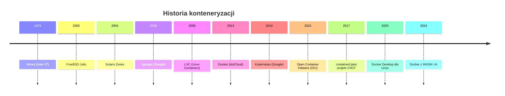
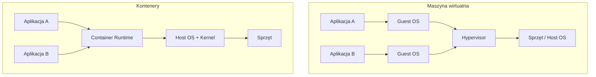
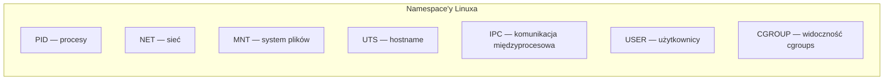
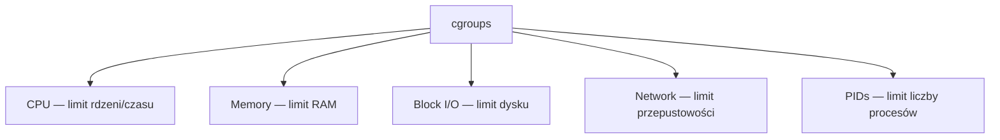
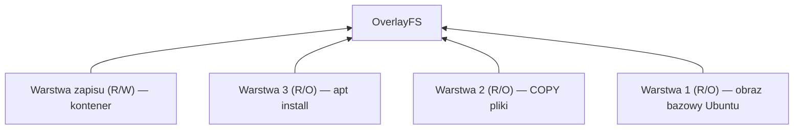
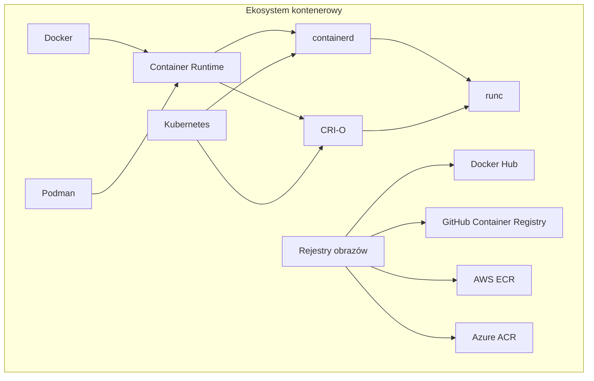
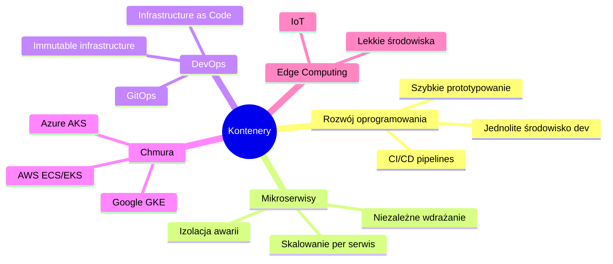
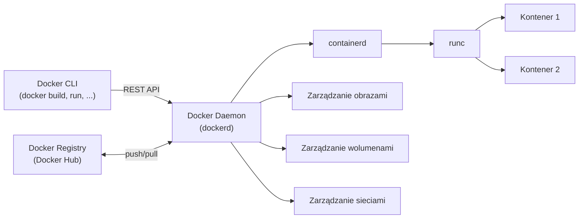
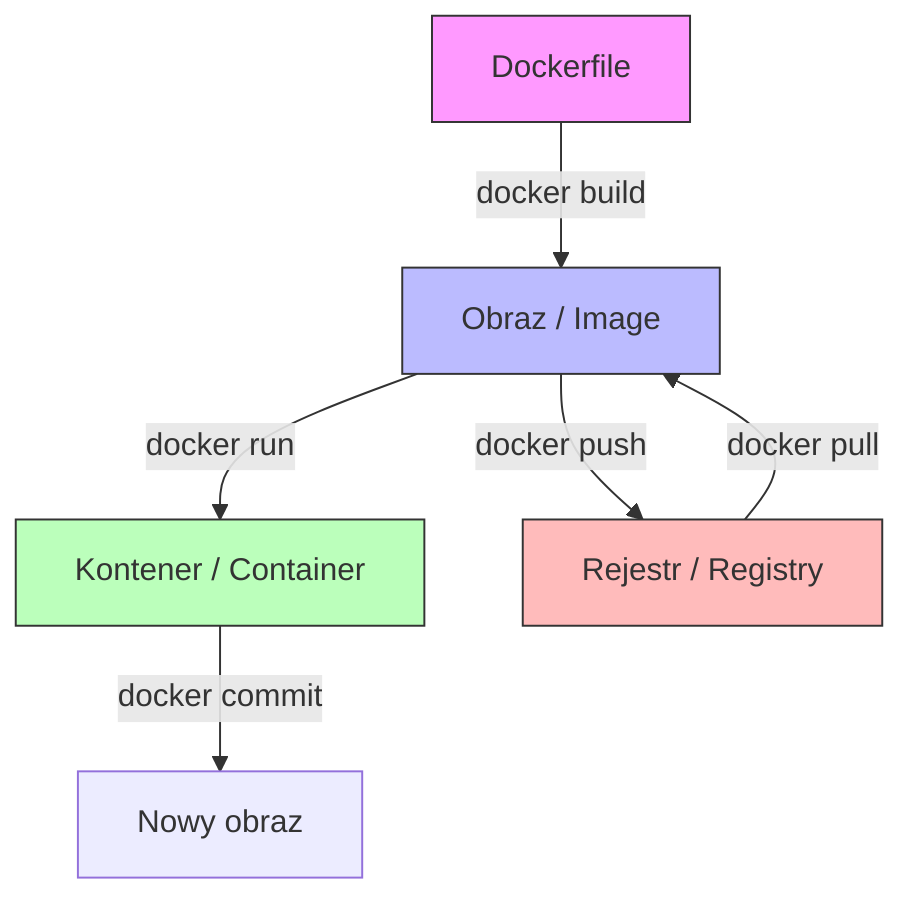

# Wykład 1: Wprowadzenie do konteneryzacji (2 godz.)

## 1.1 Czym jest konteneryzacja?

Konteneryzacja to metoda wirtualizacji na poziomie systemu operacyjnego, która pozwala uruchamiać aplikacje w izolowanych środowiskach zwanych **kontenerami**. W odróżnieniu od tradycyjnej wirtualizacji (maszyny wirtualne), kontenery współdzielą jądro systemu operacyjnego hosta, co czyni je znacznie lżejszymi i szybszymi.

### Kluczowe cechy konteneryzacji
- **Izolacja** — każdy kontener działa niezależnie od innych
- **Przenośność** — kontener działa tak samo na każdej maszynie
- **Lekkość** — brak potrzeby emulacji całego systemu operacyjnego
- **Szybkość** — uruchomienie kontenera trwa sekundy, nie minuty
- **Skalowalność** — łatwe tworzenie wielu instancji tej samej aplikacji

## 1.2 Historia konteneryzacji



### Kamienie milowe
| Rok  | Wydarzenie | Znaczenie |
|------|-----------|-----------|
| 1979 | `chroot`  | Pierwsza forma izolacji systemu plików w Unix |
| 2006 | cgroups   | Google wprowadza kontrolę zasobów w jądrze Linux |
| 2008 | LXC       | Pierwsze pełne kontenery Linux |
| 2013 | Docker    | Rewolucja — kontenery stają się dostępne dla każdego |
| 2014 | Kubernetes| Orkiestracja kontenerów na dużą skalę |

## 1.3 Maszyny wirtualne vs kontenery



### Porównanie

| Cecha | Maszyna wirtualna | Kontener |
|-------|-------------------|----------|
| Izolacja | Pełna (osobne jądro) | Na poziomie procesu |
| Rozmiar | GB (pełny OS) | MB (tylko aplikacja + zależności) |
| Czas startu | Minuty | Sekundy |
| Wydajność | Narzut hypervisora | Bliska natywnej |
| Przenośność | Ograniczona | Bardzo wysoka |
| Gęstość | Dziesiątki na host | Setki/tysiące na host |
| Bezpieczeństwo | Silna izolacja | Słabsza izolacja (współdzielone jądro) |

## 1.4 Technologie stojące za kontenerami Linux

Kontenery w Linuxie opierają się na trzech kluczowych mechanizmach jądra:

### Namespaces (przestrzenie nazw)
Zapewniają **izolację** — każdy kontener widzi własny „świat":



- **PID namespace** — kontener widzi tylko swoje procesy (PID 1 = główny proces kontenera)
- **NET namespace** — własny stos sieciowy, interfejsy, tablice routingu
- **MNT namespace** — własny system plików (overlay filesystem)
- **UTS namespace** — własna nazwa hosta
- **IPC namespace** — izolacja komunikacji międzyprocesowej
- **USER namespace** — mapowanie użytkowników (root w kontenerze ≠ root na hoście)

### cgroups (Control Groups)
Zapewniają **kontrolę zasobów** — limitowanie CPU, pamięci, I/O:



### Union Filesystem (OverlayFS)
Zapewnia **warstwowy system plików** — obrazy składają się z warstw tylko do odczytu, a kontener dodaje warstwę zapisu:



## 1.5 Ekosystem konteneryzacji



### Główne narzędzia
- **Docker** — najpopularniejsza platforma kontenerowa (nasze główne narzędzie)
- **Podman** — alternatywa bez demona (daemonless)
- **containerd** — runtime kontenerów (używany przez Docker i Kubernetes)
- **Kubernetes (K8s)** — orkiestracja kontenerów na dużą skalę
- **Docker Compose** — orkiestracja wielu kontenerów na jednym hoście

## 1.6 Zastosowania kontenerów w praktyce

### Typowe scenariusze użycia



### Kto używa kontenerów?
- **Netflix** — tysiące mikroserwisów
- **Spotify** — ponad 1800 serwisów w kontenerach
- **Google** — uruchamia miliardy kontenerów tygodniowo
- **Allegro** — mikroserwisy na Kubernetes

## 1.7 Architektura Docker



### Komponenty Docker
1. **Docker CLI** — interfejs wiersza poleceń
2. **Docker Daemon (dockerd)** — serwer zarządzający kontenerami
3. **containerd** — runtime kontenerów
4. **runc** — niskopoziomowy runtime (tworzy kontenery)
5. **Docker Registry** — repozytorium obrazów (Docker Hub)

## 1.8 Instalacja Dockera

### Linux (Ubuntu/Debian)
```bash
# Aktualizacja pakietów
sudo apt-get update

# Instalacja zależności
sudo apt-get install -y ca-certificates curl gnupg

# Dodanie klucza GPG Dockera
sudo install -m 0755 -d /etc/apt/keyrings
curl -fsSL https://download.docker.com/linux/ubuntu/gpg | sudo gpg --dearmor -o /etc/apt/keyrings/docker.gpg

# Dodanie repozytorium
echo "deb [arch=$(dpkg --print-architecture) signed-by=/etc/apt/keyrings/docker.gpg] https://download.docker.com/linux/ubuntu $(lsb_release -cs) stable" | sudo tee /etc/apt/sources.list.d/docker.list > /dev/null

# Instalacja Docker Engine
sudo apt-get update
sudo apt-get install -y docker-ce docker-ce-cli containerd.io docker-buildx-plugin docker-compose-plugin

# Dodanie użytkownika do grupy docker
sudo usermod -aG docker $USER
```

### Weryfikacja instalacji
```bash
docker --version
docker compose version
docker run hello-world
```

## 1.9 Podstawowe pojęcia



| Pojęcie | Opis |
|---------|------|
| **Obraz (Image)** | Szablon tylko do odczytu, zawierający aplikację i jej zależności |
| **Kontener (Container)** | Uruchomiona instancja obrazu — izolowany proces |
| **Dockerfile** | Plik tekstowy z instrukcjami budowania obrazu |
| **Rejestr (Registry)** | Magazyn obrazów (np. Docker Hub) |
| **Warstwa (Layer)** | Pojedyncza zmiana w obrazie (każda instrukcja Dockerfile = warstwa) |
| **Tag** | Etykieta wersji obrazu (np. `ubuntu:22.04`) |
| **Wolumen (Volume)** | Trwałe przechowywanie danych poza kontenerem |

## 1.10 Podsumowanie

- Konteneryzacja to lekka forma wirtualizacji na poziomie OS
- Docker to najpopularniejsze narzędzie do pracy z kontenerami
- Kontenery opierają się na namespaces, cgroups i union filesystem
- Obraz to szablon, kontener to uruchomiona instancja obrazu
- Kontenery rewolucjonizują sposób tworzenia, dostarczania i uruchamiania aplikacji

### Pytania kontrolne
1. Czym różni się kontener od maszyny wirtualnej?
2. Jakie mechanizmy jądra Linux umożliwiają działanie kontenerów?
3. Jaka jest różnica między obrazem a kontenerem?
4. Wymień trzy zalety konteneryzacji.
5. Jakie komponenty wchodzą w skład architektury Docker?

### Literatura
- Docker Documentation: https://docs.docker.com/
- „Docker Deep Dive" — Nigel Poulton
- „Konteneryzacja z Dockerem" — materiały kursu
