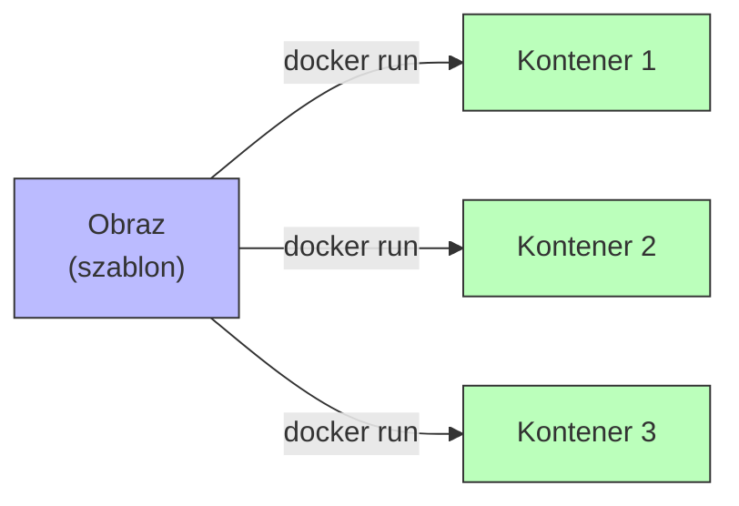
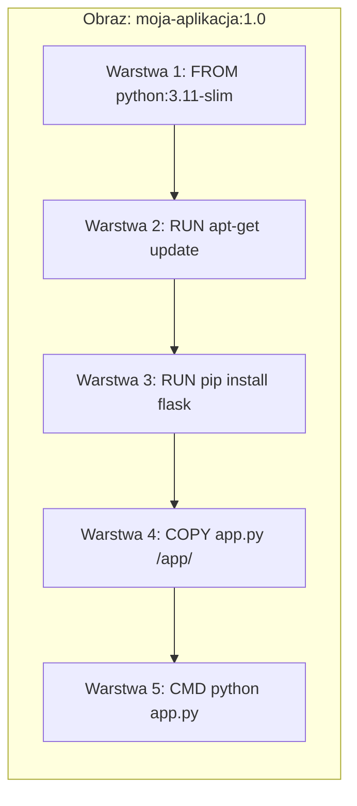
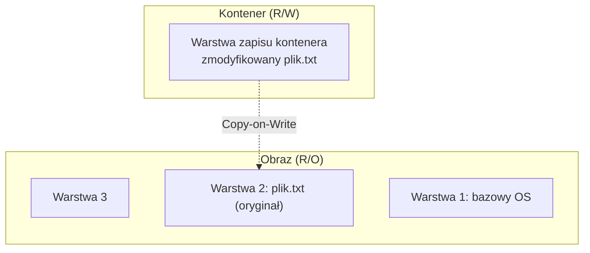
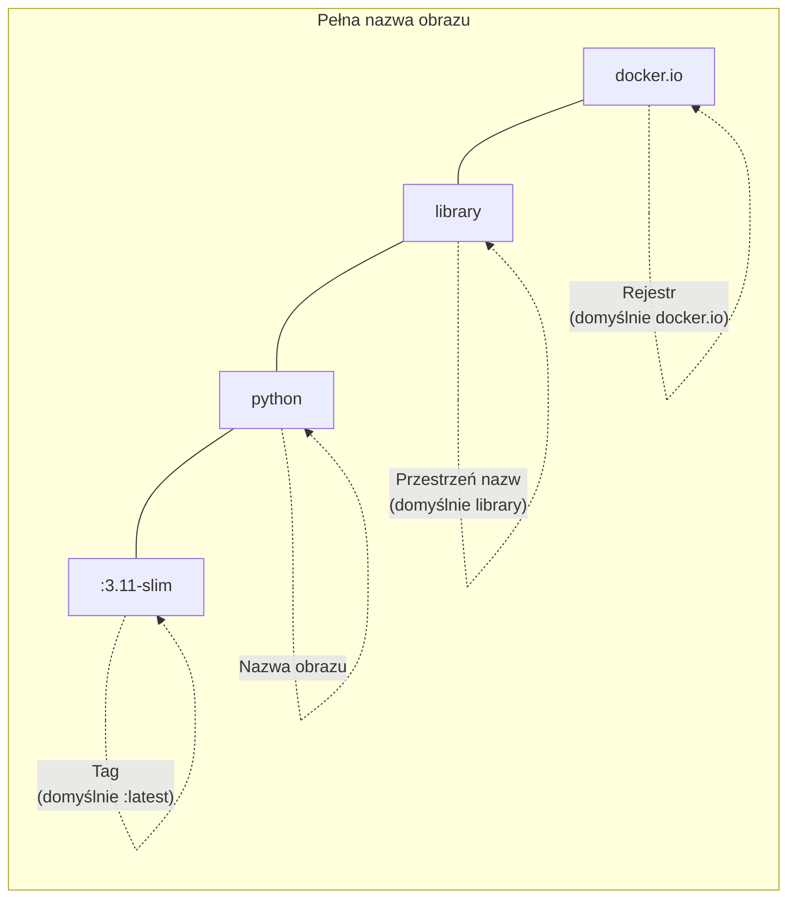
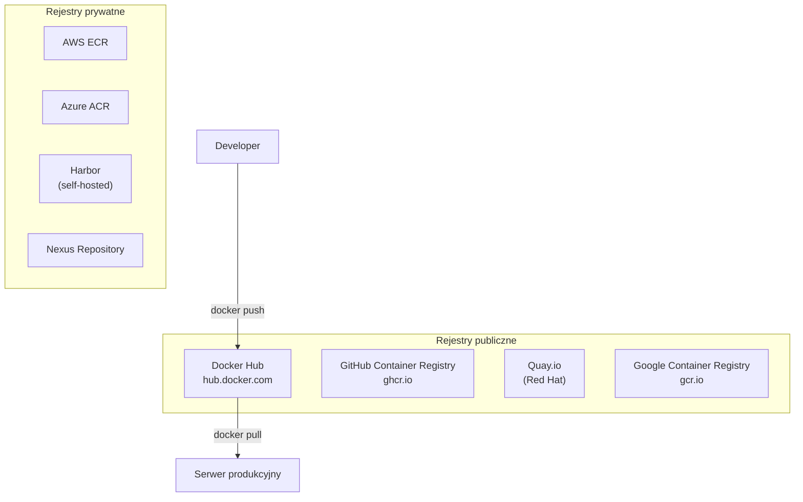
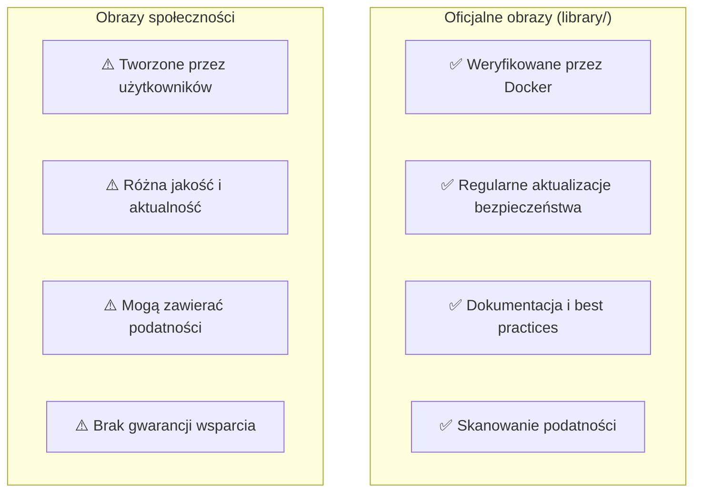
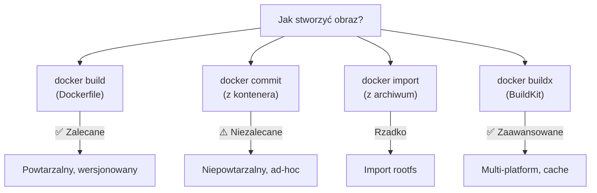
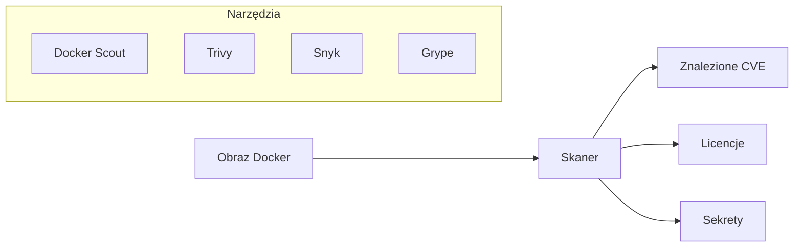
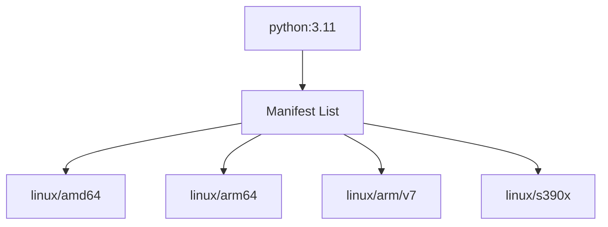

# Wykład 2: Obrazy Docker i rejestry (2 godz.)

## 2.1 Czym jest obraz Docker?

Obraz Docker to **niezmienny (immutable) szablon** służący do tworzenia kontenerów. Składa się z warstw (layers), z których każda reprezentuje zestaw zmian w systemie plików.

### Analogia
- **Obraz** = klasa w programowaniu obiektowym
- **Kontener** = instancja (obiekt) tej klasy



## 2.2 Warstwy obrazu (Image Layers)

Każda instrukcja w Dockerfile tworzy nową warstwę. Warstwy są **tylko do odczytu** i mogą być **współdzielone** między obrazami.



### Mechanizm Copy-on-Write (CoW)
Gdy kontener modyfikuje plik z warstwy obrazu:
1. Plik jest **kopiowany** do warstwy zapisu kontenera
2. Modyfikacja dotyczy **tylko kopii** w warstwie kontenera
3. Oryginalna warstwa obrazu pozostaje **nienaruszona**



### Podgląd warstw
```bash
# Historia warstw obrazu
docker history python:3.11-slim

# Szczegółowe informacje o obrazie
docker inspect python:3.11-slim

# Rozmiar warstw
docker image inspect python:3.11-slim --format='{{.Size}}'
```

## 2.3 Identyfikacja obrazów

### Nazewnictwo obrazów
```
[rejestr/][przestrzeń_nazw/]nazwa[:tag][@digest]
```



### Przykłady nazw
| Skrócona | Pełna | Opis |
|----------|-------|------|
| `ubuntu` | `docker.io/library/ubuntu:latest` | Oficjalny obraz Ubuntu |
| `python:3.11` | `docker.io/library/python:3.11` | Python z tagiem wersji |
| `nginx:alpine` | `docker.io/library/nginx:alpine` | Nginx na Alpine Linux |
| `myuser/myapp:v2` | `docker.io/myuser/myapp:v2` | Obraz użytkownika |
| `ghcr.io/org/app:1.0` | `ghcr.io/org/app:1.0` | GitHub Container Registry |

### Tagi (Tags)
- Tag `latest` jest **domyślny**, ale **nie oznacza najnowszego**!
- Dobre praktyki: używaj **konkretnych tagów** wersji (`python:3.11.9`, nie `python:latest`)
- Jeden obraz może mieć **wiele tagów**

### Digest (SHA256)
```bash
# Pobranie obrazu z konkretnym digestem (niezmiennym)
docker pull python@sha256:abc123...

# Sprawdzenie digestu
docker images --digests
```

## 2.4 Rejestry obrazów (Container Registries)

Rejestr to **serwer przechowujący obrazy kontenerów**. Działa jak „GitHub dla obrazów Docker".



### Docker Hub
- Największy publiczny rejestr obrazów
- **Oficjalne obrazy** (verified) — utrzymywane przez Docker Inc. i partnerów
- **Obrazy społeczności** — tworzone przez użytkowników
- Darmowe konto: nieograniczone publiczne repozytoria, 1 prywatne

### Operacje na rejestrze
```bash
# Logowanie do Docker Hub
docker login

# Pobranie obrazu
docker pull nginx:latest

# Tagowanie obrazu
docker tag moja-app:latest mojeuser/moja-app:v1.0

# Wysłanie obrazu do rejestru
docker push mojeuser/moja-app:v1.0

# Wyszukiwanie obrazów
docker search python
```

## 2.5 Oficjalne obrazy vs obrazy społeczności



### Jak rozpoznać oficjalny obraz?
- Brak prefiksu użytkownika: `nginx`, `python`, `postgres`
- Oznaczenie „Docker Official Image" na Docker Hub
- Utrzymywane w repozytorium `docker-library`

### Warianty oficjalnych obrazów
| Wariant | Opis | Rozmiar | Przykład |
|---------|------|---------|---------|
| `<default>` | Pełny obraz (Debian) | Duży | `python:3.11` |
| `-slim` | Okrojony Debian | Średni | `python:3.11-slim` |
| `-alpine` | Na bazie Alpine Linux | Mały | `python:3.11-alpine` |
| `-bookworm` | Konkretna wersja Debian | Duży | `python:3.11-bookworm` |
| `-windowsservercore` | Windows Server Core | Bardzo duży | `python:3.11-windowsservercore` |

```bash
# Porównanie rozmiarów
docker pull python:3.11          # ~1 GB
docker pull python:3.11-slim     # ~150 MB
docker pull python:3.11-alpine   # ~50 MB
```

## 2.6 Zarządzanie obrazami lokalnie

### Podstawowe komendy
```bash
# Lista lokalnych obrazów
docker images
docker image ls

# Szczegóły obrazu
docker image inspect nginx

# Historia warstw
docker history nginx

# Usunięcie obrazu
docker image rm nginx
docker rmi nginx

# Usunięcie nieużywanych obrazów
docker image prune

# Usunięcie WSZYSTKICH nieużywanych obrazów
docker image prune -a

# Eksport obrazu do pliku tar
docker save -o nginx.tar nginx:latest

# Import obrazu z pliku tar
docker load -i nginx.tar
```

### Filtrowanie obrazów
```bash
# Obrazy bez tagu (dangling)
docker images -f "dangling=true"

# Obrazy przed konkretnym obrazem
docker images -f "before=nginx:latest"

# Tylko ID obrazów
docker images -q

# Formatowanie wyjścia
docker images --format "{{.Repository}}:{{.Tag}} - {{.Size}}"
```

## 2.7 Budowanie obrazów — przegląd metod



### docker commit (niezalecane)
```bash
# Uruchomienie kontenera
docker run -it ubuntu bash

# Wewnątrz kontenera: instalacja pakietów
apt-get update && apt-get install -y curl

# W innym terminalu: zapisanie jako nowy obraz
docker commit <container_id> moj-ubuntu-z-curl:v1
```

### docker build (zalecane)
```bash
# Budowanie z Dockerfile
docker build -t moja-app:v1 .

# Budowanie z kontekstem z innego katalogu
docker build -t moja-app:v1 -f Dockerfile.prod ./src
```

## 2.8 Skanowanie bezpieczeństwa obrazów



### Docker Scout
```bash
# Skanowanie obrazu
docker scout cves nginx:latest

# Szybki przegląd
docker scout quickview nginx:latest

# Rekomendacje
docker scout recommendations nginx:latest
```

### Trivy (open-source)
```bash
# Instalacja i skanowanie
docker run aquasec/trivy image python:3.11

# Tylko krytyczne i wysokie podatności
docker run aquasec/trivy image --severity HIGH,CRITICAL python:3.11
```

## 2.9 Manifest i obrazy multi-platform

Jeden tag obrazu może wskazywać na **wiele wariantów** dla różnych architektur:



```bash
# Sprawdzenie manifestu
docker manifest inspect python:3.11

# Budowanie obrazu multi-platform (BuildKit)
docker buildx build --platform linux/amd64,linux/arm64 -t myapp:v1 .
```

## 2.10 Podsumowanie

- Obraz Docker to niezmienny, warstwowy szablon do tworzenia kontenerów
- Warstwy są współdzielone i cachowane — oszczędność miejsca i czasu
- Rejestry (Docker Hub, GHCR, ECR) przechowują i dystrybuują obrazy
- Używaj oficjalnych obrazów i konkretnych tagów wersji
- Skanuj obrazy pod kątem podatności bezpieczeństwa
- Mechanizm Copy-on-Write zapewnia efektywność kontenerów

### Pytania kontrolne
1. Czym jest warstwa (layer) w obrazie Docker?
2. Jak działa mechanizm Copy-on-Write?
3. Jaka jest różnica między oficjalnym obrazem a obrazem społeczności?
4. Dlaczego nie powinno się używać tagu `latest` w produkcji?
5. Wymień trzy warianty oficjalnych obrazów i ich zastosowania.
6. Jak sprawdzić podatności bezpieczeństwa w obrazie?

### Literatura
- Docker Image specification: https://docs.docker.com/reference/dockerfile/
- Docker Hub: https://hub.docker.com/
- OCI Image Spec: https://github.com/opencontainers/image-spec
