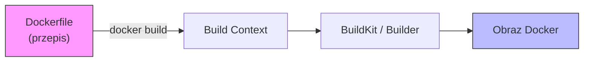
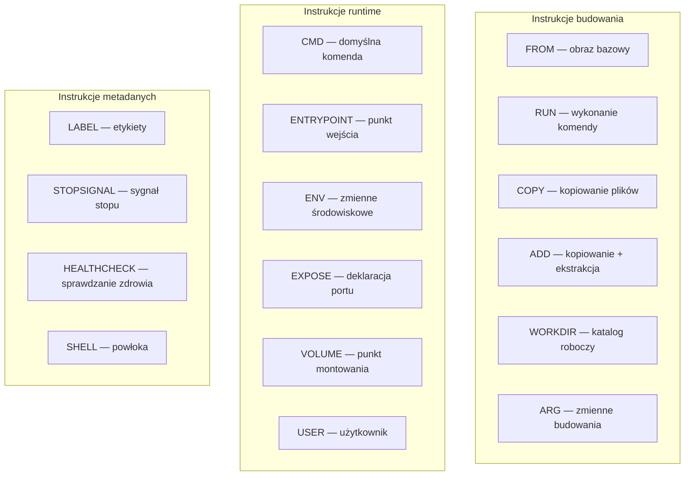
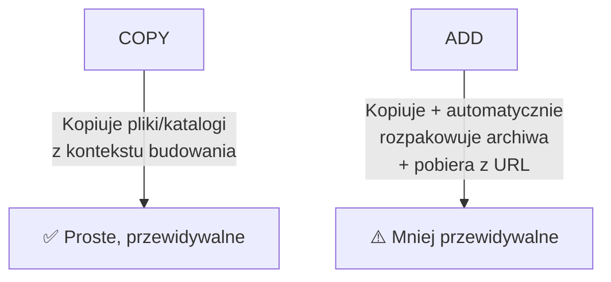
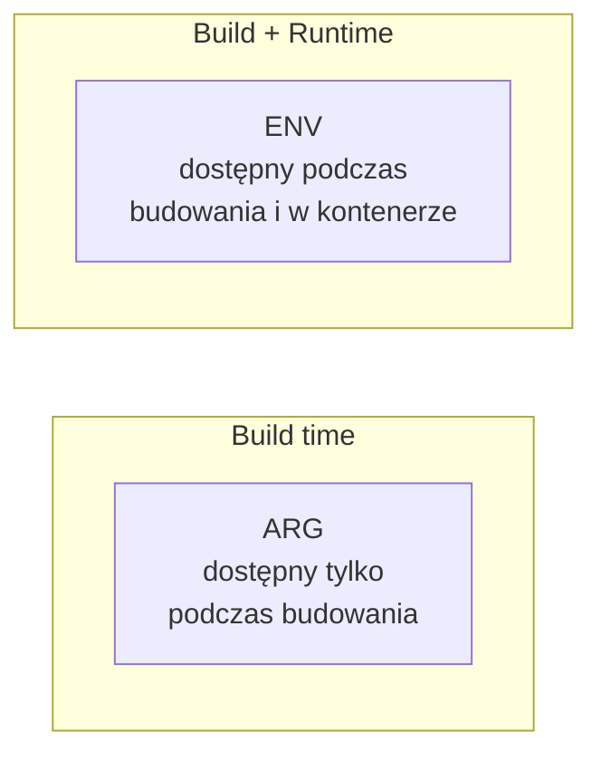
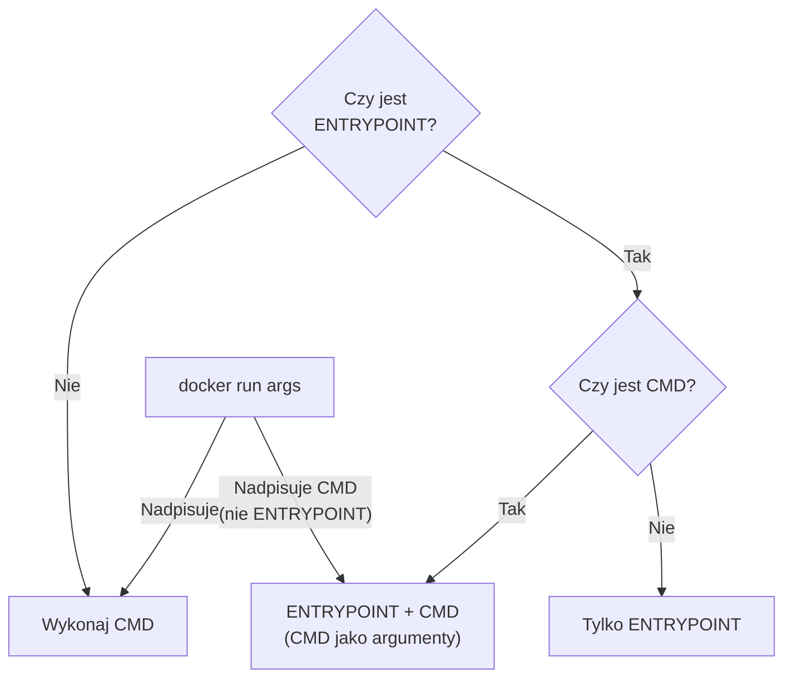
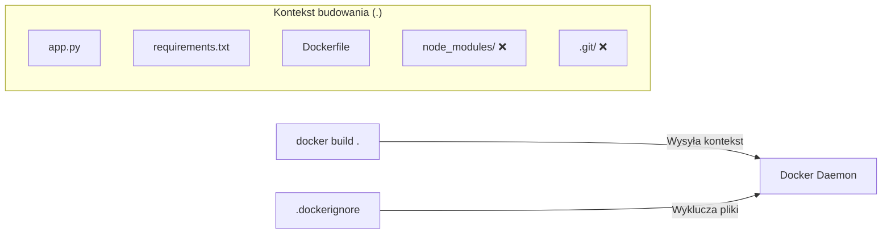
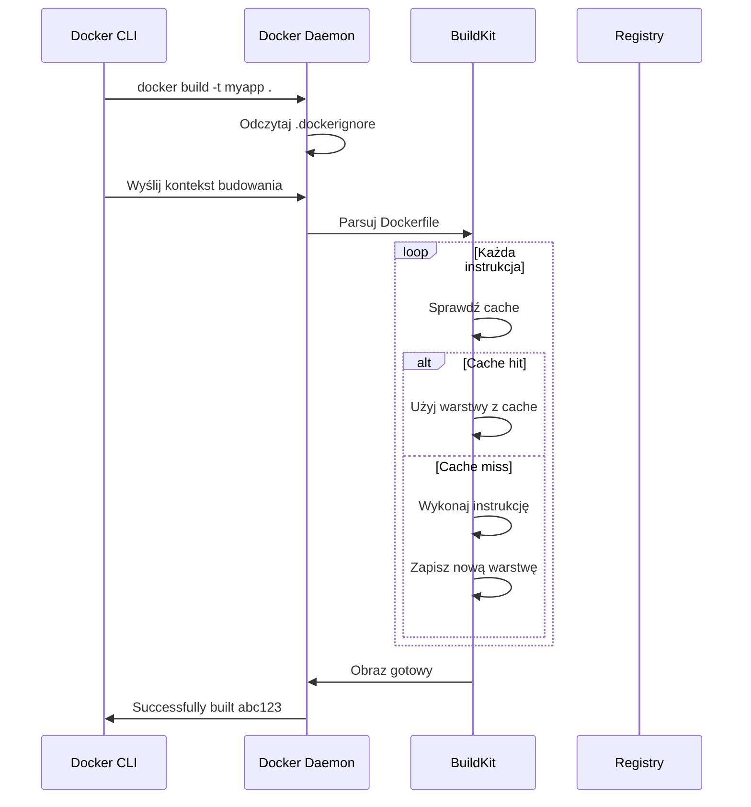
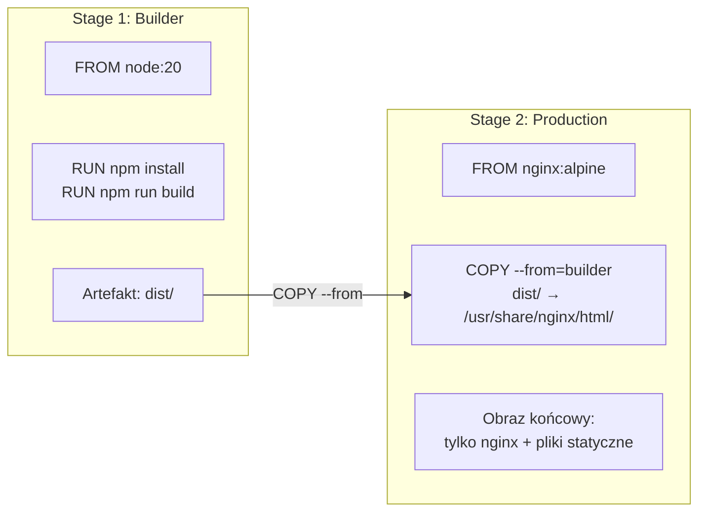
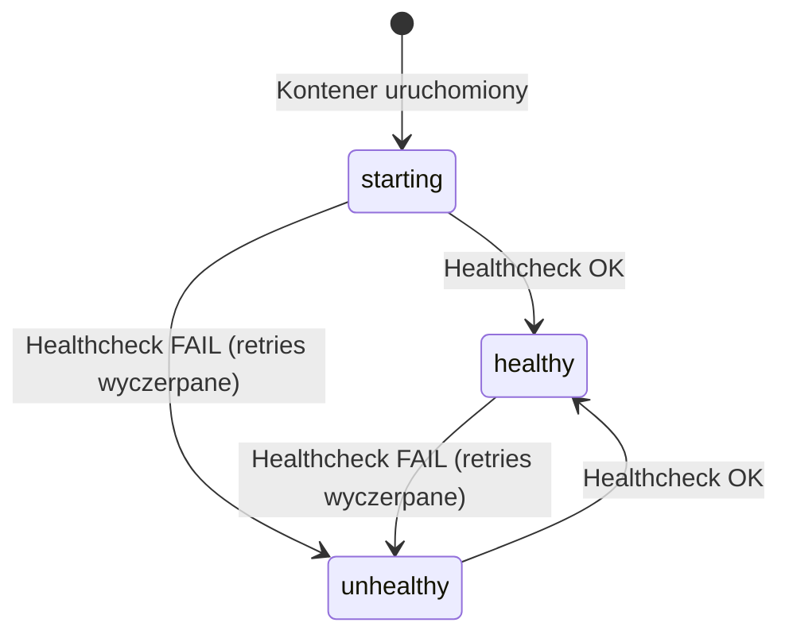

# Wykład 3: Dockerfile i budowanie obrazów (2 godz.)

## 3.1 Czym jest Dockerfile?

Dockerfile to **plik tekstowy** zawierający zestaw instrukcji opisujących, jak zbudować obraz Docker. Jest to „przepis" na tworzenie powtarzalnych, wersjonowanych obrazów kontenerów.



### Przykład prostego Dockerfile
```dockerfile
# Obraz bazowy
FROM python:3.11-slim

# Metadane
LABEL maintainer="student@uczelnia.pl"
LABEL version="1.0"

# Katalog roboczy
WORKDIR /app

# Kopiowanie zależności
COPY requirements.txt .

# Instalacja zależności
RUN pip install --no-cache-dir -r requirements.txt

# Kopiowanie kodu aplikacji
COPY . .

# Port aplikacji
EXPOSE 5000

# Komenda startowa
CMD ["python", "app.py"]
```

## 3.2 Instrukcje Dockerfile — kompletny przegląd



### FROM — obraz bazowy
```dockerfile
# Konkretna wersja (zalecane)
FROM python:3.11-slim

# Z aliasem (multi-stage build)
FROM node:20-alpine AS builder

# Pusty obraz (scratch)
FROM scratch
```

> **Zasada:** Każdy Dockerfile **musi** zaczynać się od `FROM` (z wyjątkiem `ARG` przed `FROM`).

### RUN — wykonanie komendy podczas budowania
```dockerfile
# Forma shell (uruchamia /bin/sh -c)
RUN apt-get update && apt-get install -y curl

# Forma exec (bez powłoki)
RUN ["apt-get", "install", "-y", "curl"]

# Łączenie komend (jedna warstwa zamiast wielu)
RUN apt-get update \
    && apt-get install -y --no-install-recommends \
        curl \
        wget \
    && rm -rf /var/lib/apt/lists/*
```

> **Ważne:** Każde `RUN` tworzy nową warstwę. Łącz komendy operatorem `&&`, aby minimalizować liczbę warstw.

### COPY vs ADD



| Cecha | COPY | ADD |
|-------|------|-----|
| Kopiowanie plików | ✅ | ✅ |
| Kopiowanie katalogów | ✅ | ✅ |
| Rozpakowywanie .tar | ❌ | ✅ (automatyczne) |
| Pobieranie z URL | ❌ | ✅ |
| Zalecane? | ✅ Tak | ⚠️ Tylko gdy potrzebna ekstrakcja |

```dockerfile
# COPY — zalecane
COPY app.py /app/
COPY src/ /app/src/

# ADD — rozpakowywanie archiwum
ADD archive.tar.gz /app/

# ADD — pobieranie z URL (lepiej użyć RUN curl)
ADD https://example.com/file.txt /app/
```

### WORKDIR — katalog roboczy
```dockerfile
# Ustawienie katalogu roboczego
WORKDIR /app

# Kolejne WORKDIR są relatywne
WORKDIR /app
WORKDIR src      # teraz jesteśmy w /app/src
WORKDIR ../config # teraz w /app/config
```

> **Zasada:** Używaj `WORKDIR` zamiast `RUN cd /katalog && ...`

### ENV — zmienne środowiskowe
```dockerfile
# Pojedyncza zmienna
ENV APP_VERSION=1.0

# Wiele zmiennych
ENV APP_HOME=/app \
    APP_PORT=5000 \
    DEBUG=false

# Użycie zmiennej
RUN echo "Wersja: $APP_VERSION"
WORKDIR $APP_HOME
```

### ARG — zmienne budowania (build-time)
```dockerfile
# Definicja argumentu z wartością domyślną
ARG PYTHON_VERSION=3.11

# Użycie w FROM
FROM python:${PYTHON_VERSION}-slim

# ARG po FROM musi być ponownie zadeklarowany
ARG APP_VERSION=1.0
LABEL version=$APP_VERSION
```

```bash
# Przekazanie argumentu podczas budowania
docker build --build-arg PYTHON_VERSION=3.12 -t myapp .
```

### Różnica między ARG a ENV



| Cecha | ARG | ENV |
|-------|-----|-----|
| Dostępny podczas budowania | ✅ | ✅ |
| Dostępny w kontenerze | ❌ | ✅ |
| Nadpisywany z CLI | `--build-arg` | `-e` / `--env` |
| Zapisany w warstwie | ❌ | ✅ |

## 3.3 CMD vs ENTRYPOINT

To jedno z najczęściej mylonych zagadnień w Dockerfile.

### CMD — domyślna komenda
```dockerfile
# Forma exec (zalecana)
CMD ["python", "app.py"]

# Forma shell
CMD python app.py

# Jako domyślne argumenty dla ENTRYPOINT
CMD ["--help"]
```

### ENTRYPOINT — punkt wejścia
```dockerfile
# Forma exec (zalecana)
ENTRYPOINT ["python", "app.py"]

# Forma shell (ignoruje CMD i argumenty docker run)
ENTRYPOINT python app.py
```

### Interakcja CMD i ENTRYPOINT



| Dockerfile | `docker run myimg` | `docker run myimg arg1` |
|-----------|-------------------|------------------------|
| `CMD ["echo", "hello"]` | `echo hello` | `arg1` |
| `ENTRYPOINT ["echo"]` | `echo` | `echo arg1` |
| `ENTRYPOINT ["echo"]` + `CMD ["hello"]` | `echo hello` | `echo arg1` |

### Przykład praktyczny
```dockerfile
# Kontener jako "narzędzie"
FROM python:3.11-slim
ENTRYPOINT ["python"]
CMD ["--version"]
```

```bash
docker run myimg              # python --version
docker run myimg app.py       # python app.py
docker run myimg -c "print(1)" # python -c "print(1)"
```

## 3.4 Kontekst budowania (Build Context)



### .dockerignore
Plik `.dockerignore` działa jak `.gitignore` — wyklucza pliki z kontekstu budowania:

```
# .dockerignore
.git
.gitignore
node_modules
__pycache__
*.pyc
.env
.vscode
.idea
Dockerfile
docker-compose*.yml
README.md
*.md
.DS_Store
```

> **Dlaczego to ważne?** Cały kontekst budowania jest wysyłany do demona Docker. Duży kontekst = wolne budowanie.

## 3.5 Proces budowania obrazu



### Cache warstw
Docker cachuje każdą warstwę. Jeśli instrukcja i jej kontekst się nie zmieniły, Docker użyje warstwy z cache.

**Kiedy cache jest unieważniany?**
- Zmiana instrukcji w Dockerfile
- Zmiana plików kopiowanych przez `COPY`/`ADD`
- Unieważnienie cache **propaguje się** do wszystkich kolejnych warstw

```dockerfile
# ❌ Źle — zmiana kodu unieważnia cache pip install
COPY . .
RUN pip install -r requirements.txt

# ✅ Dobrze — zależności cachowane osobno
COPY requirements.txt .
RUN pip install -r requirements.txt
COPY . .
```

## 3.6 Multi-stage builds

Multi-stage build pozwala używać **wielu instrukcji FROM** w jednym Dockerfile. Dzięki temu obraz końcowy zawiera tylko to, co potrzebne do uruchomienia aplikacji.



### Przykład: aplikacja Go
```dockerfile
# Stage 1: Kompilacja
FROM golang:1.22 AS builder
WORKDIR /app
COPY go.mod go.sum ./
RUN go mod download
COPY . .
RUN CGO_ENABLED=0 GOOS=linux go build -o /app/server .

# Stage 2: Obraz produkcyjny
FROM scratch
COPY --from=builder /app/server /server
EXPOSE 8080
ENTRYPOINT ["/server"]
```

### Przykład: aplikacja Python
```dockerfile
# Stage 1: Budowanie zależności
FROM python:3.11-slim AS builder
WORKDIR /app
COPY requirements.txt .
RUN pip install --user --no-cache-dir -r requirements.txt

# Stage 2: Obraz produkcyjny
FROM python:3.11-slim
WORKDIR /app
COPY --from=builder /root/.local /root/.local
COPY . .
ENV PATH=/root/.local/bin:$PATH
EXPOSE 5000
CMD ["python", "app.py"]
```

### Porównanie rozmiarów

| Aplikacja | Bez multi-stage | Z multi-stage | Redukcja |
|-----------|----------------|---------------|----------|
| Go API | ~800 MB | ~12 MB | 98.5% |
| Node.js frontend | ~1.2 GB | ~25 MB | 97.9% |
| Java Spring Boot | ~700 MB | ~200 MB | 71.4% |

## 3.7 HEALTHCHECK — sprawdzanie zdrowia kontenera

```dockerfile
HEALTHCHECK --interval=30s --timeout=10s --start-period=5s --retries=3 \
    CMD curl -f http://localhost:5000/health || exit 1
```



| Parametr | Domyślnie | Opis |
|----------|-----------|------|
| `--interval` | 30s | Odstęp między sprawdzeniami |
| `--timeout` | 30s | Maksymalny czas oczekiwania |
| `--start-period` | 0s | Czas na rozruch (błędy ignorowane) |
| `--retries` | 3 | Liczba prób przed oznaczeniem jako unhealthy |

## 3.8 USER — uruchamianie jako nie-root

```dockerfile
# Tworzenie użytkownika
RUN groupadd -r appuser && useradd -r -g appuser appuser

# Zmiana właściciela plików
RUN chown -R appuser:appuser /app

# Przełączenie na użytkownika
USER appuser

CMD ["python", "app.py"]
```

> **Bezpieczeństwo:** Domyślnie kontener działa jako `root`. W produkcji **zawsze** używaj użytkownika nie-root.

## 3.9 LABEL, EXPOSE, VOLUME, STOPSIGNAL

### LABEL — metadane obrazu
```dockerfile
LABEL maintainer="jan@example.com"
LABEL version="2.0"
LABEL description="Aplikacja webowa Flask"
LABEL org.opencontainers.image.source="https://github.com/user/repo"
```

### EXPOSE — deklaracja portu
```dockerfile
# Deklaracja (dokumentacja, nie otwiera portu!)
EXPOSE 5000
EXPOSE 5000/tcp
EXPOSE 5000/udp
```

> **Uwaga:** `EXPOSE` to tylko **dokumentacja**. Aby opublikować port, użyj `docker run -p 5000:5000`.

### VOLUME — punkt montowania
```dockerfile
# Deklaracja wolumenu
VOLUME /data
VOLUME ["/data", "/logs"]
```

### STOPSIGNAL
```dockerfile
# Sygnał wysyłany przy docker stop (domyślnie SIGTERM)
STOPSIGNAL SIGQUIT
```

## 3.10 Budowanie z BuildKit

BuildKit to nowoczesny silnik budowania obrazów Docker (domyślny od Docker 23.0).

### Zalety BuildKit
- **Równoległe budowanie** niezależnych warstw
- **Lepsze cachowanie** (mount cache)
- **Sekrety** podczas budowania (bez zapisywania w warstwie)
- **SSH forwarding** do prywatnych repozytoriów

```bash
# Włączenie BuildKit (jeśli nie jest domyślny)
DOCKER_BUILDKIT=1 docker build -t myapp .

# Cache mount — przyspieszenie instalacji pakietów
```

```dockerfile
# syntax=docker/dockerfile:1

FROM python:3.11-slim
WORKDIR /app
COPY requirements.txt .

# Cache mount dla pip
RUN --mount=type=cache,target=/root/.cache/pip \
    pip install -r requirements.txt

# Sekret podczas budowania (nie zapisany w warstwie!)
RUN --mount=type=secret,id=mytoken \
    cat /run/secrets/mytoken
    
COPY . .
CMD ["python", "app.py"]
```

```bash
# Budowanie z sekretem
docker build --secret id=mytoken,src=./token.txt -t myapp .
```

## 3.11 Podsumowanie

- Dockerfile to deklaratywny przepis na budowanie obrazu
- Kluczowe instrukcje: `FROM`, `RUN`, `COPY`, `CMD`, `ENTRYPOINT`, `WORKDIR`, `ENV`
- `COPY` jest preferowane nad `ADD` (prostsze, przewidywalne)
- `ENTRYPOINT` + `CMD` pozwalają na elastyczne uruchamianie kontenerów
- Multi-stage builds drastycznie redukują rozmiar obrazów
- `.dockerignore` minimalizuje kontekst budowania
- Cache warstw przyspiesza budowanie — kolejność instrukcji ma znaczenie
- BuildKit oferuje zaawansowane funkcje (cache mount, sekrety)

### Pytania kontrolne
1. Jaka jest różnica między `COPY` a `ADD`?
2. Jak współdziałają `CMD` i `ENTRYPOINT`?
3. Co to jest multi-stage build i kiedy go stosować?
4. Dlaczego kolejność instrukcji w Dockerfile ma znaczenie dla cache?
5. Jak bezpiecznie przekazać sekret podczas budowania obrazu?
6. Do czego służy plik `.dockerignore`?

### Literatura
- Dockerfile reference: https://docs.docker.com/reference/dockerfile/
- Best practices for Dockerfiles: https://docs.docker.com/build/building/best-practices/
- BuildKit: https://docs.docker.com/build/buildkit/
