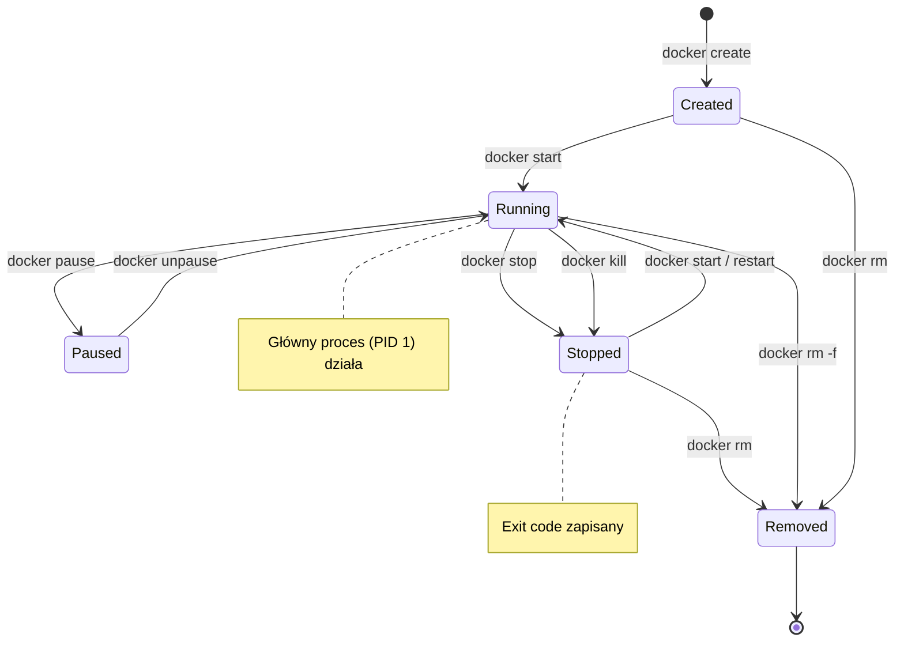
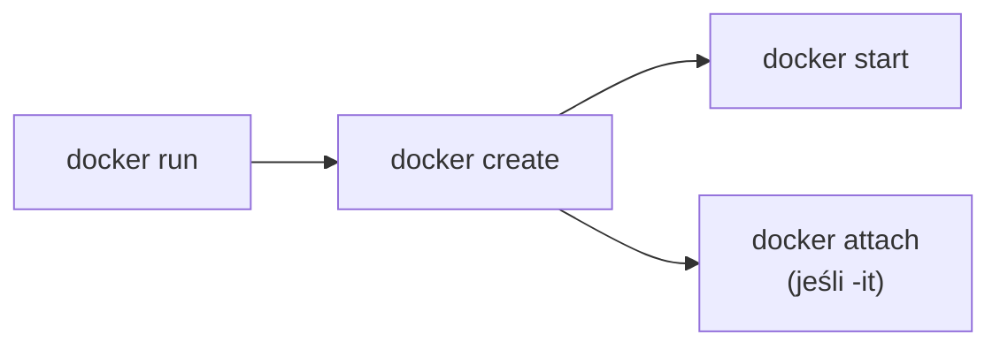
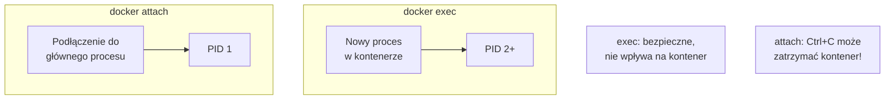
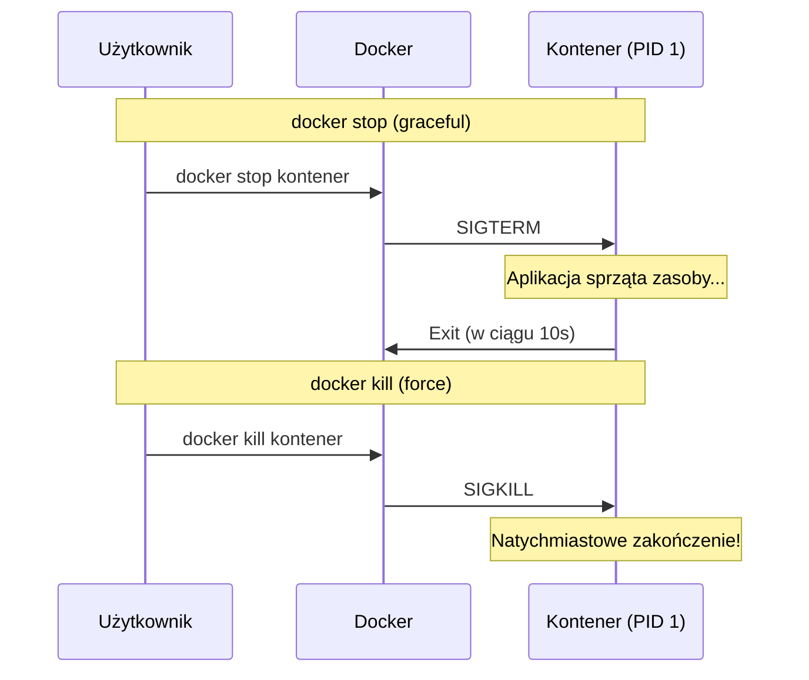
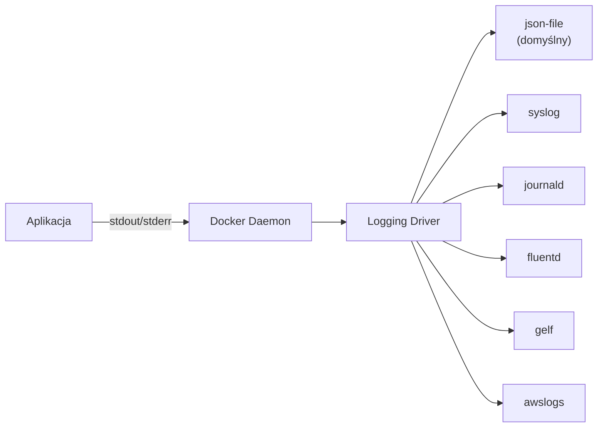
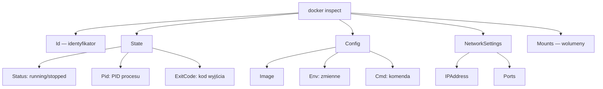
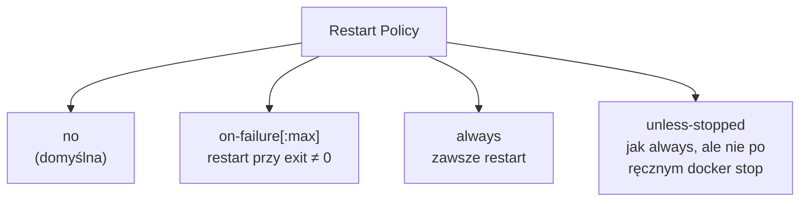
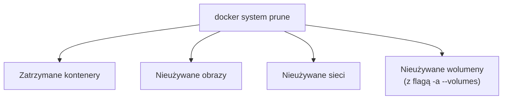
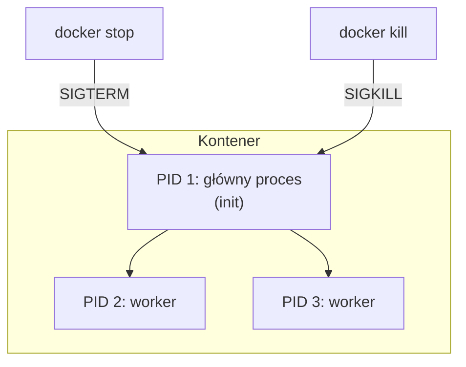

# Wykład 4: Kontenery — zarządzanie i cykl życia (2 godz.)

## 4.1 Cykl życia kontenera

Kontener Docker przechodzi przez określone stany od momentu utworzenia do usunięcia.



### Stany kontenera

| Stan | Opis | Komenda |
|------|------|---------|
| **Created** | Kontener utworzony, ale nie uruchomiony | `docker create` |
| **Running** | Główny proces działa | `docker start` / `docker run` |
| **Paused** | Procesy zamrożone (SIGSTOP) | `docker pause` |
| **Stopped** | Główny proces zakończony | `docker stop` / `docker kill` |
| **Removed** | Kontener usunięty z systemu | `docker rm` |

## 4.2 Tworzenie i uruchamianie kontenerów

### docker run — tworzenie + uruchomienie



```bash
# Podstawowe uruchomienie
docker run nginx

# Z nazwą
docker run --name moj-nginx nginx

# W tle (detached)
docker run -d --name moj-nginx nginx

# Interaktywnie z terminalem
docker run -it ubuntu bash

# Z automatycznym usunięciem po zakończeniu
docker run --rm ubuntu echo "Hello"

# Z mapowaniem portów
docker run -d -p 8080:80 nginx

# Z ograniczeniami zasobów
docker run -d --memory=512m --cpus=1.5 nginx

# Ze zmiennymi środowiskowymi
docker run -d -e MYSQL_ROOT_PASSWORD=secret mysql:8

# Z wolumenem
docker run -d -v moje-dane:/var/lib/mysql mysql:8
```

### Kluczowe flagi docker run

| Flaga | Opis | Przykład |
|-------|------|---------|
| `-d` | Tryb detached (w tle) | `docker run -d nginx` |
| `-it` | Interaktywny terminal | `docker run -it ubuntu bash` |
| `--name` | Nazwa kontenera | `--name moj-kontener` |
| `-p` | Mapowanie portów | `-p 8080:80` |
| `-v` | Montowanie wolumenu | `-v dane:/data` |
| `-e` | Zmienna środowiskowa | `-e KEY=value` |
| `--rm` | Usuń po zakończeniu | `docker run --rm ubuntu` |
| `--network` | Sieć | `--network moja-siec` |
| `--restart` | Polityka restartu | `--restart unless-stopped` |
| `-w` | Katalog roboczy | `-w /app` |

## 4.3 Zarządzanie uruchomionymi kontenerami

### Monitorowanie
```bash
# Lista uruchomionych kontenerów
docker ps

# Lista wszystkich kontenerów (w tym zatrzymanych)
docker ps -a

# Szczegóły kontenera
docker inspect moj-kontener

# Statystyki zasobów (na żywo)
docker stats

# Statystyki konkretnego kontenera
docker stats moj-kontener

# Procesy w kontenerze
docker top moj-kontener

# Porty kontenera
docker port moj-kontener
```

### Interakcja z kontenerem
```bash
# Wykonanie komendy w działającym kontenerze
docker exec moj-kontener ls /app

# Interaktywna sesja w kontenerze
docker exec -it moj-kontener bash
docker exec -it moj-kontener sh  # dla Alpine

# Podłączenie się do głównego procesu
docker attach moj-kontener
# Ctrl+P, Ctrl+Q — odłączenie bez zatrzymania

# Kopiowanie plików
docker cp plik.txt moj-kontener:/app/
docker cp moj-kontener:/app/log.txt ./
```

### Różnica między exec a attach



## 4.4 Zatrzymywanie i usuwanie kontenerów

### Graceful shutdown vs Force kill



```bash
# Graceful stop (SIGTERM, czeka 10s, potem SIGKILL)
docker stop moj-kontener

# Stop z niestandardowym timeout
docker stop -t 30 moj-kontener

# Force kill (SIGKILL — natychmiast)
docker kill moj-kontener

# Kill z innym sygnałem
docker kill --signal=SIGHUP moj-kontener

# Usunięcie zatrzymanego kontenera
docker rm moj-kontener

# Usunięcie działającego kontenera (force)
docker rm -f moj-kontener

# Usunięcie wszystkich zatrzymanych kontenerów
docker container prune

# Zatrzymanie wszystkich kontenerów
docker stop $(docker ps -q)

# Usunięcie wszystkich kontenerów
docker rm $(docker ps -aq)
```

## 4.5 Logi kontenerów



### Przeglądanie logów
```bash
# Wszystkie logi
docker logs moj-kontener

# Ostatnie 100 linii
docker logs --tail 100 moj-kontener

# Logi na żywo (follow)
docker logs -f moj-kontener

# Logi z timestampami
docker logs -t moj-kontener

# Logi od konkretnego czasu
docker logs --since 2024-01-01T10:00:00 moj-kontener
docker logs --since 30m moj-kontener

# Kombinacja flag
docker logs -f --tail 50 -t moj-kontener
```

### Konfiguracja logging driver
```bash
# Globalnie (daemon.json)
# /etc/docker/daemon.json
{
  "log-driver": "json-file",
  "log-opts": {
    "max-size": "10m",
    "max-file": "3"
  }
}

# Per kontener
docker run -d \
  --log-driver json-file \
  --log-opt max-size=10m \
  --log-opt max-file=3 \
  nginx
```

## 4.6 Inspekcja kontenerów (docker inspect)

`docker inspect` zwraca szczegółowe informacje o kontenerze w formacie JSON.

```bash
# Pełna inspekcja
docker inspect moj-kontener

# Adres IP kontenera
docker inspect -f '{{range .NetworkSettings.Networks}}{{.IPAddress}}{{end}}' moj-kontener

# Stan kontenera
docker inspect -f '{{.State.Status}}' moj-kontener

# Zamontowane wolumeny
docker inspect -f '{{json .Mounts}}' moj-kontener | python3 -m json.tool

# Zmienne środowiskowe
docker inspect -f '{{json .Config.Env}}' moj-kontener

# Polityka restartu
docker inspect -f '{{.HostConfig.RestartPolicy.Name}}' moj-kontener
```

### Struktura wyniku docker inspect



## 4.7 Polityki restartu



| Polityka | Opis | Użycie |
|----------|------|--------|
| `no` | Brak restartu (domyślna) | Kontenery jednorazowe |
| `on-failure` | Restart przy błędzie (exit ≠ 0) | Zadania batch |
| `on-failure:5` | Max 5 restartów | Ograniczenie pętli |
| `always` | Zawsze restart (nawet po reboot) | Serwisy produkcyjne |
| `unless-stopped` | Jak always, ale nie po `docker stop` | Serwisy dev |

```bash
# Ustawienie polityki restartu
docker run -d --restart unless-stopped nginx

# Zmiana polityki dla istniejącego kontenera
docker update --restart always moj-kontener
```

## 4.8 Ograniczenia zasobów

### CPU
```bash
# Limit do 1.5 rdzenia
docker run -d --cpus=1.5 nginx

# Udział CPU (domyślnie 1024)
docker run -d --cpu-shares=512 nginx

# Przypięcie do konkretnych rdzeni
docker run -d --cpuset-cpus="0,1" nginx
```

### Pamięć
```bash
# Limit pamięci RAM
docker run -d --memory=512m nginx

# Limit RAM + swap
docker run -d --memory=512m --memory-swap=1g nginx

# Rezerwacja pamięci (soft limit)
docker run -d --memory=512m --memory-reservation=256m nginx
```

### Monitorowanie zasobów

```bash
# Statystyki na żywo
docker stats

# Jednorazowy snapshot
docker stats --no-stream

# Formatowanie
docker stats --format "table {{.Name}}\t{{.CPUPerc}}\t{{.MemUsage}}"
```

```
CONTAINER ID   NAME        CPU %   MEM USAGE / LIMIT   MEM %   NET I/O       BLOCK I/O
abc123         moj-nginx   0.05%   5.2MiB / 512MiB     1.02%   1.2kB / 0B    0B / 0B
```

## 4.9 Różnice w systemach plików kontenerów

### docker diff — zmiany w systemie plików
```bash
# Uruchomienie kontenera i modyfikacja
docker run -it --name test ubuntu bash
# wewnątrz: touch /nowy-plik && rm /etc/hostname

# Sprawdzenie zmian
docker diff test
# A /nowy-plik        (Added)
# C /etc              (Changed)
# D /etc/hostname     (Deleted)
```

### docker commit — zapisanie zmian jako nowy obraz
```bash
# Zapisanie kontenera jako obraz (niezalecane w produkcji)
docker commit test moj-obraz:v1

# Z metadanymi
docker commit -m "Dodano curl" -a "Jan Kowalski" test moj-obraz:v2
```

## 4.10 Czyszczenie zasobów Docker



```bash
# Usunięcie zatrzymanych kontenerów
docker container prune

# Usunięcie nieużywanych obrazów
docker image prune        # tylko dangling
docker image prune -a     # wszystkie nieużywane

# Usunięcie nieużywanych sieci
docker network prune

# Usunięcie nieużywanych wolumenów
docker volume prune

# Usunięcie WSZYSTKIEGO nieużywanego
docker system prune

# Włącznie z wolumenami
docker system prune -a --volumes

# Sprawdzenie zajętości dysku
docker system df
docker system df -v  # szczegółowo
```

## 4.11 PID 1 i obsługa sygnałów

W kontenerze Docker główny proces ma **PID 1**. To ma istotne konsekwencje:



### Problem z formą shell
```dockerfile
# ❌ Forma shell — /bin/sh nie przekazuje sygnałów
CMD python app.py
# Uruchamia: /bin/sh -c "python app.py"
# SIGTERM trafia do sh, nie do python!

# ✅ Forma exec — sygnały trafiają bezpośrednio
CMD ["python", "app.py"]
# Uruchamia: python app.py (PID 1)
```

### Tini — lekki init dla kontenerów
```dockerfile
# Użycie tini jako init process
RUN apt-get update && apt-get install -y tini
ENTRYPOINT ["tini", "--"]
CMD ["python", "app.py"]
```

```bash
# Lub flaga --init w docker run
docker run --init python:3.11 python app.py
```

## 4.12 Podsumowanie

- Kontener przechodzi przez stany: created → running → stopped → removed
- `docker run` = `docker create` + `docker start`
- `docker exec` uruchamia nowy proces, `docker attach` podłącza do PID 1
- `docker stop` wysyła SIGTERM (graceful), `docker kill` wysyła SIGKILL
- Logi kontenerów to stdout/stderr głównego procesu
- `docker inspect` dostarcza szczegółowych informacji o kontenerze
- Polityki restartu zapewniają odporność na awarie
- Ograniczenia CPU i pamięci chronią hosta przed wyczerpaniem zasobów
- Regularne czyszczenie (`docker system prune`) zapobiega zapełnieniu dysku

### Pytania kontrolne
1. Jakie stany może przyjmować kontener Docker?
2. Jaka jest różnica między `docker stop` a `docker kill`?
3. Czym różni się `docker exec` od `docker attach`?
4. Jak ograniczyć zużycie pamięci przez kontener?
5. Dlaczego PID 1 w kontenerze jest ważny?
6. Jakie polityki restartu oferuje Docker i kiedy je stosować?

### Literatura
- Docker CLI reference: https://docs.docker.com/reference/cli/docker/
- Runtime options: https://docs.docker.com/engine/containers/run/
- Logging: https://docs.docker.com/engine/logging/
