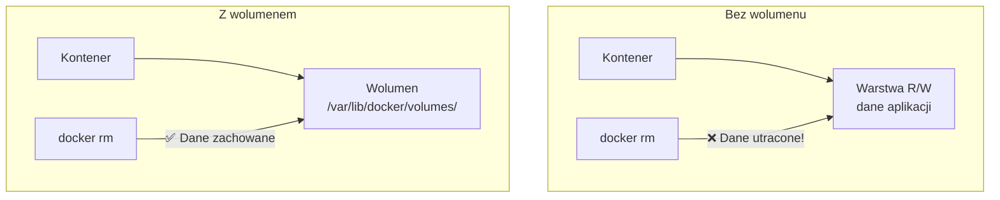
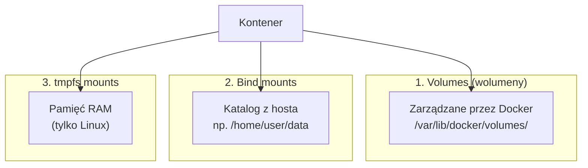
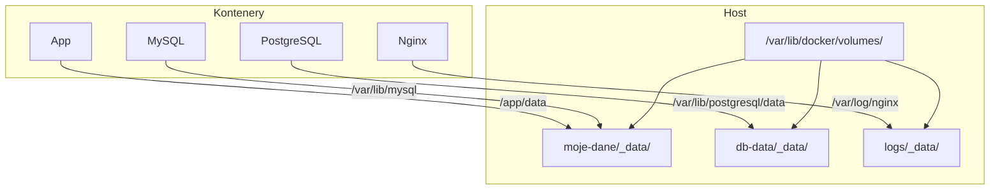
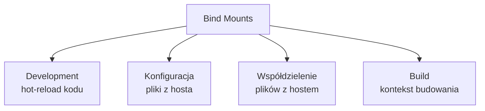
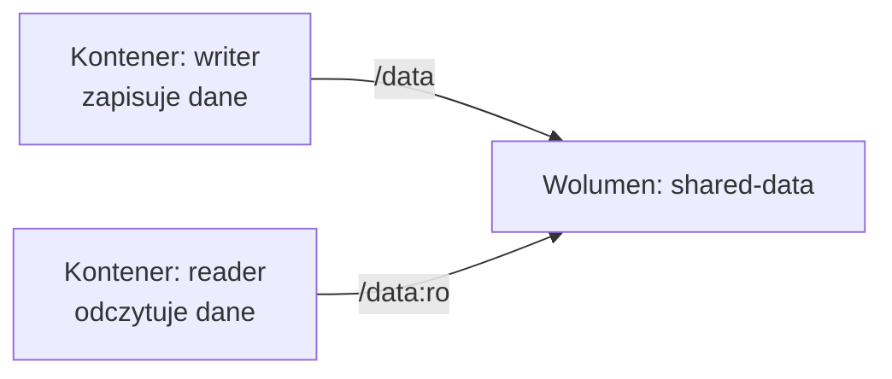
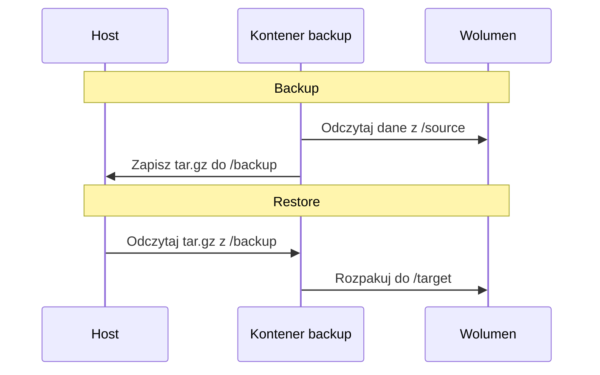
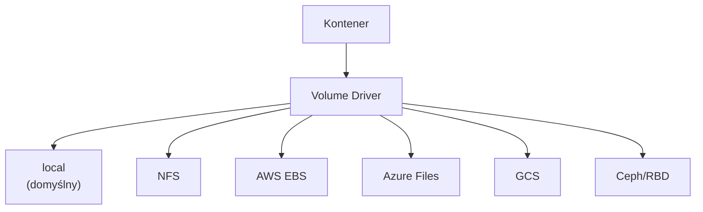
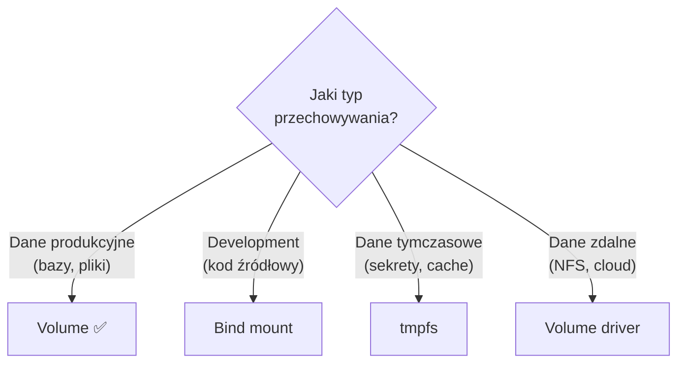

# Wykład 5: Wolumeny i trwałość danych (2 godz.)

## 5.1 Problem trwałości danych w kontenerach

Kontenery są z natury **efemeryczne** (tymczasowe). Gdy kontener zostanie usunięty, wszystkie dane zapisane w jego warstwie zapisu **znikają bezpowrotnie**.



### Kiedy potrzebujemy trwałości danych?
- **Bazy danych** — MySQL, PostgreSQL, MongoDB
- **Pliki użytkowników** — uploady, media
- **Logi aplikacji** — do analizy po restarcie
- **Konfiguracja** — pliki konfiguracyjne
- **Sesje** — dane sesji użytkowników
- **Cache** — dane tymczasowe między restartami

## 5.2 Trzy sposoby przechowywania danych



### Porównanie

| Cecha | Volumes | Bind mounts | tmpfs |
|-------|---------|-------------|-------|
| Lokalizacja | `/var/lib/docker/volumes/` | Dowolna na hoście | RAM |
| Zarządzanie | Docker CLI | System plików hosta | Docker CLI |
| Przenośność | ✅ Wysoka | ❌ Zależna od hosta | ❌ Brak |
| Wydajność | Dobra | Dobra (natywna) | Najlepsza |
| Trwałość | ✅ Tak | ✅ Tak | ❌ Nie (do restartu) |
| Współdzielenie | ✅ Między kontenerami | ✅ Między kontenerami | ❌ Nie |
| Backup | Łatwy | Łatwy | N/A |
| Zalecane? | ✅ Produkcja | ⚠️ Development | Dane wrażliwe/tymczasowe |

## 5.3 Volumes (wolumeny Docker)

Wolumeny to **zalecany mechanizm** trwałego przechowywania danych w Docker.

### Zarządzanie wolumenami
```bash
# Tworzenie wolumenu
docker volume create moje-dane

# Lista wolumenów
docker volume ls

# Szczegóły wolumenu
docker volume inspect moje-dane

# Usunięcie wolumenu
docker volume rm moje-dane

# Usunięcie nieużywanych wolumenów
docker volume prune
```

### Użycie wolumenów z kontenerami

```bash
# Flaga -v (stary styl)
docker run -d -v moje-dane:/var/lib/mysql mysql:8

# Flaga --mount (nowy styl, bardziej czytelny)
docker run -d \
  --mount type=volume,source=moje-dane,target=/var/lib/mysql \
  mysql:8

# Wolumen anonimowy (bez nazwy)
docker run -d -v /var/lib/mysql mysql:8

# Wolumen tylko do odczytu
docker run -d -v moje-dane:/data:ro nginx
```

### Flaga -v vs --mount

| Cecha | `-v` / `--volume` | `--mount` |
|-------|-------------------|-----------|
| Składnia | `-v nazwa:/ścieżka` | `--mount type=volume,src=nazwa,dst=/ścieżka` |
| Czytelność | Krótka | Bardziej opisowa |
| Auto-tworzenie | Tworzy wolumen jeśli nie istnieje | Błąd jeśli nie istnieje |
| Zalecane? | Proste przypadki | Złożone konfiguracje |

### Architektura wolumenów



## 5.4 Bind mounts

Bind mount mapuje **konkretny katalog lub plik z hosta** do kontenera.

```bash
# Bind mount katalogu
docker run -d -v /home/user/projekt:/app nginx

# Bind mount z --mount
docker run -d \
  --mount type=bind,source=/home/user/projekt,target=/app \
  nginx

# Bind mount tylko do odczytu
docker run -d -v /home/user/config:/etc/nginx/conf.d:ro nginx

# Bind mount pojedynczego pliku
docker run -d -v /home/user/nginx.conf:/etc/nginx/nginx.conf:ro nginx
```

### Kiedy używać bind mounts?



### Przykład: hot-reload w development
```bash
# Kod źródłowy montowany z hosta — zmiany widoczne natychmiast
docker run -d \
  -v $(pwd)/src:/app/src \
  -p 3000:3000 \
  node:20 npm run dev
```

### Uwagi bezpieczeństwa
- Bind mount daje kontenerowi dostęp do systemu plików hosta
- Kontener z root może modyfikować pliki hosta
- Używaj `:ro` gdy kontener nie musi zapisywać

## 5.5 tmpfs mounts

tmpfs mount przechowuje dane **w pamięci RAM** — dane znikają po zatrzymaniu kontenera.

```bash
# tmpfs mount
docker run -d \
  --tmpfs /tmp \
  nginx

# Z opcjami
docker run -d \
  --mount type=tmpfs,target=/tmp,tmpfs-size=100m,tmpfs-mode=1777 \
  nginx
```

### Zastosowania tmpfs
- **Dane wrażliwe** — sekrety, tokeny (nie zapisywane na dysku)
- **Dane tymczasowe** — cache, pliki sesji
- **Wydajność** — operacje I/O w RAM

## 5.6 Wolumeny w praktyce — bazy danych

### MySQL
```bash
# Tworzenie wolumenu
docker volume create mysql-data

# Uruchomienie MySQL z wolumenem
docker run -d \
  --name mysql-db \
  -e MYSQL_ROOT_PASSWORD=secret \
  -e MYSQL_DATABASE=myapp \
  -v mysql-data:/var/lib/mysql \
  -p 3306:3306 \
  mysql:8

# Dane przetrwają restart
docker stop mysql-db
docker rm mysql-db
docker run -d \
  --name mysql-db-new \
  -e MYSQL_ROOT_PASSWORD=secret \
  -v mysql-data:/var/lib/mysql \
  -p 3306:3306 \
  mysql:8
# Baza danych "myapp" nadal istnieje!
```

### PostgreSQL
```bash
docker run -d \
  --name postgres-db \
  -e POSTGRES_PASSWORD=secret \
  -e POSTGRES_DB=myapp \
  -v pgdata:/var/lib/postgresql/data \
  -p 5432:5432 \
  postgres:16
```

### MongoDB
```bash
docker run -d \
  --name mongo-db \
  -e MONGO_INITDB_ROOT_USERNAME=admin \
  -e MONGO_INITDB_ROOT_PASSWORD=secret \
  -v mongodata:/data/db \
  -p 27017:27017 \
  mongo:7
```

## 5.7 Współdzielenie wolumenów między kontenerami



```bash
# Tworzenie współdzielonego wolumenu
docker volume create shared-data

# Kontener zapisujący
docker run -d --name writer \
  -v shared-data:/data \
  ubuntu bash -c "while true; do date >> /data/log.txt; sleep 5; done"

# Kontener odczytujący
docker run --rm \
  -v shared-data:/data:ro \
  ubuntu tail -f /data/log.txt
```

## 5.8 Backup i restore wolumenów

### Backup
```bash
# Backup wolumenu do archiwum tar
docker run --rm \
  -v moje-dane:/source:ro \
  -v $(pwd):/backup \
  ubuntu tar czf /backup/moje-dane-backup.tar.gz -C /source .
```

### Restore
```bash
# Restore wolumenu z archiwum
docker volume create moje-dane-restored

docker run --rm \
  -v moje-dane-restored:/target \
  -v $(pwd):/backup:ro \
  ubuntu tar xzf /backup/moje-dane-backup.tar.gz -C /target
```



## 5.9 Volume drivers — zdalne wolumeny

Docker obsługuje pluginy wolumenów do przechowywania danych na zdalnych systemach:



### NFS volume
```bash
# Tworzenie wolumenu NFS
docker volume create \
  --driver local \
  --opt type=nfs \
  --opt o=addr=192.168.1.100,rw \
  --opt device=:/shared/data \
  nfs-data
```

## 5.10 VOLUME w Dockerfile

```dockerfile
# Deklaracja wolumenu w Dockerfile
FROM mysql:8
VOLUME /var/lib/mysql
```

> **Uwaga:** `VOLUME` w Dockerfile tworzy **anonimowy wolumen** przy każdym `docker run`. Lepiej zarządzać wolumenami jawnie z poziomu CLI.

### Problemy z VOLUME w Dockerfile
```dockerfile
# ❌ Problem: RUN po VOLUME nie zapisze zmian w wolumenie
FROM ubuntu
VOLUME /data
RUN echo "hello" > /data/file.txt  # Ten plik NIE będzie w wolumenie!

# ✅ Rozwiązanie: RUN przed VOLUME
FROM ubuntu
RUN mkdir /data && echo "hello" > /data/file.txt
VOLUME /data
```

## 5.11 Dobre praktyki

### Wolumeny
1. **Nazywaj wolumeny** — unikaj anonimowych wolumenów
2. **Używaj wolumenów dla danych** — nie bind mounts w produkcji
3. **Regularnie twórz backupy** — szczególnie baz danych
4. **Czyść nieużywane wolumeny** — `docker volume prune`
5. **Używaj `:ro`** gdy kontener nie musi zapisywać

### Bind mounts
1. **Tylko w development** — hot-reload, debugowanie
2. **Używaj ścieżek absolutnych** — unikaj relatywnych
3. **Ogranicz dostęp** — `:ro` gdzie możliwe
4. **Nie montuj wrażliwych katalogów** — `/etc`, `/var`

## 5.12 Podsumowanie



- Kontenery są efemeryczne — wolumeny zapewniają trwałość danych
- Volumes to zalecany mechanizm (zarządzane przez Docker)
- Bind mounts mapują katalogi hosta — idealne do development
- tmpfs przechowuje dane w RAM — dla danych wrażliwych/tymczasowych
- Wolumeny mogą być współdzielone między kontenerami
- Backup wolumenów to kluczowa praktyka operacyjna

### Pytania kontrolne
1. Dlaczego dane w kontenerze są efemeryczne?
2. Jakie są trzy sposoby przechowywania danych w Docker?
3. Czym różni się volume od bind mount?
4. Jak wykonać backup wolumenu Docker?
5. Kiedy stosować tmpfs mount?
6. Jak współdzielić dane między kontenerami?

### Literatura
- Docker Volumes: https://docs.docker.com/engine/storage/volumes/
- Bind mounts: https://docs.docker.com/engine/storage/bind-mounts/
- tmpfs: https://docs.docker.com/engine/storage/tmpfs/
