# Wykład 6: Sieci Docker (2 godz.)

## 6.1 Model sieciowy Docker

Docker implementuje własny model sieciowy oparty na **Container Network Model (CNM)**, który zapewnia izolację i komunikację między kontenerami.

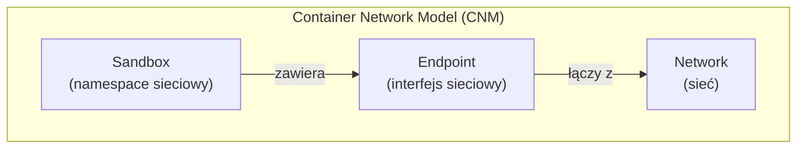

### Komponenty CNM
| Komponent | Opis | Analogia |
|-----------|------|----------|
| **Sandbox** | Izolowane środowisko sieciowe kontenera | Komputer z kartą sieciową |
| **Endpoint** | Interfejs sieciowy w sandboxie | Port Ethernet |
| **Network** | Grupa endpointów mogących się komunikować | Switch/VLAN |

## 6.2 Typy sieci Docker

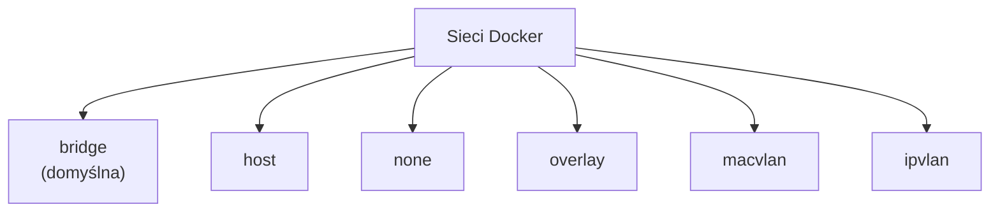

### Porównanie typów sieci

| Typ | Izolacja | Wydajność | Użycie | Multi-host |
|-----|----------|-----------|--------|------------|
| **bridge** | ✅ Tak | Dobra | Domyślna, jeden host | ❌ |
| **host** | ❌ Nie | Najlepsza | Wydajność krytyczna | ❌ |
| **none** | ✅ Pełna | N/A | Całkowita izolacja | ❌ |
| **overlay** | ✅ Tak | Dobra | Swarm/multi-host | ✅ |
| **macvlan** | ✅ Tak | Bardzo dobra | Integracja z siecią fizyczną | ❌ |

## 6.3 Sieć bridge (domyślna)

Każdy kontener uruchomiony bez `--network` trafia do domyślnej sieci **bridge** (`docker0`).

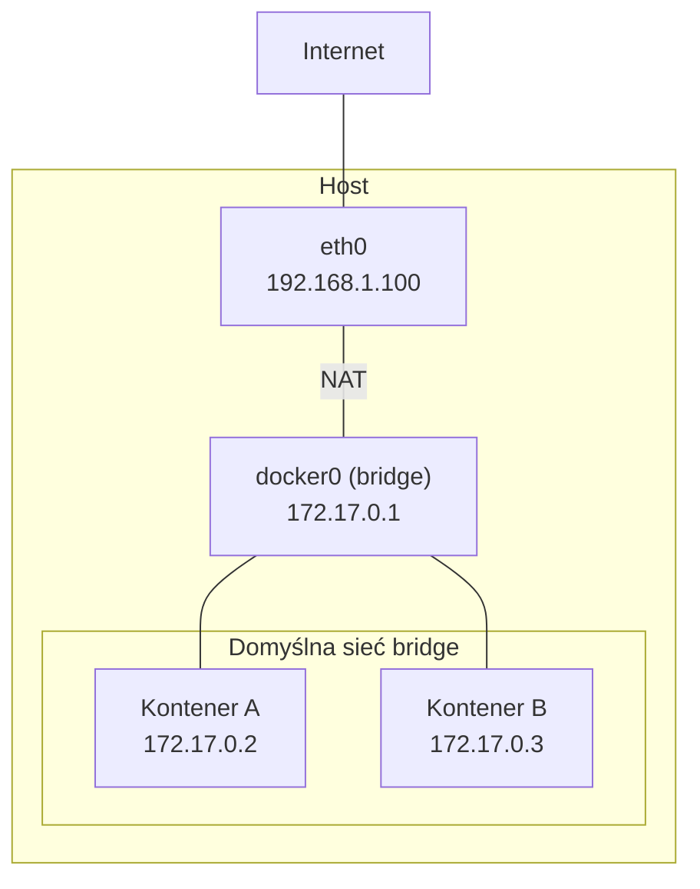

### Ograniczenia domyślnej sieci bridge
- **Brak DNS** — kontenery nie mogą się odnajdywać po nazwie
- Komunikacja tylko po adresach IP
- Wszystkie kontenery w jednej sieci (brak izolacji)

```bash
# Uruchomienie w domyślnej sieci bridge
docker run -d --name web nginx
docker run -d --name db mysql:8

# Sprawdzenie IP
docker inspect -f '{{range .NetworkSettings.Networks}}{{.IPAddress}}{{end}}' web
# 172.17.0.2

# Komunikacja po IP (działa)
docker exec web ping 172.17.0.3

# Komunikacja po nazwie (NIE działa w domyślnej bridge!)
docker exec web ping db  # ❌ Błąd!
```

## 6.4 User-defined bridge networks

Sieci zdefiniowane przez użytkownika rozwiązują problemy domyślnej sieci bridge.

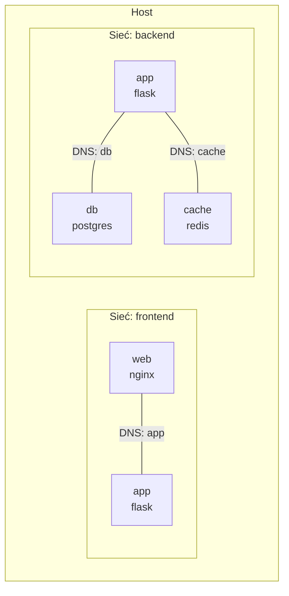

### Zalety user-defined bridge
- ✅ **Automatyczny DNS** — kontenery odnajdują się po nazwie
- ✅ **Izolacja** — kontenery w różnych sieciach nie widzą się
- ✅ **Podłączanie/odłączanie** na żywo (bez restartu)
- ✅ **Konfigurowalność** — subnet, gateway, opcje

```bash
# Tworzenie sieci
docker network create moja-siec

# Tworzenie z opcjami
docker network create \
  --driver bridge \
  --subnet 172.20.0.0/16 \
  --gateway 172.20.0.1 \
  --ip-range 172.20.240.0/20 \
  moja-siec

# Uruchomienie kontenerów w sieci
docker run -d --name web --network moja-siec nginx
docker run -d --name db --network moja-siec postgres:16

# Teraz DNS działa!
docker exec web ping db  # ✅ Działa!

# Podłączenie istniejącego kontenera do sieci
docker network connect moja-siec istniejacy-kontener

# Odłączenie od sieci
docker network disconnect moja-siec kontener
```

## 6.5 Zarządzanie sieciami

```bash
# Lista sieci
docker network ls

# Szczegóły sieci
docker network inspect moja-siec

# Tworzenie sieci
docker network create moja-siec

# Usunięcie sieci
docker network rm moja-siec

# Usunięcie nieużywanych sieci
docker network prune
```

### Domyślne sieci Docker
```bash
$ docker network ls
NETWORK ID     NAME      DRIVER    SCOPE
abc123         bridge    bridge    local    # Domyślna bridge
def456         host      host      local    # Sieć hosta
ghi789         none      null      local    # Brak sieci
```

## 6.6 Mapowanie portów

Porty kontenerów nie są domyślnie dostępne z zewnątrz. Trzeba je jawnie opublikować.

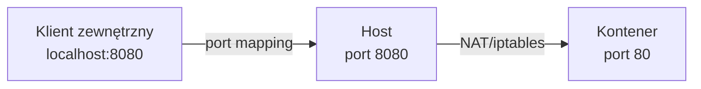

### Składnia mapowania portów
```bash
# host_port:container_port
docker run -d -p 8080:80 nginx

# Tylko konkretny interfejs
docker run -d -p 127.0.0.1:8080:80 nginx

# Losowy port hosta
docker run -d -p 80 nginx
docker port <container>  # sprawdzenie przydzielonego portu

# Wiele portów
docker run -d -p 8080:80 -p 8443:443 nginx

# Zakres portów
docker run -d -p 8000-8010:8000-8010 myapp

# UDP
docker run -d -p 53:53/udp dns-server

# Publikacja wszystkich EXPOSE portów
docker run -d -P nginx
```

### Jak działa mapowanie portów?

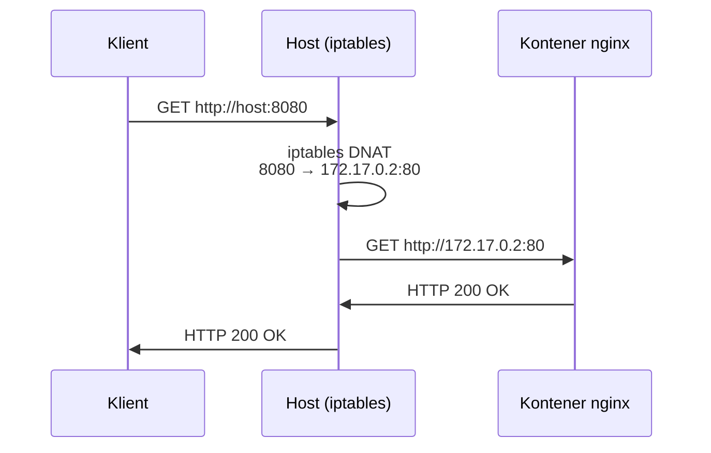

## 6.7 Sieć host

W trybie `host` kontener **współdzieli stos sieciowy hosta** — brak izolacji sieciowej, ale najlepsza wydajność.

```bash
# Kontener używa sieci hosta
docker run -d --network host nginx
# nginx nasłuchuje na porcie 80 hosta (bez mapowania!)
```

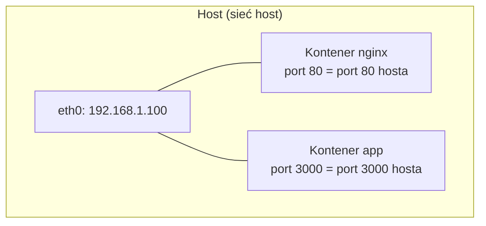

### Kiedy używać sieci host?
- Aplikacje wymagające **najwyższej wydajności sieciowej**
- Aplikacje nasłuchujące na **wielu dynamicznych portach**
- **Monitoring** i narzędzia sieciowe

> **Uwaga:** Sieć host nie działa na Docker Desktop (macOS/Windows) — tylko Linux.

## 6.8 Sieć none

Kontener z siecią `none` jest **całkowicie odizolowany** od sieci.

```bash
docker run -d --network none alpine sleep 3600

# Kontener ma tylko interfejs loopback
docker exec <container> ip addr
# 1: lo: <LOOPBACK,UP> inet 127.0.0.1/8
```

### Zastosowania
- Przetwarzanie danych offline
- Kontenery wymagające maksymalnego bezpieczeństwa
- Batch processing bez dostępu do sieci

## 6.9 DNS w Docker

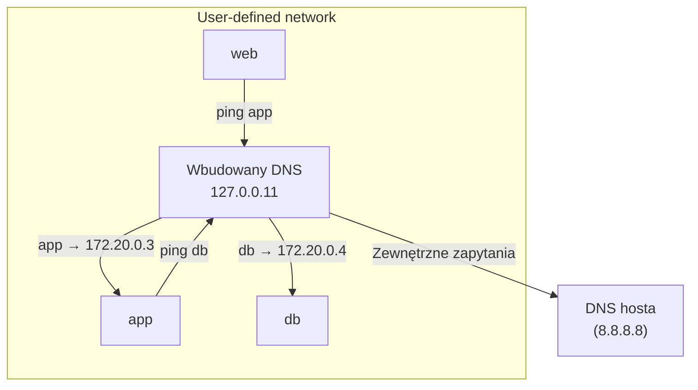

### Aliasy sieciowe
```bash
# Alias sieciowy
docker run -d --name db --network moja-siec --network-alias database postgres:16

# Teraz kontener dostępny jako "db" i "database"
docker exec web ping database  # ✅
docker exec web ping db        # ✅
```

### Round-robin DNS
```bash
# Wiele kontenerów z tym samym aliasem = load balancing DNS
docker run -d --network moja-siec --network-alias api myapp:v1
docker run -d --network moja-siec --network-alias api myapp:v1
docker run -d --network moja-siec --network-alias api myapp:v1

# Zapytania do "api" będą rozdzielane między 3 kontenery
```

## 6.10 Komunikacja między kontenerami — wzorce

### Wzorzec: Frontend + Backend + Baza danych

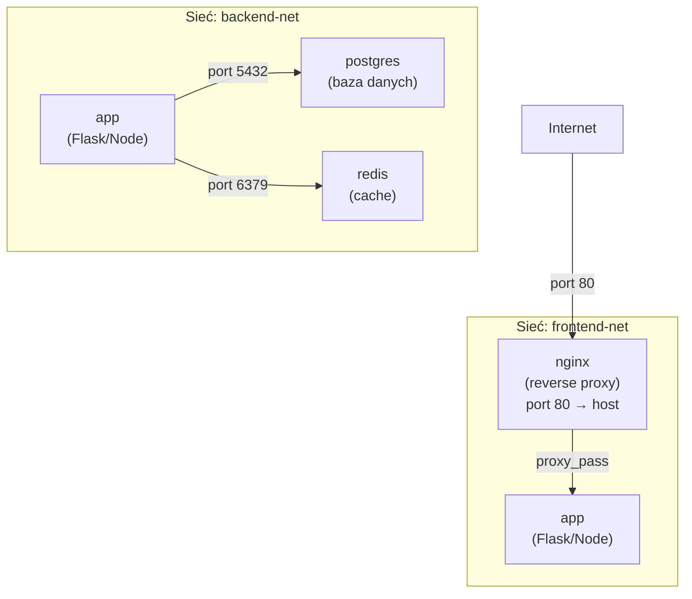

```bash
# Tworzenie sieci
docker network create frontend-net
docker network create backend-net

# Baza danych (tylko backend)
docker run -d --name db --network backend-net \
  -e POSTGRES_PASSWORD=secret postgres:16

# Redis (tylko backend)
docker run -d --name redis --network backend-net redis:7

# Aplikacja (obie sieci)
docker run -d --name app --network backend-net \
  -e DATABASE_URL=postgresql://postgres:secret@db:5432 \
  -e REDIS_URL=redis://redis:6379 \
  myapp:v1
docker network connect frontend-net app

# Nginx (tylko frontend)
docker run -d --name nginx --network frontend-net \
  -p 80:80 nginx
```

## 6.11 Overlay networks (Swarm)

Sieci overlay umożliwiają komunikację kontenerów **między wieloma hostami** w Docker Swarm.

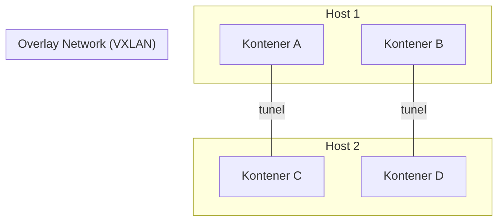

```bash
# Inicjalizacja Swarm
docker swarm init

# Tworzenie sieci overlay
docker network create --driver overlay moja-overlay

# Usługi w sieci overlay
docker service create --name web --network moja-overlay nginx
docker service create --name api --network moja-overlay myapi
```

## 6.12 Macvlan

Macvlan przypisuje kontenerowi **własny adres MAC** — kontener wygląda jak fizyczne urządzenie w sieci.

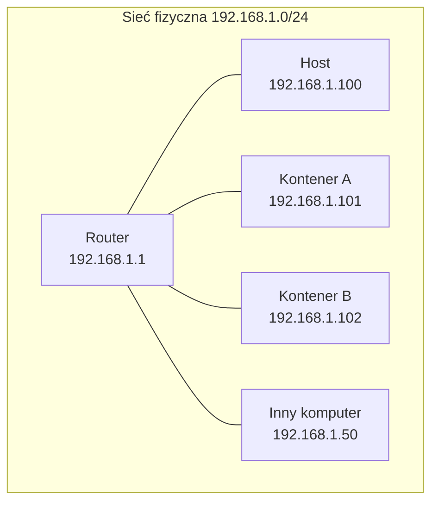

```bash
# Tworzenie sieci macvlan
docker network create -d macvlan \
  --subnet=192.168.1.0/24 \
  --gateway=192.168.1.1 \
  -o parent=eth0 \
  macvlan-net

# Kontener z adresem w sieci fizycznej
docker run -d --network macvlan-net \
  --ip 192.168.1.101 \
  nginx
```

## 6.13 Diagnostyka sieci

```bash
# Sprawdzenie sieci kontenera
docker inspect -f '{{json .NetworkSettings.Networks}}' kontener

# Ping między kontenerami
docker exec web ping db

# Sprawdzenie DNS
docker exec web nslookup db

# Sprawdzenie portów
docker exec web netstat -tlnp

# Sprawdzenie iptables (na hoście)
sudo iptables -t nat -L -n

# Logi sieciowe
docker network inspect moja-siec

# Tcpdump w kontenerze
docker exec web tcpdump -i eth0 -n
```

## 6.14 Podsumowanie

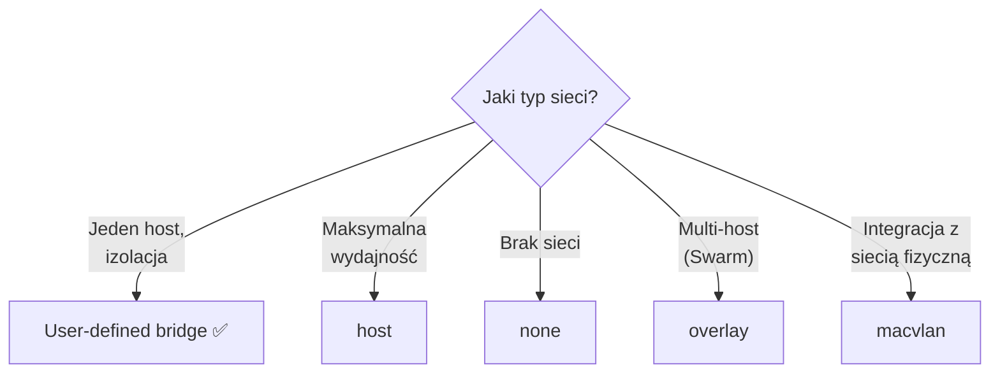

- Docker oferuje kilka typów sieci: bridge, host, none, overlay, macvlan
- User-defined bridge to zalecany typ dla większości zastosowań
- Automatyczny DNS działa tylko w user-defined networks
- Porty trzeba jawnie publikować (`-p`)
- Izolacja sieciowa to kluczowy element bezpieczeństwa
- Overlay networks umożliwiają komunikację multi-host

### Pytania kontrolne
1. Jakie typy sieci oferuje Docker?
2. Dlaczego user-defined bridge jest lepszy od domyślnej sieci bridge?
3. Jak działa DNS w sieciach Docker?
4. Jak opublikować port kontenera?
5. Kiedy stosować sieć host?
6. Czym jest sieć overlay i kiedy jest potrzebna?

### Literatura
- Docker Networking: https://docs.docker.com/engine/network/
- Bridge networks: https://docs.docker.com/engine/network/drivers/bridge/
- Overlay networks: https://docs.docker.com/engine/network/drivers/overlay/
