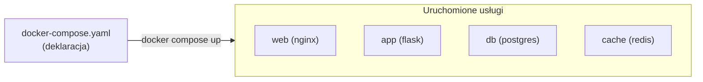
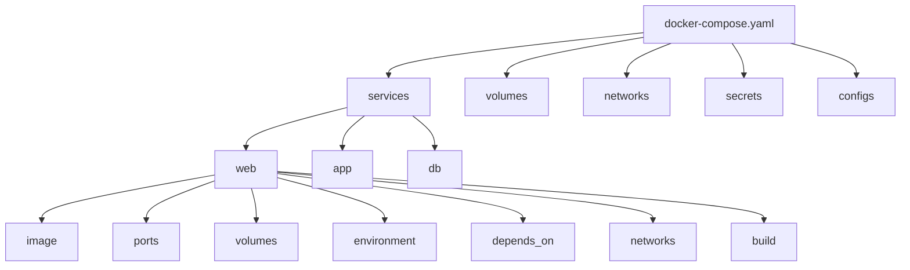
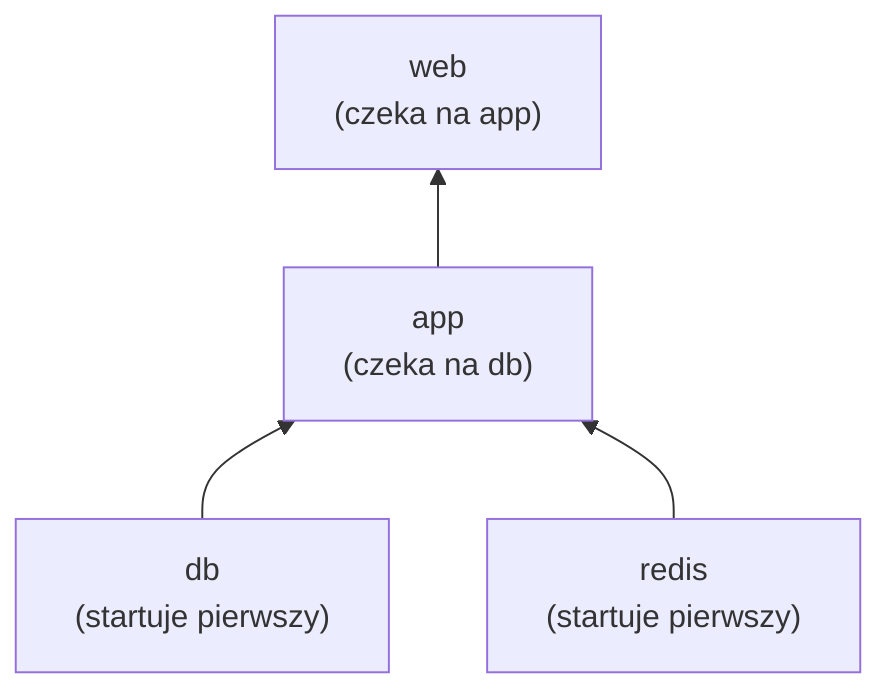
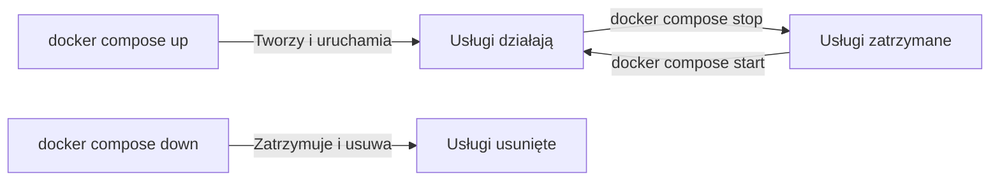
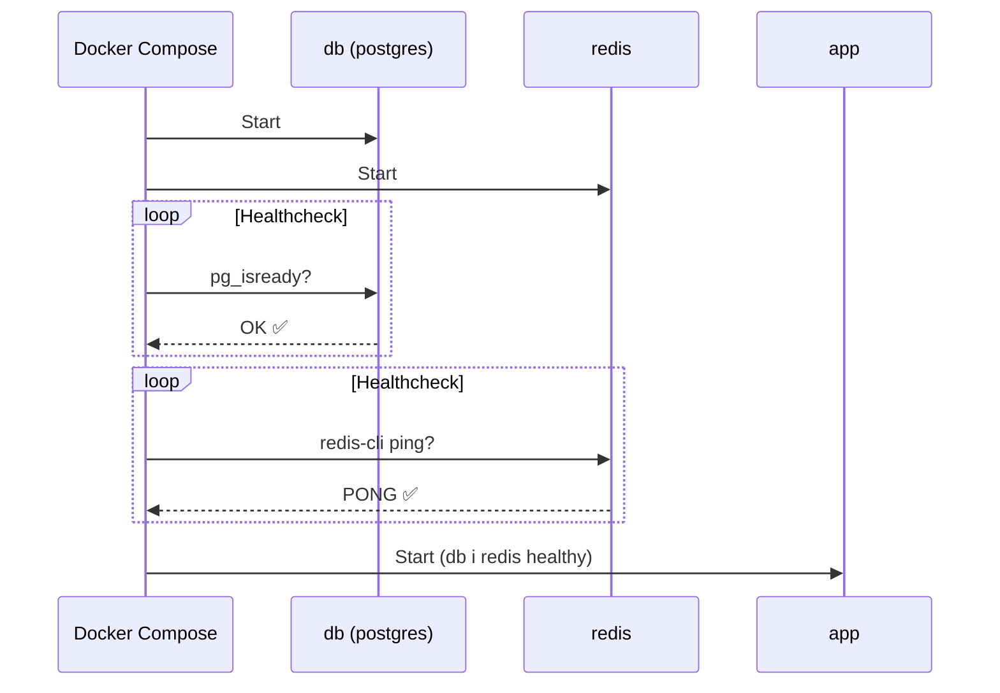
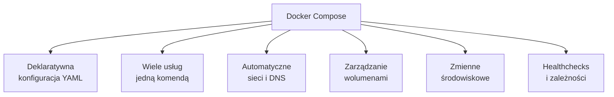

# Wykład 7: Docker Compose — orkiestracja wielu kontenerów (2 godz.)

## 7.1 Czym jest Docker Compose?

Docker Compose to narzędzie do **definiowania i uruchamiania aplikacji wielokontenerowych**. Konfiguracja zapisywana jest w pliku YAML, co pozwala na deklaratywne zarządzanie całym stosem usług.



### Dlaczego Docker Compose?
- **Jeden plik** opisuje całą infrastrukturę aplikacji
- **Jedna komenda** uruchamia wszystkie usługi
- **Powtarzalność** — ten sam stos na każdej maszynie
- **Wersjonowanie** — plik YAML w repozytorium Git
- **Izolacja** — każdy projekt w osobnej sieci

### Docker Compose vs docker run

```bash
# Bez Compose — wiele komend
docker network create myapp
docker volume create db-data
docker run -d --name db --network myapp -v db-data:/var/lib/postgresql/data \
  -e POSTGRES_PASSWORD=secret postgres:16
docker run -d --name app --network myapp -e DATABASE_URL=postgresql://postgres:secret@db:5432 \
  -p 5000:5000 myapp:v1

# Z Compose — jedna komenda
docker compose up -d
```

## 7.2 Struktura pliku docker-compose.yaml

```yaml
# Wersja (opcjonalna od Compose v2)
# version: "3.8"  # przestarzałe, ale spotykane

# Definicja usług
services:
  web:
    image: nginx:alpine
    ports:
      - "80:80"
    volumes:
      - ./nginx.conf:/etc/nginx/nginx.conf:ro
    depends_on:
      - app
    networks:
      - frontend

  app:
    build: ./app
    environment:
      - DATABASE_URL=postgresql://postgres:secret@db:5432
    networks:
      - frontend
      - backend

  db:
    image: postgres:16
    environment:
      POSTGRES_PASSWORD: secret
      POSTGRES_DB: myapp
    volumes:
      - db-data:/var/lib/postgresql/data
    networks:
      - backend

# Definicja wolumenów
volumes:
  db-data:

# Definicja sieci
networks:
  frontend:
  backend:
```

### Hierarchia elementów



## 7.3 Kluczowe dyrektywy usług

### image vs build

```yaml
services:
  # Użycie gotowego obrazu
  nginx:
    image: nginx:alpine

  # Budowanie z Dockerfile
  app:
    build: ./app  # katalog z Dockerfile

  # Budowanie z opcjami
  api:
    build:
      context: ./backend
      dockerfile: Dockerfile.prod
      args:
        - PYTHON_VERSION=3.11
    image: myapi:latest  # tag dla zbudowanego obrazu
```

### ports — mapowanie portów

```yaml
services:
  web:
    ports:
      # host:kontener
      - "8080:80"
      # tylko kontener (losowy port hosta)
      - "80"
      # konkretny interfejs
      - "127.0.0.1:8080:80"
      # UDP
      - "53:53/udp"
      # Długa składnia
      - target: 80
        published: 8080
        protocol: tcp
        mode: host
```

### environment — zmienne środowiskowe

```yaml
services:
  app:
    # Forma lista
    environment:
      - DATABASE_URL=postgresql://postgres:secret@db:5432
      - DEBUG=true
      - SECRET_KEY=mysecret

    # Forma mapa
    environment:
      DATABASE_URL: postgresql://postgres:secret@db:5432
      DEBUG: "true"

  db:
    # Z pliku .env
    env_file:
      - .env
      - .env.local
```

### volumes — wolumeny

```yaml
services:
  app:
    volumes:
      # Named volume
      - app-data:/app/data
      # Bind mount
      - ./src:/app/src
      # Bind mount read-only
      - ./config:/app/config:ro
      # Anonimowy wolumen
      - /app/node_modules
      # Długa składnia
      - type: volume
        source: db-data
        target: /var/lib/postgresql/data
        volume:
          nocopy: true

volumes:
  app-data:
  db-data:
    driver: local
```

### depends_on — zależności między usługami

```yaml
services:
  web:
    depends_on:
      - app  # prosta forma

  app:
    depends_on:
      db:
        condition: service_healthy  # czekaj na healthcheck
      redis:
        condition: service_started

  db:
    image: postgres:16
    healthcheck:
      test: ["CMD-SHELL", "pg_isready -U postgres"]
      interval: 5s
      timeout: 5s
      retries: 5
```



> **Uwaga:** `depends_on` kontroluje **kolejność uruchamiania**, ale nie gwarantuje, że usługa jest **gotowa**. Użyj `condition: service_healthy` z healthcheck.

### networks — sieci

```yaml
services:
  web:
    networks:
      - frontend
  app:
    networks:
      - frontend
      - backend
  db:
    networks:
      - backend

networks:
  frontend:
    driver: bridge
  backend:
    driver: bridge
    internal: true  # brak dostępu do internetu
```

### restart — polityka restartu

```yaml
services:
  web:
    restart: unless-stopped  # no | always | on-failure | unless-stopped
```

## 7.4 Komendy Docker Compose



### Podstawowe komendy

```bash
# Uruchomienie wszystkich usług
docker compose up

# W tle (detached)
docker compose up -d

# Budowanie obrazów przed uruchomieniem
docker compose up --build

# Uruchomienie konkretnej usługi
docker compose up -d db

# Zatrzymanie usług
docker compose stop

# Zatrzymanie i usunięcie kontenerów, sieci
docker compose down

# Usunięcie z wolumenami
docker compose down -v

# Usunięcie z obrazami
docker compose down --rmi all

# Restart usług
docker compose restart

# Status usług
docker compose ps

# Logi
docker compose logs
docker compose logs -f app
docker compose logs --tail 50 app db

# Wykonanie komendy w usłudze
docker compose exec app bash
docker compose exec db psql -U postgres

# Jednorazowe uruchomienie komendy
docker compose run --rm app python manage.py migrate

# Skalowanie usługi
docker compose up -d --scale app=3

# Budowanie obrazów
docker compose build
docker compose build --no-cache app
```

## 7.5 Pliki .env i zmienne

### Plik .env
```bash
# .env (automatycznie ładowany przez Compose)
POSTGRES_PASSWORD=secret
POSTGRES_DB=myapp
APP_PORT=5000
```

```yaml
# docker-compose.yaml — interpolacja zmiennych
services:
  db:
    image: postgres:16
    environment:
      POSTGRES_PASSWORD: ${POSTGRES_PASSWORD}
      POSTGRES_DB: ${POSTGRES_DB:-defaultdb}  # wartość domyślna
  app:
    ports:
      - "${APP_PORT:-5000}:5000"
```

### Wiele plików Compose

```bash
# Domyślnie: docker-compose.yaml + docker-compose.override.yaml
docker compose up

# Jawne wskazanie plików
docker compose -f docker-compose.yaml -f docker-compose.prod.yaml up -d

# Profil
docker compose --profile debug up -d
```

```yaml
# docker-compose.yaml (bazowy)
services:
  app:
    image: myapp:latest
    ports:
      - "5000:5000"

# docker-compose.override.yaml (development — automatycznie ładowany)
services:
  app:
    build: .
    volumes:
      - ./src:/app/src
    environment:
      - DEBUG=true

# docker-compose.prod.yaml (produkcja)
services:
  app:
    restart: always
    environment:
      - DEBUG=false
```

## 7.6 Healthcheck w Compose

```yaml
services:
  db:
    image: postgres:16
    healthcheck:
      test: ["CMD-SHELL", "pg_isready -U postgres"]
      interval: 10s
      timeout: 5s
      retries: 5
      start_period: 30s

  redis:
    image: redis:7
    healthcheck:
      test: ["CMD", "redis-cli", "ping"]
      interval: 10s
      timeout: 5s
      retries: 3

  app:
    build: .
    depends_on:
      db:
        condition: service_healthy
      redis:
        condition: service_healthy
    healthcheck:
      test: ["CMD", "curl", "-f", "http://localhost:5000/health"]
      interval: 30s
      timeout: 10s
      retries: 3
```



## 7.7 Profiles — warunkowe usługi

```yaml
services:
  app:
    build: .
    ports:
      - "5000:5000"

  db:
    image: postgres:16

  # Tylko w trybie debug
  adminer:
    image: adminer
    ports:
      - "8080:8080"
    profiles:
      - debug

  # Tylko w trybie monitoring
  prometheus:
    image: prom/prometheus
    profiles:
      - monitoring
```

```bash
# Bez profili — tylko app i db
docker compose up -d

# Z profilem debug — app, db, adminer
docker compose --profile debug up -d

# Wiele profili
docker compose --profile debug --profile monitoring up -d
```

## 7.8 Secrets i configs

```yaml
services:
  db:
    image: postgres:16
    secrets:
      - db_password
    environment:
      POSTGRES_PASSWORD_FILE: /run/secrets/db_password

  app:
    build: .
    configs:
      - source: nginx_config
        target: /etc/nginx/nginx.conf

secrets:
  db_password:
    file: ./secrets/db_password.txt

configs:
  nginx_config:
    file: ./nginx.conf
```

## 7.9 Przykłady praktyczne

### Aplikacja webowa z bazą danych

```yaml
services:
  frontend:
    image: nginx:alpine
    ports:
      - "80:80"
    volumes:
      - ./nginx.conf:/etc/nginx/conf.d/default.conf:ro
    depends_on:
      - backend
    networks:
      - frontend-net

  backend:
    build: ./backend
    environment:
      - DATABASE_URL=postgresql://postgres:${DB_PASSWORD}@db:5432/${DB_NAME}
      - REDIS_URL=redis://cache:6379
    depends_on:
      db:
        condition: service_healthy
      cache:
        condition: service_healthy
    networks:
      - frontend-net
      - backend-net

  db:
    image: postgres:16-alpine
    environment:
      POSTGRES_PASSWORD: ${DB_PASSWORD}
      POSTGRES_DB: ${DB_NAME}
    volumes:
      - db-data:/var/lib/postgresql/data
      - ./init.sql:/docker-entrypoint-initdb.d/init.sql
    healthcheck:
      test: ["CMD-SHELL", "pg_isready -U postgres"]
      interval: 5s
      timeout: 5s
      retries: 5
    networks:
      - backend-net

  cache:
    image: redis:7-alpine
    volumes:
      - redis-data:/data
    healthcheck:
      test: ["CMD", "redis-cli", "ping"]
      interval: 5s
      timeout: 3s
      retries: 3
    networks:
      - backend-net

volumes:
  db-data:
  redis-data:

networks:
  frontend-net:
  backend-net:
    internal: true
```

### Stos monitoringu

```yaml
services:
  prometheus:
    image: prom/prometheus:latest
    ports:
      - "9090:9090"
    volumes:
      - ./prometheus.yml:/etc/prometheus/prometheus.yml:ro
      - prometheus-data:/prometheus

  grafana:
    image: grafana/grafana:latest
    ports:
      - "3000:3000"
    environment:
      - GF_SECURITY_ADMIN_PASSWORD=admin
    volumes:
      - grafana-data:/var/lib/grafana
    depends_on:
      - prometheus

volumes:
  prometheus-data:
  grafana-data:
```

## 7.10 Docker Compose Watch (development)

```yaml
services:
  app:
    build: .
    ports:
      - "5000:5000"
    develop:
      watch:
        # Sync plików (hot-reload)
        - action: sync
          path: ./src
          target: /app/src
        # Rebuild przy zmianie zależności
        - action: rebuild
          path: ./requirements.txt
        # Restart przy zmianie konfiguracji
        - action: sync+restart
          path: ./config
          target: /app/config
```

```bash
# Uruchomienie z watch
docker compose watch

# Lub
docker compose up --watch
```

## 7.11 Dobre praktyki Docker Compose

1. **Używaj `.env`** do zmiennych — nie hardkoduj sekretów
2. **Definiuj healthchecks** — `depends_on` z `condition: service_healthy`
3. **Nazywaj wolumeny** — unikaj anonimowych
4. **Separuj sieci** — frontend/backend dla izolacji
5. **Używaj `restart: unless-stopped`** — odporność na awarie
6. **Override files** — `docker-compose.override.yaml` dla dev
7. **Profiles** — warunkowe usługi (debug, monitoring)
8. **Pinuj wersje obrazów** — `postgres:16`, nie `postgres:latest`
9. **Używaj `build.cache_from`** — przyspieszenie budowania
10. **Dokumentuj** — komentarze w YAML

## 7.12 Podsumowanie



- Docker Compose definiuje aplikacje wielokontenerowe w pliku YAML
- `docker compose up -d` uruchamia cały stos usług
- Automatyczne sieci i DNS między usługami
- Healthchecks zapewniają prawidłową kolejność uruchamiania
- Pliki `.env` i override umożliwiają konfigurację per środowisko
- Profiles pozwalają na warunkowe uruchamianie usług

### Pytania kontrolne
1. Jakie są główne sekcje pliku docker-compose.yaml?
2. Jak zapewnić, że baza danych jest gotowa przed uruchomieniem aplikacji?
3. Jaka jest różnica między `docker compose up` a `docker compose run`?
4. Jak zarządzać sekretami w Docker Compose?
5. Do czego służą profiles w Compose?
6. Jak skonfigurować różne środowiska (dev/prod) z Compose?

### Literatura
- Docker Compose: https://docs.docker.com/compose/
- Compose file reference: https://docs.docker.com/reference/compose-file/
- Compose CLI: https://docs.docker.com/reference/cli/docker/compose/
