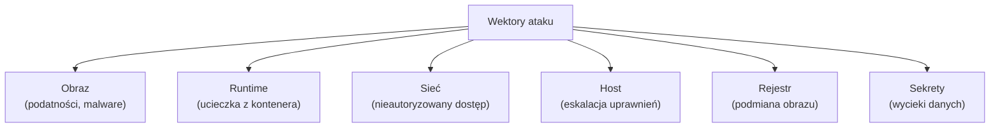
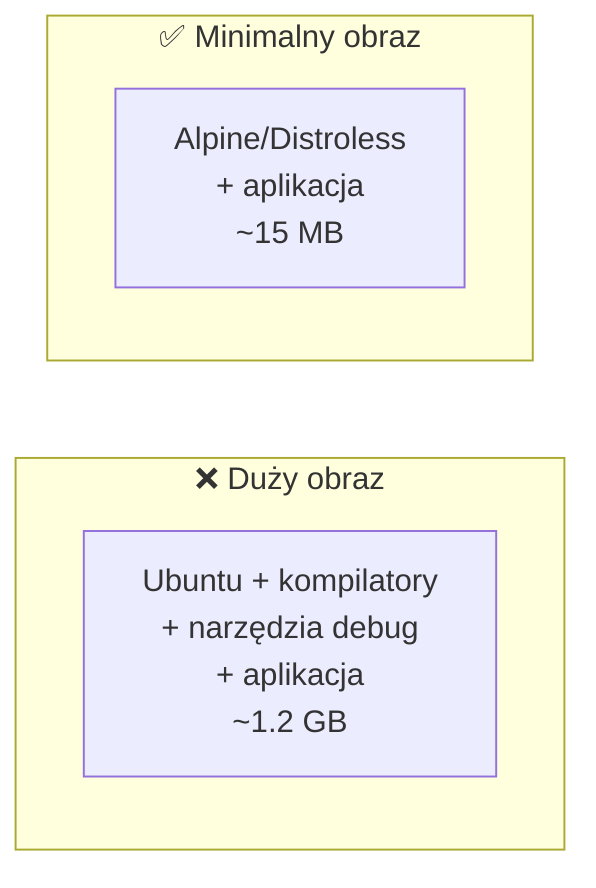
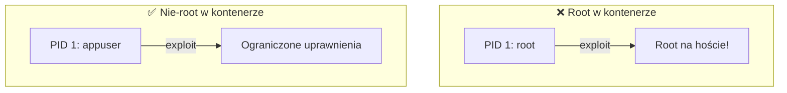
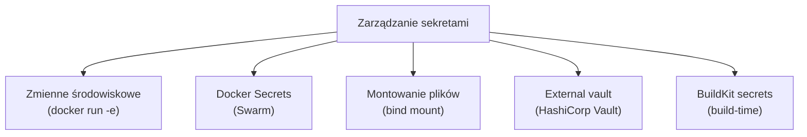
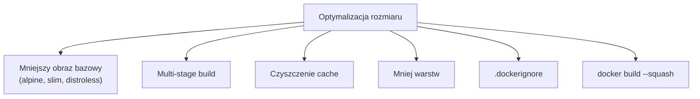
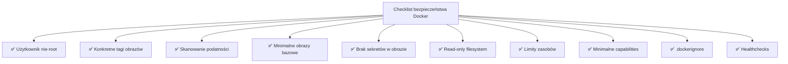

# Wykład 8: Bezpieczeństwo i dobre praktyki Docker (2 godz.)

## 8.1 Powierzchnia ataku kontenerów



### Model zagrożeń kontenerów

| Zagrożenie | Opis | Mitygacja |
|-----------|------|-----------|
| Podatności w obrazie | Nieaktualne pakiety z CVE | Skanowanie, aktualizacje |
| Root w kontenerze | Eskalacja uprawnień | USER nie-root |
| Ucieczka z kontenera | Exploit jądra | Aktualizacje, seccomp |
| Wycieki sekretów | Hasła w obrazie/logach | Docker secrets, vault |
| Niezaufane obrazy | Malware w obrazie | Oficjalne obrazy, podpisy |
| Nieograniczone zasoby | DoS na hoście | Limity CPU/RAM |

## 8.2 Bezpieczeństwo obrazów

### Zasada minimalnego obrazu



```dockerfile
# ❌ Źle — pełny obraz z narzędziami
FROM ubuntu:22.04
RUN apt-get update && apt-get install -y python3 python3-pip gcc
COPY . .
RUN pip install -r requirements.txt
CMD ["python3", "app.py"]

# ✅ Dobrze — minimalny obraz, multi-stage
FROM python:3.11-slim AS builder
WORKDIR /app
COPY requirements.txt .
RUN pip install --user --no-cache-dir -r requirements.txt

FROM python:3.11-slim
RUN groupadd -r app && useradd -r -g app app
WORKDIR /app
COPY --from=builder /root/.local /home/app/.local
COPY --chown=app:app . .
USER app
ENV PATH=/home/app/.local/bin:$PATH
CMD ["python", "app.py"]
```

### Skanowanie podatności

```bash
# Docker Scout
docker scout cves myapp:latest
docker scout quickview myapp:latest

# Trivy
docker run aquasec/trivy image myapp:latest

# Grype
docker run anchore/grype myapp:latest
```

### Podpisywanie obrazów (Docker Content Trust)

```bash
# Włączenie DCT
export DOCKER_CONTENT_TRUST=1

# Podpisanie i push
docker push myuser/myapp:v1  # automatycznie podpisuje

# Pull tylko podpisanych obrazów
docker pull myuser/myapp:v1  # weryfikuje podpis
```

## 8.3 Użytkownik nie-root



```dockerfile
# Tworzenie dedykowanego użytkownika
FROM python:3.11-slim

# Tworzenie grupy i użytkownika
RUN groupadd -r appuser && useradd -r -g appuser -d /app -s /sbin/nologin appuser

WORKDIR /app
COPY --chown=appuser:appuser . .
RUN pip install --no-cache-dir -r requirements.txt

# Przełączenie na nie-root
USER appuser

EXPOSE 8000
CMD ["python", "app.py"]
```

### Alpine Linux
```dockerfile
FROM python:3.11-alpine
RUN addgroup -S app && adduser -S -G app app
USER app
```

## 8.4 Zarządzanie sekretami

### ❌ Antypatterns

```dockerfile
# NIGDY nie rób tego!
ENV DATABASE_PASSWORD=super_secret_password
COPY .env /app/.env
RUN echo "password123" > /app/config.txt
```

### ✅ Dobre praktyki



```bash
# Zmienne środowiskowe (nie w Dockerfile!)
docker run -e DATABASE_PASSWORD=secret myapp

# Docker Secrets (Swarm)
echo "super_secret" | docker secret create db_password -
docker service create --secret db_password myapp

# BuildKit secrets (build-time)
docker build --secret id=npmrc,src=.npmrc -t myapp .
```

```dockerfile
# BuildKit secret — nie zapisany w warstwie
# syntax=docker/dockerfile:1
FROM node:20
RUN --mount=type=secret,id=npmrc,target=/root/.npmrc npm install
```

## 8.5 Ograniczanie uprawnień kontenera

### Capabilities Linux

```bash
# Usunięcie wszystkich capabilities i dodanie tylko potrzebnych
docker run --cap-drop=ALL --cap-add=NET_BIND_SERVICE nginx

# Sprawdzenie capabilities
docker exec kontener cat /proc/1/status | grep Cap
```

| Capability | Opis | Potrzebna? |
|-----------|------|-----------|
| `NET_BIND_SERVICE` | Bindowanie portów < 1024 | Serwery web |
| `CHOWN` | Zmiana właściciela plików | Rzadko |
| `SYS_ADMIN` | Operacje administracyjne | ❌ Nigdy |
| `NET_RAW` | Surowe sockety | Ping, diagnostyka |

### Read-only filesystem

```bash
# System plików tylko do odczytu
docker run --read-only \
  --tmpfs /tmp \
  --tmpfs /var/run \
  nginx
```

### Seccomp i AppArmor

```bash
# Niestandardowy profil seccomp
docker run --security-opt seccomp=./seccomp-profile.json myapp

# AppArmor
docker run --security-opt apparmor=docker-default myapp

# Brak nowych uprawnień
docker run --security-opt no-new-privileges myapp
```

### Flaga --privileged

```bash
# ❌ NIGDY w produkcji!
docker run --privileged myapp
# Daje kontenerowi PEŁNY dostęp do hosta!
```

## 8.6 Dobre praktyki Dockerfile

### 1. Używaj konkretnych tagów

```dockerfile
# ❌ Źle
FROM python:latest
FROM python

# ✅ Dobrze
FROM python:3.11.9-slim-bookworm
```

### 2. Minimalizuj liczbę warstw

```dockerfile
# ❌ Źle — 3 warstwy
RUN apt-get update
RUN apt-get install -y curl wget
RUN rm -rf /var/lib/apt/lists/*

# ✅ Dobrze — 1 warstwa
RUN apt-get update \
    && apt-get install -y --no-install-recommends curl wget \
    && rm -rf /var/lib/apt/lists/*
```

### 3. Optymalizuj kolejność warstw (cache)

```dockerfile
# ✅ Zależności przed kodem (rzadko się zmieniają)
COPY requirements.txt .
RUN pip install -r requirements.txt
COPY . .  # kod zmienia się często
```

### 4. Używaj .dockerignore

```
.git
node_modules
__pycache__
*.pyc
.env
.vscode
```

### 5. Nie instaluj niepotrzebnych pakietów

```dockerfile
# ✅ --no-install-recommends
RUN apt-get install -y --no-install-recommends curl
```

### 6. Czyść cache w tej samej warstwie

```dockerfile
RUN apt-get update \
    && apt-get install -y curl \
    && rm -rf /var/lib/apt/lists/*

RUN pip install --no-cache-dir -r requirements.txt
```

### 7. Używaj COPY zamiast ADD

```dockerfile
# ✅ COPY — proste, przewidywalne
COPY app.py /app/

# ADD tylko do rozpakowywania archiwów
ADD archive.tar.gz /app/
```

### 8. Jeden proces na kontener

```dockerfile
# ❌ Źle — wiele procesów
CMD service nginx start && python app.py

# ✅ Dobrze — jeden proces
CMD ["python", "app.py"]
# Nginx w osobnym kontenerze
```

## 8.7 Dobre praktyki Docker Compose

```yaml
# ✅ Kompletny przykład z dobrymi praktykami
services:
  app:
    build:
      context: .
      dockerfile: Dockerfile
    image: myapp:${APP_VERSION:-latest}
    restart: unless-stopped
    # Ograniczenia zasobów
    deploy:
      resources:
        limits:
          cpus: '1.0'
          memory: 512M
        reservations:
          cpus: '0.25'
          memory: 128M
    # Healthcheck
    healthcheck:
      test: ["CMD", "curl", "-f", "http://localhost:5000/health"]
      interval: 30s
      timeout: 10s
      retries: 3
    # Bezpieczeństwo
    security_opt:
      - no-new-privileges:true
    read_only: true
    tmpfs:
      - /tmp
    # Zmienne z pliku
    env_file:
      - .env
    # Sieci
    networks:
      - backend
    # Logowanie
    logging:
      driver: json-file
      options:
        max-size: "10m"
        max-file: "3"

  db:
    image: postgres:16-alpine
    restart: unless-stopped
    volumes:
      - db-data:/var/lib/postgresql/data
    environment:
      POSTGRES_PASSWORD_FILE: /run/secrets/db_password
    secrets:
      - db_password
    networks:
      - backend
    deploy:
      resources:
        limits:
          memory: 1G

volumes:
  db-data:

networks:
  backend:
    driver: bridge

secrets:
  db_password:
    file: ./secrets/db_password.txt
```

## 8.8 Bezpieczeństwo hosta Docker

### Ochrona Docker socket

```bash
# Docker socket = root access!
# ❌ Nigdy nie montuj do kontenera bez potrzeby
docker run -v /var/run/docker.sock:/var/run/docker.sock myapp

# Jeśli konieczne — użyj proxy (np. Tecnativa/docker-socket-proxy)
```

### Konfiguracja demona Docker

```json
// /etc/docker/daemon.json
{
  "icc": false,
  "userns-remap": "default",
  "no-new-privileges": true,
  "log-driver": "json-file",
  "log-opts": {
    "max-size": "10m",
    "max-file": "3"
  },
  "live-restore": true
}
```

### Docker Bench Security

```bash
# Automatyczny audyt bezpieczeństwa
docker run --rm --net host --pid host \
  --userns host --cap-add audit_control \
  -v /var/lib:/var/lib \
  -v /var/run/docker.sock:/var/run/docker.sock \
  -v /etc:/etc:ro \
  docker/docker-bench-security
```

## 8.9 Optymalizacja rozmiaru obrazów



### Porównanie obrazów bazowych

| Obraz | Rozmiar | Shell | Package manager | Użycie |
|-------|---------|-------|----------------|--------|
| `ubuntu:22.04` | ~77 MB | bash | apt | Development |
| `debian:bookworm-slim` | ~74 MB | bash | apt | Produkcja |
| `alpine:3.19` | ~7 MB | sh | apk | Produkcja (lekka) |
| `distroless` | ~2-20 MB | ❌ | ❌ | Produkcja (bezpieczna) |
| `scratch` | 0 MB | ❌ | ❌ | Statyczne binaria |

### Google Distroless

```dockerfile
# Obraz bez shella, package managera — minimalna powierzchnia ataku
FROM gcr.io/distroless/python3-debian12
COPY --from=builder /app /app
WORKDIR /app
CMD ["app.py"]
```

## 8.10 Linting i walidacja

### Hadolint — linter Dockerfile

```bash
# Skanowanie Dockerfile
docker run --rm -i hadolint/hadolint < Dockerfile

# Przykładowe ostrzeżenia:
# DL3008: Pin versions in apt-get install
# DL3009: Delete apt-get lists after installing
# DL3025: Use JSON notation for CMD
# SC2086: Double quote to prevent globbing
```

### docker-compose config — walidacja

```bash
# Walidacja pliku Compose
docker compose config

# Sprawdzenie zmiennych
docker compose config --no-interpolate
```

## 8.11 Checklist bezpieczeństwa



## 8.12 Podsumowanie

- Bezpieczeństwo kontenerów wymaga podejścia wielowarstwowego
- Zawsze uruchamiaj kontenery jako użytkownik nie-root
- Używaj minimalnych obrazów bazowych (alpine, slim, distroless)
- Skanuj obrazy pod kątem podatności (Scout, Trivy)
- Nie przechowuj sekretów w obrazach ani Dockerfile
- Ograniczaj capabilities i zasoby kontenerów
- Multi-stage builds redukują rozmiar i powierzchnię ataku
- Hadolint pomaga utrzymać jakość Dockerfile

### Pytania kontrolne
1. Dlaczego nie powinno się uruchamiać kontenerów jako root?
2. Jak bezpiecznie zarządzać sekretami w Docker?
3. Czym jest Docker Content Trust?
4. Jakie narzędzia służą do skanowania podatności w obrazach?
5. Co to jest distroless i kiedy go stosować?
6. Wymień 5 dobrych praktyk tworzenia Dockerfile.

### Literatura
- Docker Security: https://docs.docker.com/engine/security/
- CIS Docker Benchmark: https://www.cisecurity.org/benchmark/docker
- Hadolint: https://github.com/hadolint/hadolint
- Distroless: https://github.com/GoogleContainerTools/distroless
