# Wykład 9: CI/CD i Docker w produkcji (2 godz.)

## 9.1 Docker w cyklu życia oprogramowania

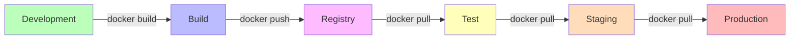

### Zasada: Build Once, Deploy Everywhere

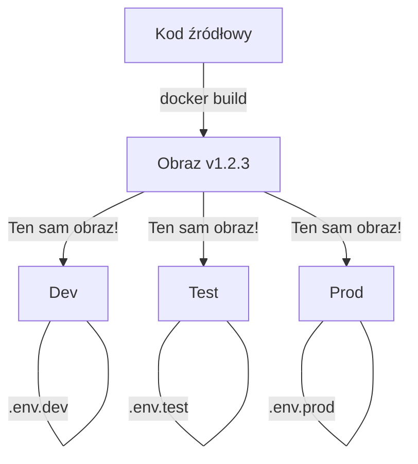

> **Kluczowa zasada:** Obraz budowany jest **raz** i ten sam obraz jest wdrażany na wszystkich środowiskach. Konfiguracja per środowisko przez zmienne środowiskowe.

## 9.2 CI/CD Pipeline z Docker

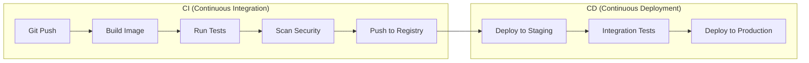

### Typowy pipeline

| Etap | Opis | Narzędzia |
|------|------|-----------|
| **Checkout** | Pobranie kodu | Git |
| **Build** | Budowanie obrazu Docker | `docker build` |
| **Unit Tests** | Testy jednostkowe w kontenerze | `docker run` |
| **Lint** | Analiza statyczna | Hadolint, ESLint |
| **Security Scan** | Skanowanie podatności | Trivy, Scout |
| **Push** | Wysłanie do rejestru | `docker push` |
| **Deploy Staging** | Wdrożenie na staging | Docker Compose, K8s |
| **Integration Tests** | Testy integracyjne | `docker compose` |
| **Deploy Production** | Wdrożenie produkcyjne | K8s, Docker Swarm |

## 9.3 GitHub Actions z Docker

```yaml
# .github/workflows/docker.yml
name: Docker CI/CD

on:
  push:
    branches: [main]
  pull_request:
    branches: [main]

env:
  REGISTRY: ghcr.io
  IMAGE_NAME: ${{ github.repository }}

jobs:
  build-and-test:
    runs-on: ubuntu-latest
    steps:
      - name: Checkout
        uses: actions/checkout@v4

      - name: Set up Docker Buildx
        uses: docker/setup-buildx-action@v3

      - name: Build test image
        uses: docker/build-push-action@v5
        with:
          context: .
          target: test
          load: true
          tags: myapp:test

      - name: Run tests
        run: docker run --rm myapp:test pytest

      - name: Lint Dockerfile
        uses: hadolint/hadolint-action@v3.1.0
        with:
          dockerfile: Dockerfile

      - name: Scan for vulnerabilities
        uses: aquasecurity/trivy-action@master
        with:
          image-ref: myapp:test
          severity: CRITICAL,HIGH

  push:
    needs: build-and-test
    runs-on: ubuntu-latest
    if: github.event_name == 'push'
    steps:
      - name: Checkout
        uses: actions/checkout@v4

      - name: Login to GHCR
        uses: docker/login-action@v3
        with:
          registry: ${{ env.REGISTRY }}
          username: ${{ github.actor }}
          password: ${{ secrets.GITHUB_TOKEN }}

      - name: Build and push
        uses: docker/build-push-action@v5
        with:
          context: .
          push: true
          tags: |
            ${{ env.REGISTRY }}/${{ env.IMAGE_NAME }}:latest
            ${{ env.REGISTRY }}/${{ env.IMAGE_NAME }}:${{ github.sha }}
          cache-from: type=gha
          cache-to: type=gha,mode=max
```

### Multi-stage Dockerfile dla CI/CD

```dockerfile
# Stage 1: Dependencies
FROM python:3.11-slim AS base
WORKDIR /app
COPY requirements.txt .
RUN pip install --no-cache-dir -r requirements.txt

# Stage 2: Test
FROM base AS test
COPY requirements-dev.txt .
RUN pip install --no-cache-dir -r requirements-dev.txt
COPY . .
CMD ["pytest", "--cov=app"]

# Stage 3: Production
FROM base AS production
RUN groupadd -r app && useradd -r -g app app
COPY --chown=app:app . .
USER app
EXPOSE 5000
CMD ["gunicorn", "-b", "0.0.0.0:5000", "app:create_app()"]
```

## 9.4 GitLab CI z Docker

```yaml
# .gitlab-ci.yml
stages:
  - build
  - test
  - scan
  - deploy

variables:
  IMAGE: $CI_REGISTRY_IMAGE:$CI_COMMIT_SHA

build:
  stage: build
  image: docker:24
  services:
    - docker:24-dind
  script:
    - docker login -u $CI_REGISTRY_USER -p $CI_REGISTRY_PASSWORD $CI_REGISTRY
    - docker build -t $IMAGE .
    - docker push $IMAGE

test:
  stage: test
  image: docker:24
  services:
    - docker:24-dind
  script:
    - docker run --rm $IMAGE pytest

scan:
  stage: scan
  image: aquasec/trivy
  script:
    - trivy image --severity HIGH,CRITICAL $IMAGE

deploy-staging:
  stage: deploy
  script:
    - docker compose -f docker-compose.staging.yml up -d
  environment:
    name: staging
  only:
    - main
```

## 9.5 Strategie tagowania obrazów

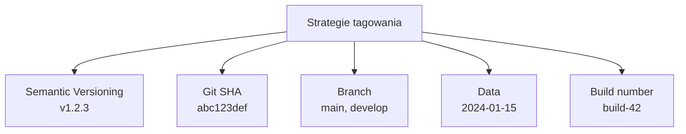

### Zalecana strategia

```bash
# Tag z wersją semantyczną + Git SHA
docker build -t myapp:1.2.3 -t myapp:abc123d -t myapp:latest .

# W CI/CD
docker build \
  -t ghcr.io/org/myapp:${VERSION} \
  -t ghcr.io/org/myapp:${GIT_SHA:0:7} \
  -t ghcr.io/org/myapp:latest \
  .
```

| Strategia | Przykład | Zalety | Wady |
|-----------|---------|--------|------|
| Semantic | `v1.2.3` | Czytelna, wersjonowana | Wymaga zarządzania |
| Git SHA | `abc123d` | Unikalna, automatyczna | Nieczytelna |
| Latest | `latest` | Prosta | Niepowtarzalna! |
| Branch | `main` | Automatyczna | Nadpisywana |

## 9.6 Docker w środowisku produkcyjnym

### Strategie wdrażania

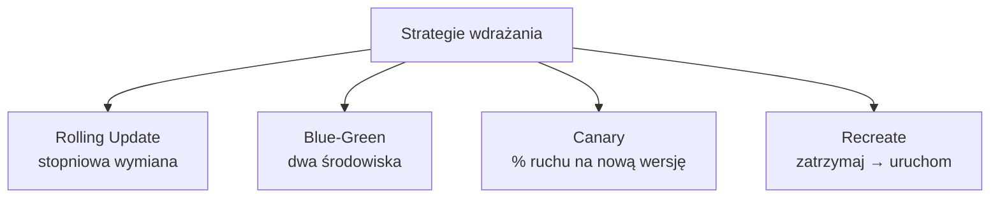

### Rolling Update

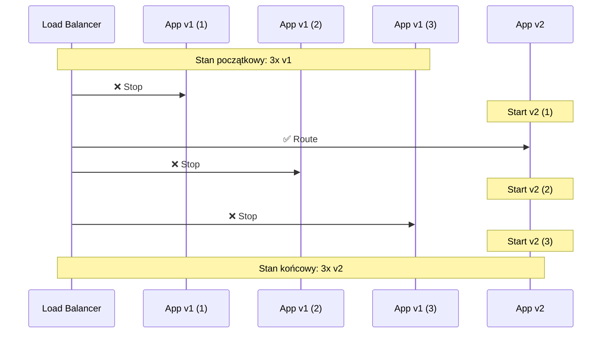

### Blue-Green Deployment

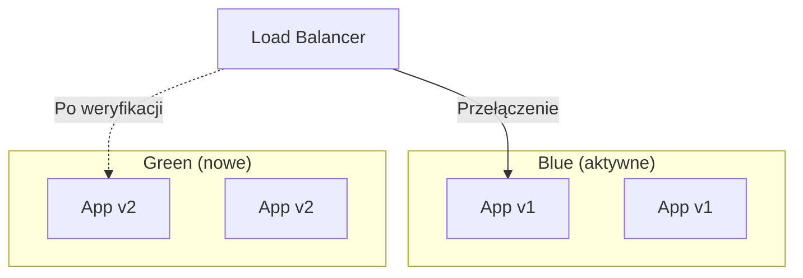

## 9.7 Docker Swarm — orkiestracja produkcyjna

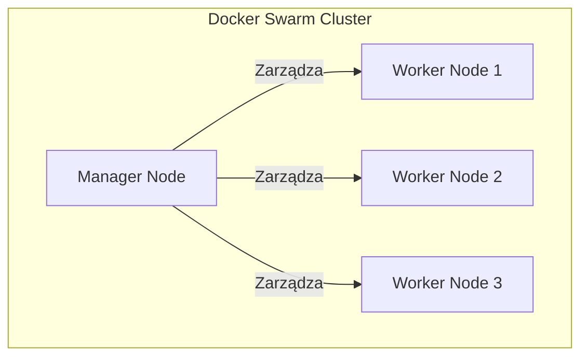

```bash
# Inicjalizacja Swarm
docker swarm init --advertise-addr 192.168.1.100

# Dołączenie worker node
docker swarm join --token SWMTKN-xxx 192.168.1.100:2377

# Tworzenie usługi
docker service create \
  --name web \
  --replicas 3 \
  --publish 80:80 \
  --update-delay 10s \
  --update-parallelism 1 \
  nginx:alpine

# Aktualizacja usługi (rolling update)
docker service update --image nginx:1.25-alpine web

# Skalowanie
docker service scale web=5

# Status
docker service ls
docker service ps web

# Stack deploy (z Compose file)
docker stack deploy -c docker-compose.yml myapp
```

## 9.8 Logowanie i monitoring w produkcji

### Centralne logowanie

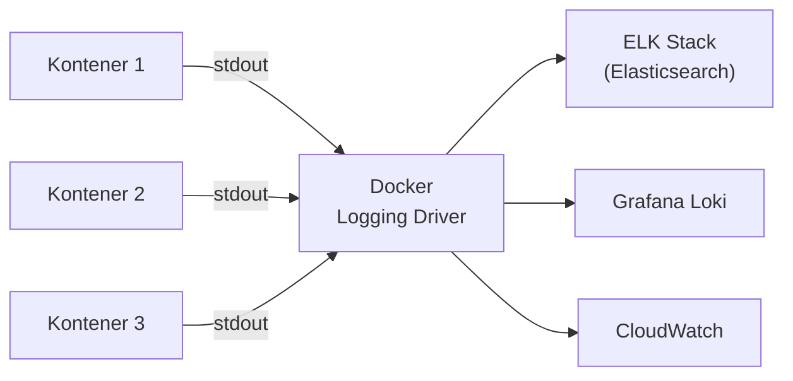

### Stos ELK z Docker Compose

```yaml
services:
  elasticsearch:
    image: elasticsearch:8.12.0
    environment:
      - discovery.type=single-node
      - xpack.security.enabled=false
    volumes:
      - es-data:/usr/share/elasticsearch/data
    ports:
      - "9200:9200"

  logstash:
    image: logstash:8.12.0
    volumes:
      - ./logstash.conf:/usr/share/logstash/pipeline/logstash.conf
    depends_on:
      - elasticsearch

  kibana:
    image: kibana:8.12.0
    ports:
      - "5601:5601"
    depends_on:
      - elasticsearch

volumes:
  es-data:
```

### Monitoring z Prometheus + Grafana

```yaml
services:
  prometheus:
    image: prom/prometheus:latest
    volumes:
      - ./prometheus.yml:/etc/prometheus/prometheus.yml:ro
    ports:
      - "9090:9090"

  grafana:
    image: grafana/grafana:latest
    ports:
      - "3000:3000"
    environment:
      - GF_SECURITY_ADMIN_PASSWORD=${GRAFANA_PASSWORD}
    volumes:
      - grafana-data:/var/lib/grafana

  cadvisor:
    image: gcr.io/cadvisor/cadvisor:latest
    volumes:
      - /:/rootfs:ro
      - /var/run:/var/run:ro
      - /sys:/sys:ro
      - /var/lib/docker/:/var/lib/docker:ro
    ports:
      - "8080:8080"

  node-exporter:
    image: prom/node-exporter:latest
    ports:
      - "9100:9100"

volumes:
  grafana-data:
```

## 9.9 Reverse proxy i load balancing

### Nginx jako reverse proxy

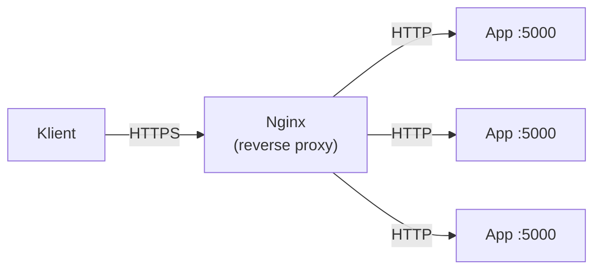

### Traefik — automatyczny reverse proxy

```yaml
services:
  traefik:
    image: traefik:v3.0
    command:
      - "--providers.docker=true"
      - "--entrypoints.web.address=:80"
    ports:
      - "80:80"
    volumes:
      - /var/run/docker.sock:/var/run/docker.sock:ro

  app:
    image: myapp:latest
    labels:
      - "traefik.http.routers.app.rule=Host(`app.example.com`)"
    deploy:
      replicas: 3
```

## 9.10 Backup i disaster recovery

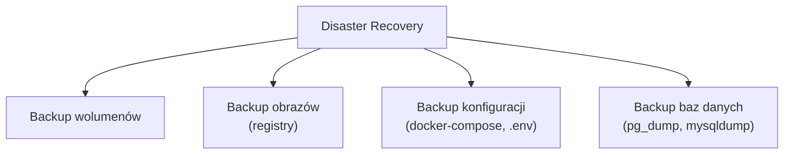

### Automatyczny backup bazy danych

```yaml
services:
  db:
    image: postgres:16
    volumes:
      - db-data:/var/lib/postgresql/data

  backup:
    image: postgres:16
    volumes:
      - ./backups:/backups
    environment:
      - PGHOST=db
      - PGUSER=postgres
      - PGPASSWORD=${DB_PASSWORD}
    command: >
      sh -c "while true; do
        pg_dumpall > /backups/backup_$$(date +%Y%m%d_%H%M%S).sql;
        find /backups -mtime +7 -delete;
        sleep 86400;
      done"
    depends_on:
      - db
```

## 9.11 Docker w chmurze

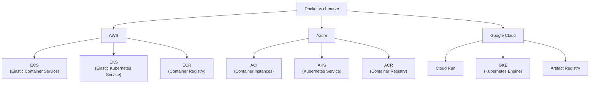

## 9.12 Podsumowanie

- Docker jest kluczowym elementem nowoczesnych pipeline'ów CI/CD
- Zasada „Build Once, Deploy Everywhere" zapewnia spójność
- GitHub Actions i GitLab CI natywnie wspierają Docker
- Strategie tagowania: semantic versioning + Git SHA
- Docker Swarm umożliwia prostą orkiestrację produkcyjną
- Centralne logowanie i monitoring są niezbędne w produkcji
- Reverse proxy (Nginx, Traefik) zarządza ruchem do kontenerów
- Regularne backupy wolumenów i baz danych to konieczność

### Pytania kontrolne
1. Co oznacza zasada „Build Once, Deploy Everywhere"?
2. Jakie etapy zawiera typowy pipeline CI/CD z Docker?
3. Jak skonfigurować GitHub Actions do budowania obrazów Docker?
4. Jakie strategie wdrażania kontenerów znasz?
5. Czym jest Docker Swarm i jak różni się od Kubernetes?
6. Jak zorganizować centralne logowanie kontenerów?

### Literatura
- Docker CI/CD: https://docs.docker.com/build/ci/
- GitHub Actions Docker: https://docs.github.com/en/actions/publishing-packages/publishing-docker-images
- Docker Swarm: https://docs.docker.com/engine/swarm/
