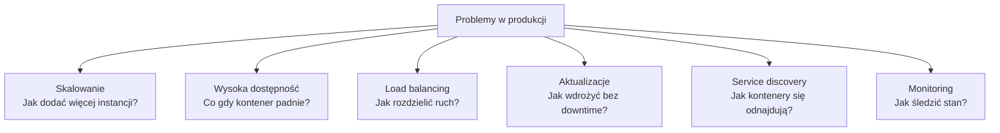
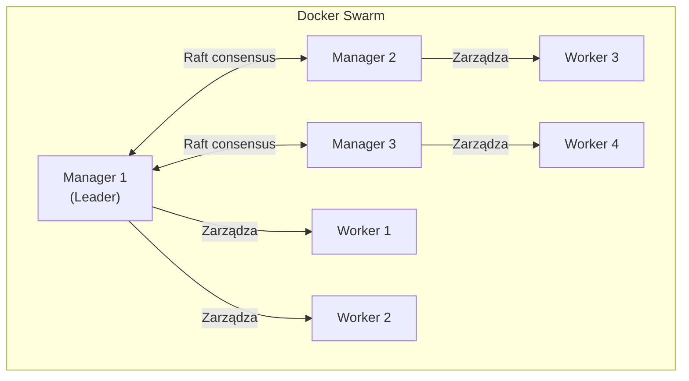
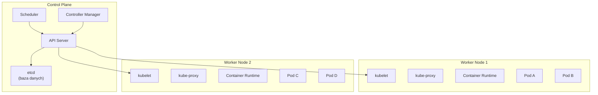
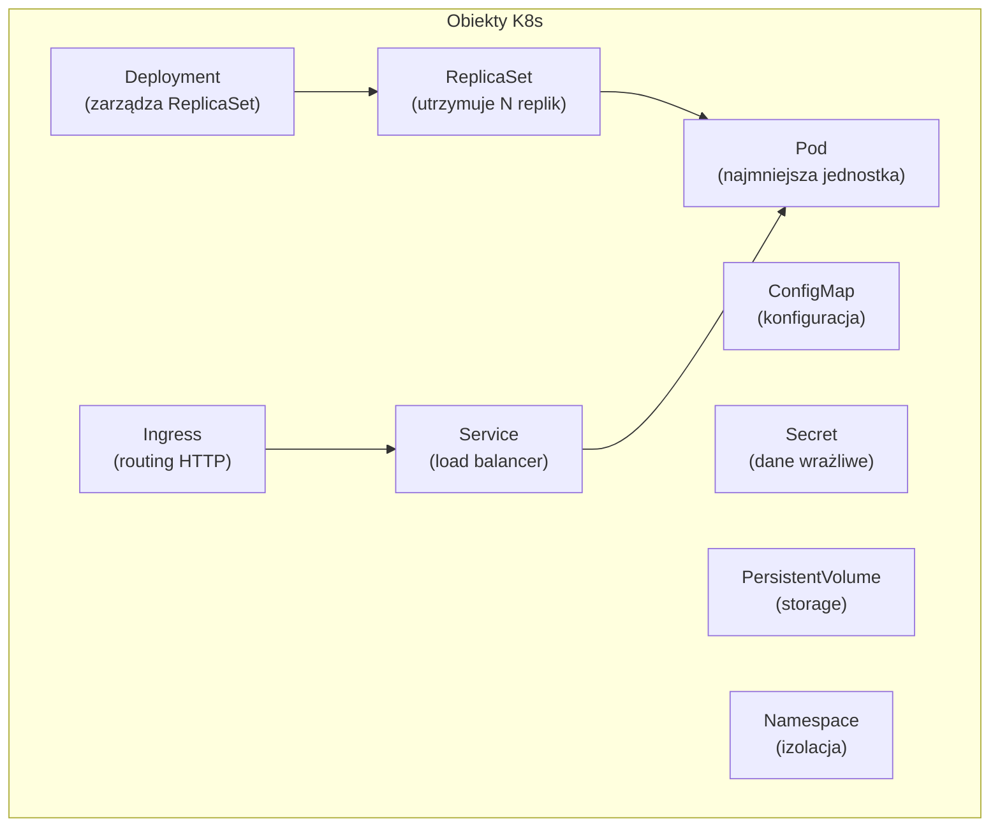
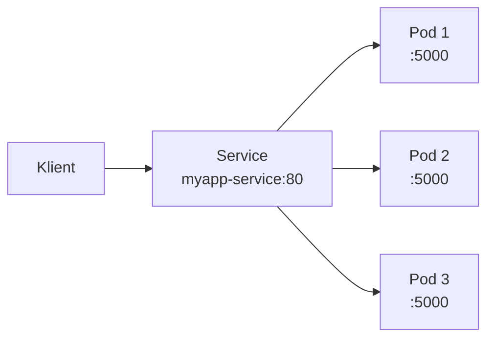
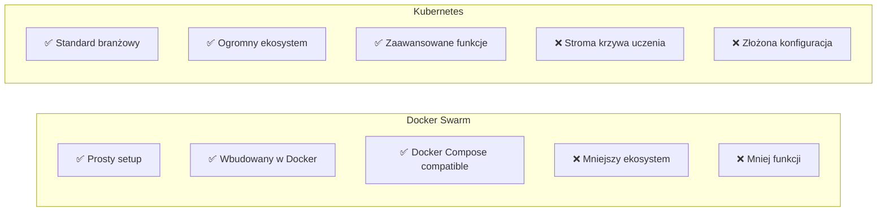
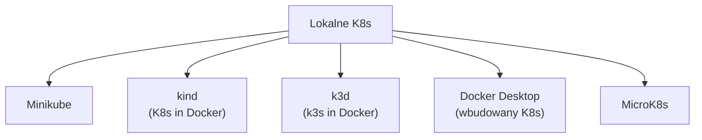
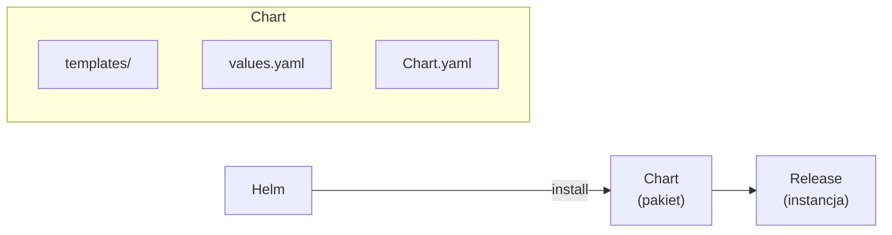
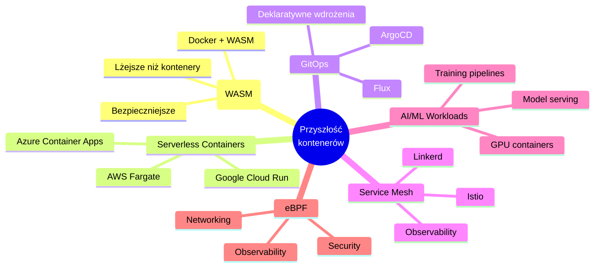
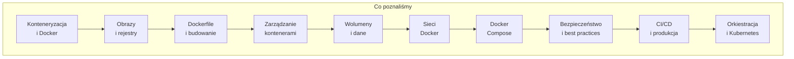

# Wykład 10: Orkiestracja kontenerów i wprowadzenie do Kubernetes (2 godz.)

## 10.1 Dlaczego potrzebujemy orkiestracji?

Gdy aplikacja składa się z wielu kontenerów rozproszonych na wielu hostach, potrzebujemy narzędzia do automatycznego zarządzania nimi.



### Docker Compose vs orkiestracja

| Cecha | Docker Compose | Docker Swarm | Kubernetes |
|-------|---------------|-------------|------------|
| Hosty | Jeden | Wiele | Wiele |
| Skalowanie | Ręczne | Automatyczne | Automatyczne |
| Self-healing | ❌ | ✅ | ✅ |
| Load balancing | ❌ | ✅ | ✅ |
| Rolling updates | ❌ | ✅ | ✅ |
| Złożoność | Niska | Średnia | Wysoka |
| Użycie | Development | Mała produkcja | Duża produkcja |

## 10.2 Docker Swarm — powtórzenie i rozszerzenie



### Kluczowe pojęcia Swarm

| Pojęcie | Opis |
|---------|------|
| **Node** | Maszyna w klastrze (manager lub worker) |
| **Service** | Definicja zadania (obraz, repliki, porty) |
| **Task** | Pojedyncza instancja kontenera |
| **Stack** | Grupa powiązanych usług (z Compose file) |
| **Overlay network** | Sieć łącząca kontenery między hostami |

### Swarm w praktyce

```bash
# Inicjalizacja
docker swarm init

# Tworzenie usługi z replikami
docker service create --name api --replicas 5 --publish 8080:80 myapi:v1

# Rolling update
docker service update --image myapi:v2 --update-parallelism 2 --update-delay 10s api

# Rollback
docker service rollback api

# Globalny serwis (1 instancja na każdym node)
docker service create --mode global --name monitor prom/node-exporter

# Stack deploy
docker stack deploy -c docker-compose.yml myapp
docker stack ls
docker stack services myapp
docker stack rm myapp
```

## 10.3 Wprowadzenie do Kubernetes

Kubernetes (K8s) to **system orkiestracji kontenerów** stworzony przez Google, obecnie rozwijany przez CNCF. Jest standardem branżowym dla zarządzania kontenerami w produkcji.



### Architektura Kubernetes

| Komponent | Rola |
|-----------|------|
| **API Server** | Centralny punkt komunikacji (REST API) |
| **etcd** | Rozproszona baza klucz-wartość (stan klastra) |
| **Scheduler** | Przydziela Pody do Node'ów |
| **Controller Manager** | Utrzymuje pożądany stan (repliki, deployment) |
| **kubelet** | Agent na każdym Node (zarządza Podami) |
| **kube-proxy** | Zarządza siecią na Node |

## 10.4 Podstawowe obiekty Kubernetes



### Pod
Najmniejsza jednostka w K8s — jeden lub więcej kontenerów współdzielących sieć i storage.

```yaml
# pod.yaml
apiVersion: v1
kind: Pod
metadata:
  name: myapp
  labels:
    app: myapp
spec:
  containers:
    - name: app
      image: myapp:v1
      ports:
        - containerPort: 5000
      resources:
        limits:
          memory: "256Mi"
          cpu: "500m"
```

### Deployment
Zarządza cyklem życia Podów — skalowanie, aktualizacje, rollback.

```yaml
# deployment.yaml
apiVersion: apps/v1
kind: Deployment
metadata:
  name: myapp
spec:
  replicas: 3
  selector:
    matchLabels:
      app: myapp
  template:
    metadata:
      labels:
        app: myapp
    spec:
      containers:
        - name: app
          image: myapp:v1
          ports:
            - containerPort: 5000
          readinessProbe:
            httpGet:
              path: /health
              port: 5000
            initialDelaySeconds: 5
          livenessProbe:
            httpGet:
              path: /health
              port: 5000
            initialDelaySeconds: 15
  strategy:
    type: RollingUpdate
    rollingUpdate:
      maxSurge: 1
      maxUnavailable: 0
```

### Service
Stabilny endpoint (IP + DNS) dla grupy Podów.

```yaml
# service.yaml
apiVersion: v1
kind: Service
metadata:
  name: myapp-service
spec:
  selector:
    app: myapp
  ports:
    - port: 80
      targetPort: 5000
  type: ClusterIP  # ClusterIP | NodePort | LoadBalancer
```



## 10.5 kubectl — narzędzie CLI

```bash
# Informacje o klastrze
kubectl cluster-info
kubectl get nodes

# Zarządzanie Podami
kubectl get pods
kubectl describe pod myapp
kubectl logs myapp
kubectl exec -it myapp -- bash

# Deployment
kubectl apply -f deployment.yaml
kubectl get deployments
kubectl rollout status deployment/myapp
kubectl rollout undo deployment/myapp

# Skalowanie
kubectl scale deployment myapp --replicas=5

# Usługi
kubectl get services
kubectl expose deployment myapp --port=80 --target-port=5000

# Namespace
kubectl get namespaces
kubectl create namespace staging
```

## 10.6 Kubernetes vs Docker Swarm



| Cecha | Docker Swarm | Kubernetes |
|-------|-------------|------------|
| Krzywa uczenia | Łagodna | Stroma |
| Setup | Minuty | Godziny |
| Skalowanie | Dobre | Doskonałe |
| Ekosystem | Mały | Ogromny (Helm, Istio, ...) |
| Auto-scaling | Ręczne | HPA, VPA |
| Storage | Ograniczone | PV, PVC, StorageClass |
| Networking | Overlay | CNI (Calico, Flannel, ...) |
| Popularność | Malejąca | Dominująca |

## 10.7 Lokalne środowiska Kubernetes



```bash
# Minikube
minikube start
minikube dashboard

# kind (Kubernetes in Docker)
kind create cluster
kind load docker-image myapp:v1

# k3d (k3s in Docker)
k3d cluster create mycluster
```

## 10.8 Helm — menedżer pakietów Kubernetes



```bash
# Instalacja aplikacji z Helm
helm repo add bitnami https://charts.bitnami.com/bitnami
helm install my-postgres bitnami/postgresql

# Własny chart
helm create myapp
helm install myapp ./myapp --values values-prod.yaml

# Aktualizacja
helm upgrade myapp ./myapp

# Rollback
helm rollback myapp 1
```

## 10.9 Przyszłość konteneryzacji



### Docker + WebAssembly

```bash
# Uruchomienie modułu WASM w Docker
docker run --runtime=io.containerd.wasmedge.v1 --platform=wasi/wasm myapp.wasm
```

### Trendy
- **WASM** — lżejsza alternatywa dla kontenerów (Docker już wspiera)
- **GitOps** — infrastruktura jako kod w Git (ArgoCD, Flux)
- **Service Mesh** — zaawansowane zarządzanie ruchem (Istio)
- **Serverless containers** — kontenery bez zarządzania infrastrukturą
- **eBPF** — nowa generacja networking i security w kontenerach

## 10.10 Podsumowanie kursu



### Kluczowe umiejętności po kursie
1. Rozumienie konteneryzacji i jej zastosowań
2. Tworzenie i zarządzanie obrazami Docker
3. Pisanie efektywnych Dockerfile (multi-stage, cache, security)
4. Zarządzanie cyklem życia kontenerów
5. Trwałe przechowywanie danych (wolumeny)
6. Konfiguracja sieci Docker
7. Orkiestracja z Docker Compose
8. Stosowanie dobrych praktyk bezpieczeństwa
9. Integracja Docker z CI/CD
10. Podstawy orkiestracji (Swarm, Kubernetes)

### Pytania kontrolne
1. Kiedy Docker Compose nie wystarcza i potrzebna jest orkiestracja?
2. Jakie są główne komponenty architektury Kubernetes?
3. Czym jest Pod w Kubernetes?
4. Jak Kubernetes zapewnia wysoką dostępność?
5. Jakie są różnice między Docker Swarm a Kubernetes?
6. Co to jest Helm i do czego służy?

### Literatura
- Kubernetes Documentation: https://kubernetes.io/docs/
- Docker Swarm: https://docs.docker.com/engine/swarm/
- Helm: https://helm.sh/docs/
- CNCF Landscape: https://landscape.cncf.io/
- „Kubernetes in Action" — Marko Lukša
